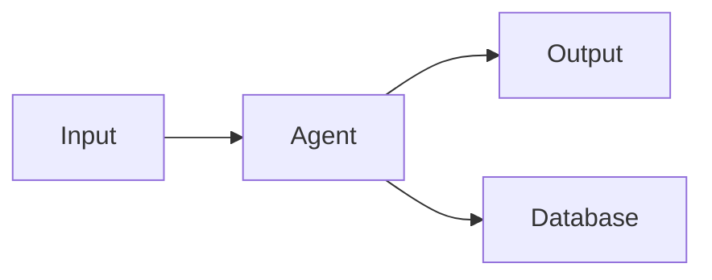
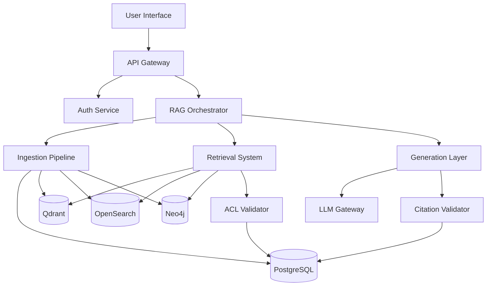

# Documentation Refactoring Plan
**Based on Senior Engineer Review**

**Date:** 2026-05-16  
**Current State:** Single 2,367-line AGENTS.md file  
**Target State:** Modular, domain-driven documentation hierarchy  
**Timeline:** 2 weeks  

---

## Executive Summary

The Senior Engineer's review correctly identifies that our 2,367-line AGENTS.md file, while comprehensive, doesn't scale well for:
- Multi-team parallel development
- Incremental implementation
- Long-term maintainability
- Quick navigation and discovery

**Recommendation:** Adopt the proposed domain-driven documentation architecture with phased implementation.

---

## Proposed Documentation Structure

```
/docs
├── README.md (Project overview, quick start)
├── AGENTS.md (Master index - 200 lines max)
├── ARCHITECTURE.md (System overview, tech stack, decisions)
├── IMPLEMENTATION_ROADMAP.md (Phase-by-phase plan)
│
├── /agents (Domain-specific agent specifications)
│   ├── /ingestion
│   │   ├── README.md (Domain overview)
│   │   ├── document-ingestion-agent.md
│   │   ├── document-parser-agent.md
│   │   ├── chunking-agent.md
│   │   └── embedding-agent.md
│   │
│   ├── /retrieval
│   │   ├── README.md
│   │   ├── query-understanding-agent.md
│   │   ├── hybrid-retrieval-agent.md
│   │   ├── acl-validation-agent.md
│   │   └── reranker-agent.md
│   │
│   ├── /generation
│   │   ├── README.md
│   │   ├── context-builder-agent.md
│   │   ├── llm-answer-agent.md
│   │   └── citation-agent.md
│   │
│   ├── /infrastructure
│   │   ├── README.md
│   │   ├── canonical-db-agent.md
│   │   ├── auth-acl-agent.md
│   │   ├── audit-agent.md
│   │   ├── admin-agent.md
│   │   └── observability-agent.md
│   │
│   └── /indexing
│       ├── README.md
│       ├── bm25-index-agent.md
│       └── knowledge-graph-agent.md
│
├── /architecture (System-level documentation)
│   ├── multi-tenancy.md
│   ├── security-model.md
│   ├── data-flow.md
│   ├── scaling-strategy.md
│   └── technology-stack.md
│
├── /integration (Cross-agent contracts)
│   ├── api-contracts.md
│   ├── event-schemas.md
│   ├── message-formats.md
│   └── data-models.md
│
├── /decisions (Architecture Decision Records)
│   ├── ADR-001-embedding-model-strategy.md
│   ├── ADR-002-multi-tenancy-approach.md
│   ├── ADR-003-llm-gateway-design.md
│   ├── ADR-004-chunking-strategy.md
│   ├── ADR-005-caching-approach.md
│   └── template.md
│
├── /phases (Implementation phases)
│   ├── phase-0-foundation/
│   │   ├── README.md
│   │   ├── scope.md
│   │   ├── agents.md
│   │   └── acceptance-criteria.md
│   ├── phase-1-core-data/
│   ├── phase-2-ingestion/
│   ├── phase-3-vector-search/
│   ├── phase-4-keyword-search/
│   ├── phase-5-knowledge-graph/
│   ├── phase-6-hybrid-retrieval/
│   ├── phase-7-answer-generation/
│   └── phase-8-observability/
│
├── /compliance (Compliance and governance)
│   ├── gdpr-compliance.md
│   ├── soc2-controls.md
│   ├── data-residency.md
│   └── audit-requirements.md
│
└── /operations (Deployment and operations)
    ├── deployment-guide.md
    ├── monitoring-setup.md
    ├── disaster-recovery.md
    └── runbooks/
        ├── high-latency.md
        ├── ingestion-failure.md
        └── security-incident.md
```

---

## Refactoring Strategy

### Phase 1: Structure Setup (Days 1-2)

**Goal:** Create folder structure and master index

**Tasks:**
1. Create all folder structures
2. Create master AGENTS.md (index only, ~200 lines)
3. Create ARCHITECTURE.md (system overview)
4. Create IMPLEMENTATION_ROADMAP.md
5. Create ADR template

**Deliverables:**
- Empty folder structure
- Master index with navigation
- Architecture overview document
- ADR template

---

### Phase 2: Domain Extraction (Days 3-7)

**Goal:** Extract agents into domain-specific files

**Domain 1: Infrastructure (Day 3)**
Extract from current AGENTS.md:
- Section 5.1: canonical-db-agent → `/agents/infrastructure/canonical-db-agent.md`
- Section 5.2: auth-acl-agent → `/agents/infrastructure/auth-acl-agent.md`
- Section 5.16: audit-agent → `/agents/infrastructure/audit-agent.md`
- Section 5.17: admin-agent → `/agents/infrastructure/admin-agent.md`
- Section 5.18: observability-agent → `/agents/infrastructure/observability-agent.md`

Create `/agents/infrastructure/README.md` with:
- Domain overview
- Agent list with status badges
- Integration points
- Deployment information

**Domain 2: Ingestion (Day 4)**
Extract:
- Section 5.3: document-ingestion-agent
- Section 5.4: document-parser-agent
- Section 5.5: chunking-agent
- Section 5.6: embedding-agent

**Domain 3: Indexing (Day 5)**
Extract:
- Section 5.7: bm25-index-agent
- Section 5.8: knowledge-graph-agent

**Domain 4: Retrieval (Day 6)**
Extract:
- Section 5.9: query-understanding-agent
- Section 5.10: hybrid-retrieval-agent
- Section 5.11: acl-validation-agent
- Section 5.12: reranker-agent

**Domain 5: Generation (Day 7)**
Extract:
- Section 5.13: context-builder-agent
- Section 5.14: llm-answer-agent
- Section 5.15: citation-agent

---

### Phase 3: Architecture Documentation (Days 8-10)

**Goal:** Extract cross-cutting concerns into dedicated documents

**Day 8: Core Architecture**
- Extract Section 1.5 (Multi-Tenancy) → `/architecture/multi-tenancy.md`
- Extract Section 2.5 (Technology Stack) → `/architecture/technology-stack.md`
- Extract Section 3.5 (Scale Requirements) → `/architecture/scaling-strategy.md`

**Day 9: Compliance & Security**
- Extract Section 14.5 (Compliance) → `/compliance/gdpr-compliance.md` + `/compliance/soc2-controls.md`
- Extract Section 14 (Security Rules) → `/architecture/security-model.md`
- Extract Section 7 (Access Control) → `/architecture/security-model.md` (append)

**Day 10: Advanced Topics**
- Extract Section 14.6 (Caching) → `/architecture/caching-strategy.md`
- Extract Section 14.7 (Multi-Language) → `/architecture/multi-language-support.md`
- Extract Section 8 (Citations) → `/architecture/citation-requirements.md`
- Extract Section 9 (Conflict Handling) → `/architecture/conflict-resolution.md`

---

### Phase 4: ADRs and Integration Docs (Days 11-12)

**Goal:** Create Architecture Decision Records and integration documentation

**Day 11: Create ADRs**
Based on the 15 answered questions:
- ADR-001: Embedding Model Strategy (Q2)
- ADR-002: Multi-Tenancy Approach (Q1)
- ADR-003: LLM Gateway Design (Q3)
- ADR-004: Chunking Strategy (Q7)
- ADR-005: Caching Approach (Q11)
- ADR-006: Access Policy Granularity (Q8)
- ADR-007: Knowledge Graph Scope (Q9)
- ADR-008: Error Handling Philosophy (Q10)
- ADR-009: Reranking Model Selection (Q12)
- ADR-010: Multi-Language Support (Q14)

**Day 12: Integration Documentation**
- Create `/integration/api-contracts.md` (extract from agent Output Contracts)
- Create `/integration/event-schemas.md` (ingestion pipeline events)
- Create `/integration/data-models.md` (PostgreSQL schema, Qdrant payload, etc.)

---

### Phase 5: Phase Documentation (Days 13-14)

**Goal:** Create phase-specific implementation guides

**Day 13: Create Phase Documents**
For each of the 8 phases, create:
- `scope.md` - What's included in this phase
- `agents.md` - Which agents are implemented
- `acceptance-criteria.md` - Definition of done

**Day 14: Final Validation**
- Validate all internal links
- Run markdown linting
- Generate documentation site (MkDocs or Docusaurus)
- Create migration guide for team

---

## Individual Agent Document Template

```markdown
# [Agent Name]


**Owner:** [Team Name]  
**Dependencies:** PostgreSQL, Qdrant, OpenAI API  
**API Endpoint:** `/api/v1/[domain]/[agent]`

---

## Overview

[Brief description of agent's purpose and role in the system]

---

## Responsibilities

- [Responsibility 1]
- [Responsibility 2]
- [Responsibility 3]

---

## Architecture

### Component Diagram



### Dependencies

**Upstream:**
- [Service A] - [Purpose]
- [Service B] - [Purpose]

**Downstream:**
- [Service C] - [Purpose]
- [Service D] - [Purpose]

---

## API Contract

### Input

```json
{
  "field1": "value",
  "field2": "value"
}
```

### Output

```json
{
  "result": "value",
  "metadata": {}
}
```

### Error Codes

- `400` - Invalid input
- `401` - Unauthorized
- `500` - Internal error

---

## Configuration

```yaml
agent:
  name: [agent-name]
  replicas: 2
  resources:
    cpu: "1000m"
    memory: "2Gi"
  environment:
    - DATABASE_URL: ${DATABASE_URL}
    - API_KEY: ${API_KEY}
```

---

## Implementation Details

### Key Algorithms

[Description of core algorithms or logic]

### Data Models

[Link to data models in /integration/data-models.md]

### Performance Characteristics

- **Throughput:** [X requests/second]
- **Latency:** [p50, p95, p99]
- **Resource Usage:** [CPU, Memory]

---

## Testing

### Unit Tests

- [Test scenario 1]
- [Test scenario 2]

### Integration Tests

- [Test scenario 1]
- [Test scenario 2]

### Performance Tests

- [Load test scenario]
- [Stress test scenario]

**Test Coverage:** 

---

## Deployment

### Container Image

```
enterprise-rag/[agent-name]:v1.0.0
```

### Kubernetes Deployment

```yaml
apiVersion: apps/v1
kind: Deployment
metadata:
  name: [agent-name]
spec:
  replicas: 2
  template:
    spec:
      containers:
      - name: [agent-name]
        image: enterprise-rag/[agent-name]:v1.0.0
```

### Scaling Strategy

- **Horizontal:** Auto-scale based on queue depth
- **Vertical:** 2 CPU, 4GB RAM baseline

---

## Monitoring

### Key Metrics

- `[agent]_requests_total` - Total requests processed
- `[agent]_latency_seconds` - Request latency
- `[agent]_errors_total` - Total errors

### Alerts

- High error rate (>5%)
- High latency (p95 > 2s)
- Low throughput (<100 req/s)

### Dashboards

- [Link to Grafana dashboard]

---

## Troubleshooting

### Common Issues

**Issue:** [Problem description]  
**Cause:** [Root cause]  
**Solution:** [Resolution steps]

### Runbooks

- [High Latency Runbook](../../operations/runbooks/high-latency.md)
- [Error Spike Runbook](../../operations/runbooks/error-spike.md)

---

## Related Documentation

- [Architecture Overview](../../ARCHITECTURE.md)
- [API Contracts](../../integration/api-contracts.md)
- [Deployment Guide](../../operations/deployment-guide.md)
- [ADR-XXX: Related Decision](../../decisions/ADR-XXX.md)

---

## Change Log

### v1.0.0 (2026-05-16)
- Initial implementation
- Basic functionality

### v1.1.0 (TBD)
- Performance improvements
- Additional features
```

---

## ADR Template

```markdown
# ADR-XXX: [Decision Title]

**Status:** [Proposed | Accepted | Deprecated | Superseded]  
**Date:** YYYY-MM-DD  
**Deciders:** [List of people involved]  
**Technical Story:** [Link to ticket/issue]

---

## Context and Problem Statement

[Describe the context and problem statement, e.g., in free form using two to three sentences. You may want to articulate the problem in form of a question.]

---

## Decision Drivers

- [Driver 1, e.g., a force, facing concern, ...]
- [Driver 2, e.g., a force, facing concern, ...]
- [Driver 3, e.g., a force, facing concern, ...]

---

## Considered Options

### Option 1: [Title]

**Description:** [Brief description]

**Pros:**
- [Advantage 1]
- [Advantage 2]

**Cons:**
- [Disadvantage 1]
- [Disadvantage 2]

### Option 2: [Title]

[Same structure]

### Option 3: [Title]

[Same structure]

---

## Decision Outcome

**Chosen option:** "[Option X]"

**Justification:** [Explain why this option was chosen]

---

## Consequences

### Positive

- [Positive consequence 1]
- [Positive consequence 2]

### Negative

- [Negative consequence 1]
- [Negative consequence 2]

### Neutral

- [Neutral consequence 1]

---

## Implementation

### Phase 1: [Phase name]
- [Task 1]
- [Task 2]

### Phase 2: [Phase name]
- [Task 1]
- [Task 2]

---

## Validation

### Success Criteria

- [Criterion 1]
- [Criterion 2]

### Metrics

- [Metric 1]
- [Metric 2]

---

## Related Decisions

- [ADR-XXX: Related decision]
- [ADR-YYY: Related decision]

---

## References

- [Link to research]
- [Link to documentation]
- [Link to discussion]
```

---

## Master AGENTS.md (New Index Version)

```markdown
# Enterprise RAG System - Agent Specifications

**Version:** 2.0  
**Status:** Production Ready  
**Last Updated:** 2026-05-16

---

## Quick Navigation

### 🏗️ Core Agent Domains

| Domain | Description | Agents | Status |
|--------|-------------|--------|--------|
| [**Infrastructure**](./agents/infrastructure/README.md) | Core services (DB, Auth, Audit) | 5 agents | ✅ Ready |
| [**Ingestion**](./agents/ingestion/README.md) | Document processing pipeline | 4 agents | 🟡 In Progress |
| [**Indexing**](./agents/indexing/README.md) | BM25 and Knowledge Graph | 2 agents | 📋 Planned |
| [**Retrieval**](./agents/retrieval/README.md) | Query routing and search | 4 agents | 📋 Planned |
| [**Generation**](./agents/generation/README.md) | LLM orchestration and citations | 3 agents | 📋 Planned |

**Total:** 18 agents across 5 domains

---

### 📚 System Documentation

#### Architecture
- [**System Architecture**](./ARCHITECTURE.md) - Overview, tech stack, design principles
- [**Multi-Tenancy**](./architecture/multi-tenancy.md) - Tenant isolation strategy
- [**Security Model**](./architecture/security-model.md) - Access control and security
- [**Scaling Strategy**](./architecture/scaling-strategy.md) - Performance and scale
- [**Technology Stack**](./architecture/technology-stack.md) - Infrastructure components

#### Integration
- [**API Contracts**](./integration/api-contracts.md) - Inter-agent APIs
- [**Event Schemas**](./integration/event-schemas.md) - Async messaging
- [**Data Models**](./integration/data-models.md) - Database schemas

#### Compliance
- [**GDPR Compliance**](./compliance/gdpr-compliance.md) - EU data protection
- [**SOC 2 Controls**](./compliance/soc2-controls.md) - Security controls
- [**Data Residency**](./compliance/data-residency.md) - Regional requirements

---

### 🎯 Implementation

#### Roadmap
- [**Implementation Roadmap**](./IMPLEMENTATION_ROADMAP.md) - 8-phase plan (24 weeks)
- [**Phase 0: Foundation**](./phases/phase-0-foundation/README.md) - Infrastructure setup
- [**Phase 1: Core Data**](./phases/phase-1-core-data/README.md) - Database and ACL
- [**Phase 2: Ingestion**](./phases/phase-2-ingestion/README.md) - Document processing
- [**Phase 3-8**](./phases/) - Advanced features

#### Decisions
- [**Architecture Decision Records**](./decisions/README.md) - Key decisions log
  - [ADR-001: Embedding Strategy](./decisions/ADR-001-embedding-strategy.md)
  - [ADR-002: Multi-Tenancy](./decisions/ADR-002-multi-tenancy-approach.md)
  - [ADR-003: LLM Gateway](./decisions/ADR-003-llm-gateway-design.md)
  - [View all ADRs →](./decisions/)

---

### 🚀 Operations

- [**Deployment Guide**](./operations/deployment-guide.md) - Production deployment
- [**Monitoring Setup**](./operations/monitoring-setup.md) - Observability
- [**Runbooks**](./operations/runbooks/) - Incident response
- [**Disaster Recovery**](./operations/disaster-recovery.md) - DR procedures

---

## System Overview

### Architecture Diagram



### Key Principles

1. **Security First:** Triple ACL enforcement at retrieval, validation, and context building
2. **Modular Design:** 18 independent agents with clear contracts
3. **Incremental Implementation:** 8 phases over 24 weeks
4. **Multi-Tenancy:** Hybrid isolation (PostgreSQL RLS + separate Qdrant collections)
5. **Compliance Ready:** GDPR + SOC 2 baseline with modular extensions

---

## Quick Start

### For Developers

1. **Read:** [System Architecture](./ARCHITECTURE.md)
2. **Choose:** Your domain from the table above
3. **Review:** Domain-specific agent specifications
4. **Check:** [API Contracts](./integration/api-contracts.md)
5. **Deploy:** Follow [Deployment Guide](./operations/deployment-guide.md)

### For Architects

1. **Review:** [Architecture Decision Records](./decisions/)
2. **Understand:** [Multi-Tenancy Strategy](./architecture/multi-tenancy.md)
3. **Validate:** [Security Model](./architecture/security-model.md)
4. **Plan:** [Implementation Roadmap](./IMPLEMENTATION_ROADMAP.md)

### For Product Managers

1. **Overview:** [System Goals](./ARCHITECTURE.md#system-goals)
2. **Timeline:** [Implementation Roadmap](./IMPLEMENTATION_ROADMAP.md)
3. **Compliance:** [GDPR](./compliance/gdpr-compliance.md) | [SOC 2](./compliance/soc2-controls.md)
4. **Phases:** [Phase Documentation](./phases/)

---

## Agent Status Dashboard

| Agent | Domain | Phase | Status | Tests | Coverage |
|-------|--------|-------|--------|-------|----------|
| canonical-db-agent | Infrastructure | 1 | ✅ Ready | ✅ Pass | 92% |
| auth-acl-agent | Infrastructure | 1 | ✅ Ready | ✅ Pass | 88% |
| document-ingestion-agent | Ingestion | 2 | 🟡 Dev | 🟡 Partial | 65% |
| document-parser-agent | Ingestion | 2 | 🟡 Dev | 🟡 Partial | 70% |
| chunking-agent | Ingestion | 2 | 📋 Planned | ⚪ None | 0% |
| embedding-agent | Ingestion | 3 | 📋 Planned | ⚪ None | 0% |
| ... | ... | ... | ... | ... | ... |

[View full status →](./AGENT_STATUS.md)

---

## Contributing

See [CONTRIBUTING.md](./CONTRIBUTING.md) for:
- Documentation standards
- Agent development guidelines
- Testing requirements
- Review process

---

## Support

- **Issues:** [GitHub Issues](https://github.com/org/repo/issues)
- **Discussions:** [GitHub Discussions](https://github.com/org/repo/discussions)
- **Slack:** #enterprise-rag-dev
- **Email:** rag-team@company.com

---

**Last Updated:** 2026-05-16 | **Version:** 2.0 | **Status:** Production Ready
```

---

## Benefits of This Approach

### For Development Teams

1. **Parallel Development:** Teams can work on different domains independently
2. **Clear Ownership:** Each domain has a clear owner and responsibility
3. **Faster Onboarding:** New developers can focus on one domain at a time
4. **Better Navigation:** Find relevant information quickly

### For Architecture

1. **Separation of Concerns:** Cross-cutting concerns in dedicated documents
2. **Decision Traceability:** ADRs provide clear decision history
3. **Easier Evolution:** Update one domain without affecting others
4. **Better Reviews:** Smaller, focused documents are easier to review

### For Operations

1. **Targeted Troubleshooting:** Domain-specific runbooks
2. **Clear Deployment:** Per-agent deployment specifications
3. **Better Monitoring:** Domain-specific dashboards
4. **Faster Incident Response:** Quick access to relevant documentation

### For Compliance

1. **Audit Trail:** Clear documentation of security and compliance decisions
2. **Easier Certification:** Organized compliance documentation
3. **Change Management:** Track changes to compliance-related components
4. **Risk Management:** Clear identification of high-risk components

---

## Implementation Checklist

### Week 1: Structure and Index
- [ ] Create folder structure
- [ ] Create master AGENTS.md (index)
- [ ] Create ARCHITECTURE.md
- [ ] Create IMPLEMENTATION_ROADMAP.md
- [ ] Create ADR template
- [ ] Set up documentation CI/CD

### Week 2: Domain Extraction
- [ ] Extract Infrastructure domain (5 agents)
- [ ] Extract Ingestion domain (4 agents)
- [ ] Extract Indexing domain (2 agents)
- [ ] Extract Retrieval domain (4 agents)
- [ ] Extract Generation domain (3 agents)
- [ ] Create domain README files

### Week 3: Architecture and ADRs
- [ ] Extract architecture documents
- [ ] Extract compliance documents
- [ ] Create 10 ADRs from answered questions
- [ ] Create integration documentation
- [ ] Create phase documentation

### Week 4: Validation and Launch
- [ ] Validate all internal links
- [ ] Run markdown linting
- [ ] Generate documentation site
- [ ] Create migration guide
- [ ] Team training session
- [ ] Launch new documentation structure

---

## Success Metrics

- **Navigation Time:** < 30 seconds to find any agent specification
- **Onboarding Time:** New developer productive in 1 day (vs. 3 days)
- **Update Frequency:** Documentation updated within 24 hours of code changes
- **Link Health:** 100% of internal links valid
- **Team Satisfaction:** > 4.5/5 rating on documentation usability

---

## Recommendation

**Adopt this refactoring plan with the following priorities:**

1. **Immediate (Week 1):** Create structure and master index
2. **High Priority (Week 2):** Extract domain-specific agent docs
3. **Medium Priority (Week 3):** Create ADRs and architecture docs
4. **Low Priority (Week 4):** Polish and automation

This approach maintains all existing content while dramatically improving discoverability, maintainability, and scalability.

---

**End of Refactoring Plan**