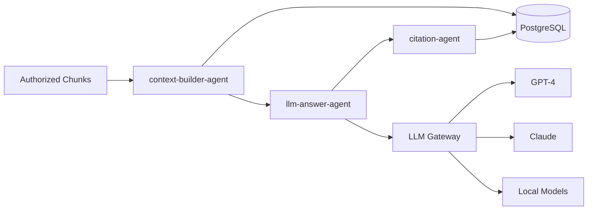

# Generation Domain

**Owner:** LLM & Generation Team  
**Status:** Phase 7 - Planned  
**Agents:** 3

---

## Overview

The Generation domain builds LLM context from authorized chunks, generates cited answers, and validates citations for accuracy and authorization.

---

## Agents in This Domain

### 1. context-builder-agent

**File:** [context-builder-agent.md](./context-builder-agent.md)  
**Status:** 📋 Planned  
**Phase:** 7  
**Responsibilities:** Build final LLM context from authorized chunks  
**Dependencies:** PostgreSQL (chunk text)

### 2. llm-answer-agent

**File:** [llm-answer-agent.md](./llm-answer-agent.md)  
**Status:** 📋 Planned  
**Phase:** 7  
**Responsibilities:** Generate answer strictly from supplied context  
**Dependencies:** LLM Gateway (GPT-4, Claude, etc.)

### 3. citation-agent

**File:** [citation-agent.md](./citation-agent.md)  
**Status:** 📋 Planned  
**Phase:** 7  
**Responsibilities:** Produce and validate citations  
**Dependencies:** PostgreSQL (citation metadata)

---

## Domain Architecture

---

## Integration Points

### Upstream Dependencies

- Authorized chunks (from reranker-agent)
- User query (original)
- User claims (for context filtering)

### Downstream Services

- LLM Gateway (model routing)
- PostgreSQL (citation validation)

### Events Published

- `context.built`
- `answer.generated`
- `citations.validated`

### Events Consumed

- `results.reranked` (from reranker-agent)

---

## Related Documentation

- [LLM Gateway Design](../../decisions/ADR-003-llm-gateway-design.md)
- [Citation Requirements](../../architecture/citation-requirements.md)
- [Prompt Engineering](../../architecture/prompt-engineering.md)
- [Phase 7 Implementation](../../phases/phase-7-answer-generation/README.md)
