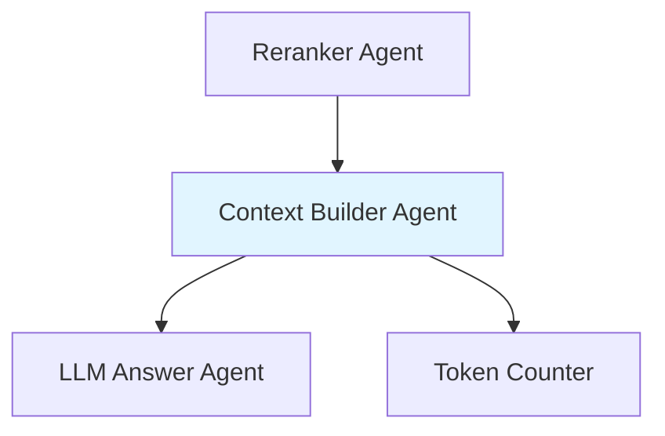
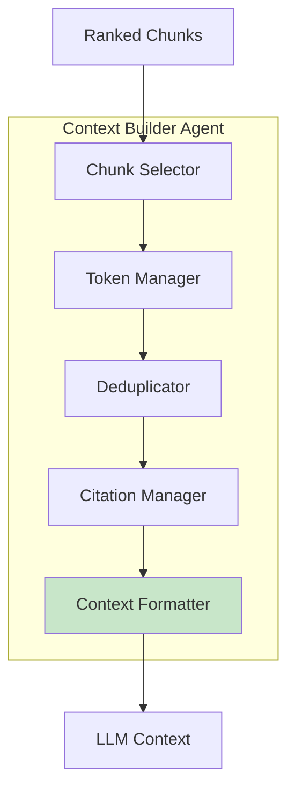

# Context Builder Agent

**Domain:** Generation  
**Version:** 1.0  
**Last Updated:** 2026-05-17  
**Owner:** Generation Team  
**Status:** Specification

---

## Overview

The Context Builder Agent constructs the final LLM context from ranked, authorized chunks, optimizing for token efficiency, citation quality, and answer completeness while respecting LLM context window limits.

### Purpose

- Build optimized LLM context from ranked chunks
- Manage token budget within context window limits
- Preserve citation metadata for every chunk
- Format context for optimal LLM comprehension
- Remove duplicate or redundant information
- Group related chunks by document/section

### Importance

Context building is critical for:
- **Answer Quality:** Well-structured context leads to better answers
- **Token Efficiency:** Maximize information within token limits
- **Citation Integrity:** Preserve source metadata for citations
- **Cost Optimization:** Minimize unnecessary tokens
- **Compliance:** Ensure all context is authorized and traceable

---

## Responsibility

### Primary Responsibilities

1. **Context Assembly**
   - Select top-ranked chunks within token budget
   - Format chunks with citation metadata
   - Group chunks by document/section
   - Remove duplicate content

2. **Token Management**
   - Calculate token counts accurately
   - Respect context window limits
   - Reserve tokens for system prompt and answer
   - Optimize chunk selection for token efficiency

3. **Citation Preservation**
   - Include document title, version, page, section for each chunk
   - Assign citation numbers
   - Maintain chunk-to-citation mapping
   - Preserve source URIs

4. **Context Formatting**
   - Structure context for LLM comprehension
   - Add section separators
   - Include metadata headers
   - Format tables and lists appropriately

5. **Quality Assurance**
   - Verify all chunks are authorized
   - Check for sufficient context
   - Validate citation completeness
   - Detect potential context issues

### Out of Scope

- Chunk retrieval (handled by [`hybrid-retrieval-agent`](../retrieval/hybrid-retrieval-agent.md))
- Chunk ranking (handled by [`reranker-agent`](../retrieval/reranker-agent.md))
- Answer generation (handled by [`llm-answer-agent`](./llm-answer-agent.md))
- Citation validation (handled by [`citation-agent`](./citation-agent.md))

---

## Architecture

### System Context



### Component Architecture



---

## API Contract

### Core Interface

```python
from typing import List, Dict, Any, Optional
from dataclasses import dataclass

@dataclass
class ContextChunk:
    """Chunk with citation metadata for context."""
    chunk_id: str
    document_id: str
    text: str
    citation_number: int
    document_title: str
    document_version: str
    page_start: Optional[int]
    page_end: Optional[int]
    section_title: Optional[str]
    source_uri: str
    token_count: int

@dataclass
class ContextBuildResult:
    """Result from context building."""
    context: str
    chunks: List[ContextChunk]
    total_tokens: int
    citation_map: Dict[int, Dict[str, Any]]
    metadata: Dict[str, Any]

class ContextBuilderAgent:
    """Context Builder Agent interface."""
    
    async def build_context(
        self,
        ranked_chunks: List[RankedChunk],
        query_understanding: QueryUnderstanding,
        max_tokens: int = 4000
    ) -> ContextBuildResult:
        """
        Build LLM context from ranked chunks.
        
        Args:
            ranked_chunks: Chunks ranked by relevance
            query_understanding: Query understanding
            max_tokens: Maximum context tokens
            
        Returns:
            ContextBuildResult with formatted context
        """
        pass
    
    def select_chunks(
        self,
        ranked_chunks: List[RankedChunk],
        max_tokens: int,
        reserve_tokens: int = 500
    ) -> List[RankedChunk]:
        """
        Select chunks within token budget.
        
        Args:
            ranked_chunks: Ranked chunks
            max_tokens: Maximum tokens
            reserve_tokens: Tokens to reserve for prompt/answer
            
        Returns:
            Selected chunks
        """
        pass
    
    def deduplicate_chunks(
        self,
        chunks: List[RankedChunk]
    ) -> List[RankedChunk]:
        """
        Remove duplicate or highly similar chunks.
        
        Args:
            chunks: Chunks to deduplicate
            
        Returns:
            Deduplicated chunks
        """
        pass
    
    def format_context(
        self,
        chunks: List[ContextChunk]
    ) -> str:
        """
        Format chunks into LLM context.
        
        Args:
            chunks: Chunks with citation metadata
            
        Returns:
            Formatted context string
        """
        pass
    
    def count_tokens(
        self,
        text: str,
        model: str = "gpt-4"
    ) -> int:
        """
        Count tokens in text.
        
        Args:
            text: Text to count
            model: Model for tokenization
            
        Returns:
            Token count
        """
        pass
```

---

## Implementation Details

### Context Building Pipeline

```python
import tiktoken
from typing import List

async def build_context(
    self,
    ranked_chunks: List[RankedChunk],
    query_understanding: QueryUnderstanding,
    max_tokens: int = 4000
) -> ContextBuildResult:
    """Build optimized LLM context."""
    
    start_time = time.time()
    
    # Step 1: Select chunks within token budget
    selected_chunks = self.select_chunks(
        ranked_chunks,
        max_tokens,
        reserve_tokens=500  # Reserve for system prompt + answer
    )
    
    if not selected_chunks:
        return ContextBuildResult(
            context="",
            chunks=[],
            total_tokens=0,
            citation_map={},
            metadata={"error": "No chunks selected"}
        )
    
    # Step 2: Deduplicate
    deduplicated_chunks = self.deduplicate_chunks(selected_chunks)
    
    # Step 3: Assign citation numbers
    context_chunks = []
    citation_map = {}
    
    for i, chunk in enumerate(deduplicated_chunks):
        citation_number = i + 1
        
        context_chunk = ContextChunk(
            chunk_id=chunk.chunk_id,
            document_id=chunk.document_id,
            text=chunk.text,
            citation_number=citation_number,
            document_title=chunk.metadata.get("title", "Unknown"),
            document_version=chunk.metadata.get("version", "Unknown"),
            page_start=chunk.metadata.get("page_start"),
            page_end=chunk.metadata.get("page_end"),
            section_title=chunk.metadata.get("section_title"),
            source_uri=chunk.metadata.get("source_uri", ""),
            token_count=self.count_tokens(chunk.text)
        )
        
        context_chunks.append(context_chunk)
        
        citation_map[citation_number] = {
            "chunk_id": chunk.chunk_id,
            "document_id": chunk.document_id,
            "title": context_chunk.document_title,
            "version": context_chunk.document_version,
            "page_start": context_chunk.page_start,
            "page_end": context_chunk.page_end,
            "section_title": context_chunk.section_title,
            "source_uri": context_chunk.source_uri
        }
    
    # Step 4: Format context
    formatted_context = self.format_context(context_chunks)
    
    # Step 5: Calculate final token count
    total_tokens = self.count_tokens(formatted_context)
    
    build_time_ms = (time.time() - start_time) * 1000
    
    logger.info(
        "context_built",
        input_chunks=len(ranked_chunks),
        selected_chunks=len(selected_chunks),
        deduplicated_chunks=len(deduplicated_chunks),
        total_tokens=total_tokens,
        build_time_ms=build_time_ms
    )
    
    return ContextBuildResult(
        context=formatted_context,
        chunks=context_chunks,
        total_tokens=total_tokens,
        citation_map=citation_map,
        metadata={
            "query": query_understanding.original_query,
            "intent": query_understanding.intent.value,
            "input_chunks": len(ranked_chunks),
            "selected_chunks": len(context_chunks),
            "build_time_ms": build_time_ms
        }
    )
```

### Chunk Selection

```python
def select_chunks(
    self,
    ranked_chunks: List[RankedChunk],
    max_tokens: int,
    reserve_tokens: int = 500
) -> List[RankedChunk]:
    """Select chunks within token budget."""
    
    available_tokens = max_tokens - reserve_tokens
    selected_chunks = []
    current_tokens = 0
    
    for chunk in ranked_chunks:
        # Estimate tokens (with citation metadata overhead)
        chunk_tokens = self.count_tokens(chunk.text)
        metadata_overhead = 50  # Approximate overhead for citation formatting
        total_chunk_tokens = chunk_tokens + metadata_overhead
        
        if current_tokens + total_chunk_tokens <= available_tokens:
            selected_chunks.append(chunk)
            current_tokens += total_chunk_tokens
        else:
            # Check if we can fit a partial chunk
            remaining_tokens = available_tokens - current_tokens
            if remaining_tokens > 200:  # Minimum useful chunk size
                # Truncate chunk to fit
                truncated_text = self.truncate_to_tokens(
                    chunk.text,
                    remaining_tokens - metadata_overhead
                )
                truncated_chunk = RankedChunk(
                    chunk_id=chunk.chunk_id,
                    document_id=chunk.document_id,
                    text=truncated_text + "...",
                    final_score=chunk.final_score,
                    rank=chunk.rank,
                    signals=chunk.signals,
                    metadata=chunk.metadata
                )
                selected_chunks.append(truncated_chunk)
            break
    
    logger.debug(
        "chunks_selected",
        input_count=len(ranked_chunks),
        selected_count=len(selected_chunks),
        total_tokens=current_tokens,
        available_tokens=available_tokens
    )
    
    return selected_chunks
```

### Deduplication

```python
from difflib import SequenceMatcher

def deduplicate_chunks(
    self,
    chunks: List[RankedChunk]
) -> List[RankedChunk]:
    """Remove duplicate or highly similar chunks."""
    
    if len(chunks) <= 1:
        return chunks
    
    deduplicated = []
    seen_texts = []
    
    for chunk in chunks:
        # Check for exact duplicates
        if chunk.text in seen_texts:
            logger.debug("exact_duplicate_removed", chunk_id=chunk.chunk_id)
            continue
        
        # Check for high similarity (>90%)
        is_similar = False
        for seen_text in seen_texts:
            similarity = SequenceMatcher(None, chunk.text, seen_text).ratio()
            if similarity > 0.9:
                logger.debug(
                    "similar_chunk_removed",
                    chunk_id=chunk.chunk_id,
                    similarity=similarity
                )
                is_similar = True
                break
        
        if not is_similar:
            deduplicated.append(chunk)
            seen_texts.append(chunk.text)
    
    logger.info(
        "deduplication_complete",
        input_count=len(chunks),
        output_count=len(deduplicated),
        removed_count=len(chunks) - len(deduplicated)
    )
    
    return deduplicated
```

### Context Formatting

```python
def format_context(
    self,
    chunks: List[ContextChunk]
) -> str:
    """Format chunks into LLM context."""
    
    context_parts = []
    
    # Group chunks by document
    chunks_by_doc = {}
    for chunk in chunks:
        doc_key = f"{chunk.document_id}_{chunk.document_version}"
        if doc_key not in chunks_by_doc:
            chunks_by_doc[doc_key] = []
        chunks_by_doc[doc_key].append(chunk)
    
    # Format each document group
    for doc_key, doc_chunks in chunks_by_doc.items():
        # Sort by page number if available
        doc_chunks.sort(key=lambda c: c.page_start or 0)
        
        for chunk in doc_chunks:
            # Build citation header
            citation_parts = [
                f"[Source {chunk.citation_number}]",
                f"Document: {chunk.document_title}",
                f"Version: {chunk.document_version}"
            ]
            
            if chunk.page_start is not None:
                if chunk.page_end and chunk.page_end != chunk.page_start:
                    citation_parts.append(f"Pages: {chunk.page_start}-{chunk.page_end}")
                else:
                    citation_parts.append(f"Page: {chunk.page_start}")
            
            if chunk.section_title:
                citation_parts.append(f"Section: {chunk.section_title}")
            
            citation_parts.append(f"Chunk ID: {chunk.chunk_id}")
            
            # Format chunk
            chunk_text = "\n".join(citation_parts) + "\n\n" + chunk.text
            context_parts.append(chunk_text)
    
    # Join with separators
    context = "\n\n---\n\n".join(context_parts)
    
    return context
```

### Token Counting

```python
def count_tokens(
    self,
    text: str,
    model: str = "gpt-4"
) -> int:
    """Count tokens using tiktoken."""
    
    try:
        encoding = tiktoken.encoding_for_model(model)
        tokens = encoding.encode(text)
        return len(tokens)
    except Exception as e:
        logger.warning(f"Token counting failed: {e}, using estimate")
        # Fallback: rough estimate (1 token ≈ 4 characters)
        return len(text) // 4

def truncate_to_tokens(
    self,
    text: str,
    max_tokens: int,
    model: str = "gpt-4"
) -> str:
    """Truncate text to fit within token limit."""
    
    try:
        encoding = tiktoken.encoding_for_model(model)
        tokens = encoding.encode(text)
        
        if len(tokens) <= max_tokens:
            return text
        
        truncated_tokens = tokens[:max_tokens]
        return encoding.decode(truncated_tokens)
    except Exception as e:
        logger.warning(f"Token truncation failed: {e}, using character estimate")
        # Fallback: character-based truncation
        max_chars = max_tokens * 4
        return text[:max_chars]
```

---

## Testing Requirements

### Unit Tests

```python
def test_chunk_selection():
    """Test chunk selection within token budget."""
    agent = ContextBuilderAgent()
    
    chunks = [
        RankedChunk(chunk_id=f"chunk_{i}", text="x" * 100, ...) 
        for i in range(10)
    ]
    
    selected = agent.select_chunks(chunks, max_tokens=1000, reserve_tokens=200)
    
    # Should select chunks within budget
    total_tokens = sum(agent.count_tokens(c.text) for c in selected)
    assert total_tokens <= 800  # 1000 - 200 reserve

def test_deduplication():
    """Test duplicate removal."""
    agent = ContextBuilderAgent()
    
    chunks = [
        RankedChunk(chunk_id="chunk_1", text="This is a test", ...),
        RankedChunk(chunk_id="chunk_2", text="This is a test", ...),  # Exact duplicate
        RankedChunk(chunk_id="chunk_3", text="This is different", ...)
    ]
    
    deduplicated = agent.deduplicate_chunks(chunks)
    
    assert len(deduplicated) == 2
    assert deduplicated[0].chunk_id == "chunk_1"
    assert deduplicated[1].chunk_id == "chunk_3"

def test_context_formatting():
    """Test context formatting."""
    agent = ContextBuilderAgent()
    
    chunks = [
        ContextChunk(
            chunk_id="chunk_1",
            document_id="doc_1",
            text="Test content",
            citation_number=1,
            document_title="Test Doc",
            document_version="v1.0",
            page_start=5,
            page_end=5,
            section_title="Introduction",
            source_uri="s3://...",
            token_count=10
        )
    ]
    
    context = agent.format_context(chunks)
    
    assert "[Source 1]" in context
    assert "Document: Test Doc" in context
    assert "Version: v1.0" in context
    assert "Page: 5" in context
    assert "Section: Introduction" in context
    assert "Test content" in context

def test_token_counting():
    """Test token counting accuracy."""
    agent = ContextBuilderAgent()
    
    text = "This is a test sentence."
    count = agent.count_tokens(text)
    
    # Should return reasonable token count
    assert count > 0
    assert count < len(text)  # Tokens < characters
```

### Integration Tests

```python
async def test_end_to_end_context_building():
    """Test complete context building pipeline."""
    agent = ContextBuilderAgent()
    
    ranked_chunks = [
        RankedChunk(
            chunk_id=f"chunk_{i}",
            document_id=f"doc_{i}",
            text=f"Content for chunk {i}" * 20,
            final_score=1.0 - (i * 0.1),
            rank=i + 1,
            signals=RankingSignals(...),
            metadata={
                "title": f"Document {i}",
                "version": "v1.0",
                "page_start": i + 1,
                "section_title": f"Section {i}"
            }
        )
        for i in range(10)
    ]
    
    query_understanding = QueryUnderstanding(...)
    
    result = await agent.build_context(
        ranked_chunks,
        query_understanding,
        max_tokens=2000
    )
    
    assert len(result.context) > 0
    assert len(result.chunks) > 0
    assert result.total_tokens <= 2000
    assert len(result.citation_map) == len(result.chunks)
    
    # Verify citation numbers are sequential
    for i, chunk in enumerate(result.chunks):
        assert chunk.citation_number == i + 1

async def test_insufficient_tokens():
    """Test handling of insufficient token budget."""
    agent = ContextBuilderAgent()
    
    large_chunks = [
        RankedChunk(chunk_id="chunk_1", text="x" * 10000, ...)
    ]
    
    result = await agent.build_context(
        large_chunks,
        QueryUnderstanding(...),
        max_tokens=500
    )
    
    # Should truncate or select partial content
    assert result.total_tokens <= 500
```

---

## Configuration

### Environment Variables

```bash
# Token Management
MAX_CONTEXT_TOKENS=4000
RESERVE_TOKENS=500
MIN_CHUNK_TOKENS=50

# Deduplication
SIMILARITY_THRESHOLD=0.9

# Formatting
INCLUDE_CHUNK_IDS=true
INCLUDE_SOURCE_URIS=true
```

### Configuration File

```yaml
# config/context_builder.yaml

context_builder:
  # Token management
  tokens:
    max_context: 4000
    reserve: 500
    min_chunk: 50
    metadata_overhead: 50
  
  # Deduplication
  deduplication:
    enabled: true
    similarity_threshold: 0.9
    exact_match_only: false
  
  # Formatting
  formatting:
    include_chunk_ids: true
    include_source_uris: true
    group_by_document: true
    sort_by_page: true
    separator: "\n\n---\n\n"
```

---

## Dependencies

### Upstream Dependencies

- **[`reranker-agent`](../retrieval/reranker-agent.md):** Provides ranked chunks

### Downstream Dependencies

- **[`llm-answer-agent`](./llm-answer-agent.md):** Receives formatted context
- **[`citation-agent`](./citation-agent.md):** Uses citation map

### External Dependencies

```python
# requirements.txt
tiktoken>=0.5.0
pydantic>=2.0.0
```

---

## Monitoring & Observability

### Metrics

```python
# Prometheus metrics
context_building_requests_total = Counter(
    "context_building_requests_total",
    "Total context building requests"
)

context_building_duration_seconds = Histogram(
    "context_building_duration_seconds",
    "Context building duration"
)

context_tokens_total = Histogram(
    "context_tokens_total",
    "Total context tokens"
)

context_chunks_selected = Histogram(
    "context_chunks_selected",
    "Number of chunks selected for context"
)

context_deduplication_rate = Histogram(
    "context_deduplication_rate",
    "Deduplication rate (removed / input)"
)
```

### Logging

```python
import structlog

logger = structlog.get_logger()

logger.info(
    "context_built",
    input_chunks=len(ranked_chunks),
    selected_chunks=len(selected_chunks),
    deduplicated_chunks=len(deduplicated_chunks),
    total_tokens=total_tokens,
    build_time_ms=build_time_ms
)
```

---

## Related Documentation

- [AGENTS.md](../../AGENTS.md) - Master agent index
- [ARCHITECTURE.md](../../ARCHITECTURE.md) - System architecture
- [reranker-agent.md](../retrieval/reranker-agent.md) - Chunk reranking
- [llm-answer-agent.md](./llm-answer-agent.md) - Answer generation
- [citation-agent.md](./citation-agent.md) - Citation validation

---

**Version History:**
- 1.0 (2026-05-17): Initial specification