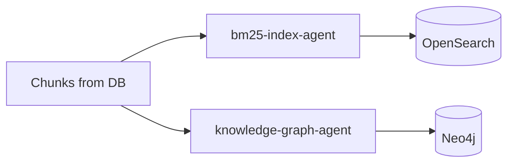

# Indexing Domain

**Owner:** Search Infrastructure Team  
**Status:** Phase 4-5 - Planned  
**Agents:** 2

---

## Overview

The Indexing domain creates searchable indexes for keyword search (BM25) and relationship-based retrieval (Knowledge Graph). These complement vector search for hybrid retrieval.

---

## Agents in This Domain

### 1. bm25-index-agent

**File:** [bm25-index-agent.md](./bm25-index-agent.md)  
**Status:** 📋 Planned  
**Phase:** 4  
**Responsibilities:** Index chunks into BM25/OpenSearch for keyword retrieval  
**Dependencies:** OpenSearch 2.11+

### 2. knowledge-graph-agent

**File:** [knowledge-graph-agent.md](./knowledge-graph-agent.md)  
**Status:** 📋 Planned  
**Phase:** 5  
**Responsibilities:** Extract entities/relationships, write to graph DB  
**Dependencies:** Neo4j 5.x, spaCy

---

## Domain Architecture

---

## Integration Points

### Upstream Dependencies

- PostgreSQL (chunk data)
- chunking-agent (chunk creation events)

### Downstream Services

- OpenSearch (keyword index)
- Neo4j (knowledge graph)

### Events Published

- `chunk.indexed` (BM25)
- `entities.extracted` (KG)
- `relationships.created` (KG)

### Events Consumed

- `chunks.created` (from chunking-agent)
- `document.updated` (for re-indexing)

---

## Related Documentation

- [BM25 Strategy](../../architecture/bm25-strategy.md)
- [Knowledge Graph Scope](../../decisions/ADR-007-knowledge-graph-scope.md)
- [Phase 4-5 Implementation](../../phases/)
