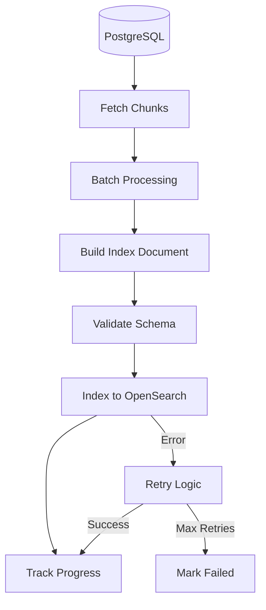

# bm25-index-agent

**Domain:** Indexing  
**Status:** 📋 Planned  
**Phase:** 4 - BM25 Retrieval  
**Owner:** Search Team  
**Implementation Week:** Weeks 10-12

---

## Overview

The `bm25-index-agent` indexes chunk text into OpenSearch for keyword-based retrieval using the BM25 algorithm. It enables exact term matching, phrase search, and keyword-based retrieval that complements semantic vector search.

BM25 excels at finding exact matches for policy codes, error messages, clause numbers, and specific terminology where semantic search may be less precise.

---

## Responsibility

### Primary Responsibilities

- Index chunk text into OpenSearch/Elasticsearch
- Index metadata filters for access control
- Support exact term search
- Support phrase search
- Support fuzzy search
- Handle document version updates
- Remove deleted chunks
- Maintain tenant-specific indexes
- Optimize index performance
- Support reindexing operations

---

## Architecture

### Indexing Pipeline



### Index Strategy

**High-Isolation Deployment:**

- Separate index per tenant: `enterprise_chunks_{tenant_id}`

**Standard Deployment:**

- Shared index with tenant filtering: `enterprise_chunks`
- All queries must include `tenant_id` filter

---

## API Contract

### Indexing Operations

```python
def index_chunk(chunk: Chunk) -> bool:
    """
    Index a single chunk into OpenSearch.

    Args:
        chunk: Chunk to index

    Returns:
        Success status
    """
    pass

def index_batch(chunks: List[Chunk], batch_size: int = 500) -> Dict[str, int]:
    """
    Index multiple chunks efficiently.

    Args:
        chunks: List of chunks to index
        batch_size: Number of chunks per batch

    Returns:
        Dictionary with success/failure counts
    """
    pass

def delete_chunks(chunk_ids: List[UUID]) -> bool:
    """
    Delete chunks from index.

    Args:
        chunk_ids: List of chunk IDs to delete

    Returns:
        Success status
    """
    pass

def update_chunk(chunk_id: UUID, updates: Dict[str, Any]) -> bool:
    """
    Update chunk metadata in index.

    Args:
        chunk_id: Chunk identifier
        updates: Fields to update

    Returns:
        Success status
    """
    pass
```

### Search Operations

```python
def search_bm25(
    query: str,
    filters: Dict[str, Any],
    top_k: int = 30,
    min_score: float = 0.0
) -> List[SearchResult]:
    """
    Search using BM25 algorithm.

    Args:
        query: Search query
        filters: Metadata filters (tenant_id, classification, etc.)
        top_k: Number of results to return
        min_score: Minimum relevance score

    Returns:
        List of search results with scores
    """
    pass

def phrase_search(
    phrase: str,
    filters: Dict[str, Any],
    top_k: int = 30
) -> List[SearchResult]:
    """
    Search for exact phrase match.

    Args:
        phrase: Exact phrase to search
        filters: Metadata filters
        top_k: Number of results

    Returns:
        List of search results
    """
    pass

def fuzzy_search(
    query: str,
    filters: Dict[str, Any],
    fuzziness: str = "AUTO",
    top_k: int = 30
) -> List[SearchResult]:
    """
    Search with fuzzy matching for typos.

    Args:
        query: Search query
        filters: Metadata filters
        fuzziness: Fuzziness level ("AUTO", "0", "1", "2")
        top_k: Number of results

    Returns:
        List of search results
    """
    pass
```

### Index Management

```python
def create_index(index_name: str, settings: Dict[str, Any]) -> bool:
    """Create new index with settings."""
    pass

def delete_index(index_name: str) -> bool:
    """Delete index."""
    pass

def reindex(source_index: str, dest_index: str) -> bool:
    """Reindex from source to destination."""
    pass

def get_index_stats(index_name: str) -> Dict[str, Any]:
    """Get index statistics."""
    pass
```

---

## Data Models

### BM25 Index Document

```python
@dataclass
class BM25Document:
    chunk_id: str  # UUID as string
    document_id: str  # UUID as string
    tenant_id: str
    text: str  # Chunk text for search
    title: str
    section_title: Optional[str]
    classification: str
    department: Optional[str]
    region: Optional[str]
    language: str
    page_start: Optional[int]
    page_end: Optional[int]
    version: str
    status: str
    allowed_departments: List[str]
    allowed_groups: List[str]
    allowed_roles: List[str]
    indexed_at: str  # ISO 8601 timestamp
```

### Example Document

```json
{
  "chunk_id": "chunk_001",
  "document_id": "doc_001",
  "tenant_id": "global-company",
  "text": "Employees must submit expenses within 14 days of travel completion. Claims must include original receipts for all expenses over $25. Policy code: FIN-204.",
  "title": "Travel Policy",
  "section_title": "Expense Claims",
  "classification": "INTERNAL_GENERAL",
  "department": "Finance",
  "region": "global",
  "language": "en",
  "page_start": 8,
  "page_end": 8,
  "version": "v3.2",
  "status": "active",
  "allowed_departments": ["Finance", "HR"],
  "allowed_groups": ["internal-users"],
  "allowed_roles": ["employee"],
  "indexed_at": "2024-03-20T10:30:00Z"
}
```

### SearchResult

```python
@dataclass
class SearchResult:
    chunk_id: UUID
    document_id: UUID
    score: float
    text: str
    highlights: List[str]
    metadata: Dict[str, Any]
```

---

## OpenSearch Index Configuration

### Index Settings

```json
{
  "settings": {
    "number_of_shards": 3,
    "number_of_replicas": 1,
    "analysis": {
      "analyzer": {
        "default": {
          "type": "standard",
          "stopwords": "_english_"
        },
        "exact_analyzer": {
          "type": "keyword"
        },
        "code_analyzer": {
          "type": "pattern",
          "pattern": "[\\W&&[^-]]",
          "lowercase": true
        }
      }
    },
    "index": {
      "max_result_window": 10000,
      "refresh_interval": "1s"
    }
  },
  "mappings": {
    "properties": {
      "chunk_id": { "type": "keyword" },
      "document_id": { "type": "keyword" },
      "tenant_id": { "type": "keyword" },
      "text": {
        "type": "text",
        "analyzer": "standard",
        "fields": {
          "exact": { "type": "keyword" },
          "code": { "type": "text", "analyzer": "code_analyzer" }
        }
      },
      "title": { "type": "text" },
      "section_title": { "type": "text" },
      "classification": { "type": "keyword" },
      "department": { "type": "keyword" },
      "region": { "type": "keyword" },
      "language": { "type": "keyword" },
      "page_start": { "type": "integer" },
      "page_end": { "type": "integer" },
      "version": { "type": "keyword" },
      "status": { "type": "keyword" },
      "allowed_departments": { "type": "keyword" },
      "allowed_groups": { "type": "keyword" },
      "allowed_roles": { "type": "keyword" },
      "indexed_at": { "type": "date" }
    }
  }
}
```

---

## Search Query Examples

### Basic BM25 Search

```python
def search_bm25(query: str, filters: Dict[str, Any], top_k: int = 30):
    """Basic BM25 search with filters."""

    search_query = {
        "query": {
            "bool": {
                "must": [
                    {
                        "multi_match": {
                            "query": query,
                            "fields": ["text^2", "title", "section_title"],
                            "type": "best_fields"
                        }
                    }
                ],
                "filter": [
                    {"term": {"tenant_id": filters["tenant_id"]}},
                    {"term": {"status": "active"}}
                ]
            }
        },
        "size": top_k,
        "highlight": {
            "fields": {
                "text": {
                    "fragment_size": 150,
                    "number_of_fragments": 3
                }
            }
        }
    }

    # Add optional filters
    if "classification" in filters:
        search_query["query"]["bool"]["filter"].append(
            {"term": {"classification": filters["classification"]}}
        )

    if "department" in filters:
        search_query["query"]["bool"]["filter"].append(
            {"term": {"department": filters["department"]}}
        )

    return opensearch_client.search(
        index=get_index_name(filters["tenant_id"]),
        body=search_query
    )
```

### Phrase Search

```python
def phrase_search(phrase: str, filters: Dict[str, Any], top_k: int = 30):
    """Exact phrase search."""

    search_query = {
        "query": {
            "bool": {
                "must": [
                    {
                        "match_phrase": {
                            "text": phrase
                        }
                    }
                ],
                "filter": [
                    {"term": {"tenant_id": filters["tenant_id"]}},
                    {"term": {"status": "active"}}
                ]
            }
        },
        "size": top_k
    }

    return opensearch_client.search(
        index=get_index_name(filters["tenant_id"]),
        body=search_query
    )
```

### Code/Policy ID Search

```python
def search_policy_code(code: str, filters: Dict[str, Any]):
    """Search for exact policy code or error code."""

    search_query = {
        "query": {
            "bool": {
                "must": [
                    {
                        "match": {
                            "text.code": code
                        }
                    }
                ],
                "filter": [
                    {"term": {"tenant_id": filters["tenant_id"]}},
                    {"term": {"status": "active"}}
                ]
            }
        },
        "size": 10
    }

    return opensearch_client.search(
        index=get_index_name(filters["tenant_id"]),
        body=search_query
    )
```

---

## Batch Indexing

### Bulk Indexing Strategy

```python
def index_batch(chunks: List[Chunk], batch_size: int = 500):
    """Bulk index chunks for efficiency."""

    success_count = 0
    failure_count = 0

    for i in range(0, len(chunks), batch_size):
        batch = chunks[i:i + batch_size]

        # Build bulk request
        bulk_body = []
        for chunk in batch:
            # Index action
            bulk_body.append({
                "index": {
                    "_index": get_index_name(chunk.tenant_id),
                    "_id": str(chunk.chunk_id)
                }
            })
            # Document
            bulk_body.append(build_index_document(chunk))

        try:
            response = opensearch_client.bulk(body=bulk_body)

            # Count successes and failures
            for item in response["items"]:
                if item["index"]["status"] in [200, 201]:
                    success_count += 1
                else:
                    failure_count += 1
                    logger.error("Indexing failed", extra={
                        "chunk_id": item["index"]["_id"],
                        "error": item["index"].get("error")
                    })

        except Exception as e:
            logger.error("Bulk indexing failed", extra={
                "batch_start": i,
                "batch_size": len(batch),
                "error": str(e)
            })
            failure_count += len(batch)

    return {
        "success": success_count,
        "failure": failure_count
    }
```

---

## Testing Requirements

### Unit Tests

**Test Coverage Target:** >80%

#### Search Tests

- ✅ Exact term query returns matching chunk
- ✅ Phrase query returns exact phrase match
- ✅ Fuzzy search handles typos
- ✅ Metadata filters are applied correctly
- ✅ Multi-field search works

#### Indexing Tests

- ✅ Index chunk successfully
- ✅ Update chunk metadata
- ✅ Delete chunk from index
- ✅ Bulk indexing handles large batches

#### Filter Tests

- ✅ Tenant filter prevents cross-tenant results
- ✅ Classification filter works
- ✅ Department filter works
- ✅ Status filter excludes deleted/archived

### Integration Tests

- ✅ Search by policy code (e.g., `FIN-204`) returns correct chunk
- ✅ Search excludes archived/deleted chunks
- ✅ Department filter prevents cross-department leakage
- ✅ Phrase search finds exact matches
- ✅ Reindex operation completes successfully

### Relevance Tests

- ✅ BM25 outperforms vector search for exact error codes
- ✅ BM25 outperforms vector search for policy IDs
- ✅ BM25 outperforms vector search for clause numbers
- ✅ BM25 finds acronyms accurately

### Performance Tests

- ✅ Index 10,000 chunks in <5 minutes
- ✅ Search query completes in <50ms
- ✅ Bulk indexing achieves >1000 docs/second
- ✅ Index size is reasonable (<2x text size)

---

## Error Handling

### Error Types

```python
class IndexingError(Exception):
    """Base indexing error."""
    pass

class OpenSearchConnectionError(IndexingError):
    """Cannot connect to OpenSearch."""
    pass

class IndexNotFoundError(IndexingError):
    """Index does not exist."""
    pass

class BulkIndexingError(IndexingError):
    """Bulk indexing operation failed."""
    pass
```

### Retry Strategy

```python
MAX_RETRIES = 3
RETRY_DELAY = [1, 5, 15]

def retry_index_chunk(chunk: Chunk):
    for attempt in range(MAX_RETRIES):
        try:
            index_chunk(chunk)
            return
        except Exception as e:
            if attempt == MAX_RETRIES - 1:
                logger.error("Max retries exceeded", extra={
                    "chunk_id": chunk.chunk_id,
                    "error": str(e)
                })
                raise
            time.sleep(RETRY_DELAY[attempt])
```

---

## Configuration

### Environment Variables

```bash
# OpenSearch
OPENSEARCH_URL=https://localhost:9200
OPENSEARCH_USERNAME=admin
OPENSEARCH_PASSWORD=...
OPENSEARCH_VERIFY_CERTS=true

# Indexing
INDEX_BATCH_SIZE=500
INDEX_REFRESH_INTERVAL=1s
INDEX_REPLICAS=1
INDEX_SHARDS=3

# Performance
INDEXING_WORKERS=4
MAX_RESULT_WINDOW=10000
```

---

## Index Lifecycle Management

### Index Rotation

For large-scale deployments, implement index rotation:

```text
enterprise_chunks_2024_01
enterprise_chunks_2024_02
enterprise_chunks_2024_03
```

### Reindexing Strategy

When schema changes:

1. Create new index with updated mapping
2. Reindex from old to new
3. Validate new index
4. Switch alias to new index
5. Delete old index after retention period

---

## Dependencies

### Upstream Dependencies

- [`canonical-db-agent`](../infrastructure/canonical-db-agent.md) - Provides chunks
- [`chunking-agent`](../ingestion/chunking-agent.md) - Creates chunks
- OpenSearch/Elasticsearch cluster

### Downstream Consumers

- [`hybrid-retrieval-agent`](../retrieval/hybrid-retrieval-agent.md) - Queries BM25 index

---

## Monitoring & Observability

### Metrics

```python
# Indexing metrics
bm25_index_chunks_indexed_total
bm25_index_indexing_duration_seconds
bm25_index_indexing_errors_total

# Search metrics
bm25_index_searches_total
bm25_index_search_duration_seconds
bm25_index_search_results_count

# Index metrics
bm25_index_size_bytes
bm25_index_document_count
```

---

## Related Documentation

- [System Architecture](../../ARCHITECTURE.md)
- [Phase 4 Implementation](../../phases/phase-4-bm25-retrieval/README.md)
- [Hybrid Retrieval Strategy](../../decisions/ADR-004-hybrid-retrieval-strategy.md)

---

**Status:** 📋 Ready for Implementation  
**Next Steps:** Begin Week 10 implementation with OpenSearch cluster setup and index configuration.
