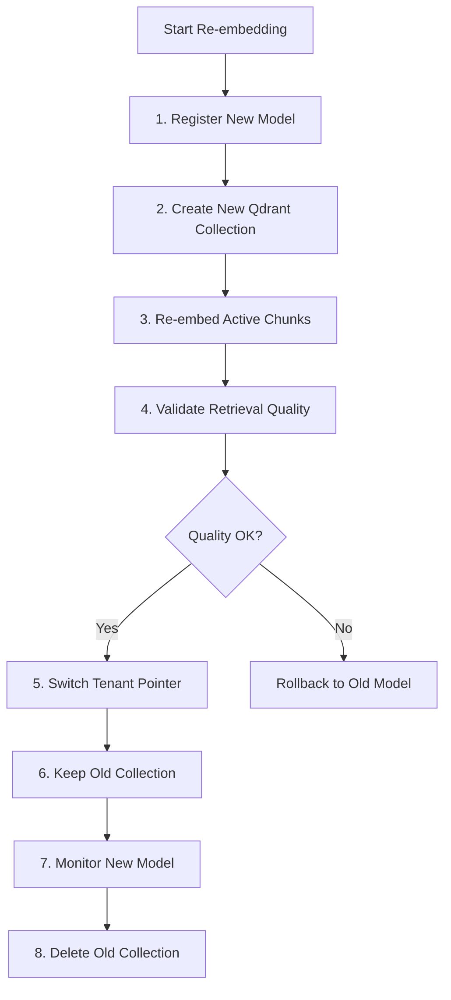
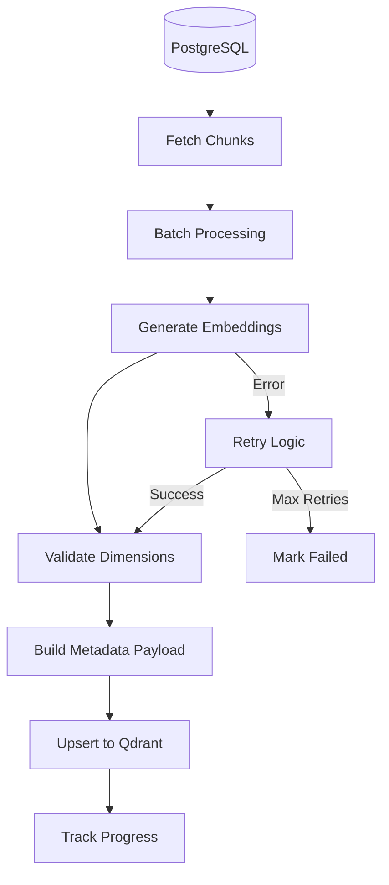

# embedding-agent

**Domain:** Indexing  
**Status:** 📋 Planned  
**Phase:** 3 - Vector Retrieval  
**Owner:** ML/AI Team  
**Implementation Week:** Weeks 7-9

---

## Overview

The `embedding-agent` generates dense vector embeddings from text chunks and writes them to Qdrant for semantic search. It serves as the foundation for semantic retrieval, enabling the system to find conceptually similar content even when exact keywords don't match.

This agent is **critical for retrieval quality** - high-quality embeddings enable accurate semantic search.

---

## Responsibility

### Primary Responsibilities

- Read chunks from PostgreSQL via [`canonical-db-agent`](../infrastructure/canonical-db-agent.md)
- Generate embeddings using configured model
- Upsert vectors into Qdrant with metadata payload
- Store embedding model metadata in PostgreSQL
- Support blue-green re-embedding when model changes
- Handle embedding failures and retries
- Support deletion and archival sync
- Track embedding progress and status
- Batch process chunks for efficiency

---

## Embedding Model Strategy

### Default Model

**Primary:** OpenAI `text-embedding-3-large` (1536 dimensions)

### Model Agnostic Architecture

The platform must be **embedding-model agnostic**. Embedding model details must be stored in PostgreSQL:

```python
@dataclass
class EmbeddingModel:
    model_id: UUID
    provider: str  # "openai", "cohere", "local"
    model_name: str  # "text-embedding-3-large"
    dimension: int  # 1536
    distance_metric: str  # "cosine", "euclidean", "dot_product"
    version: str  # "v1.0"
    status: str  # "active", "deprecated", "archived"
    created_at: datetime
```

### Supported Models

| Provider | Model                  | Dimensions | Use Case                 |
| -------- | ---------------------- | ---------- | ------------------------ |
| OpenAI   | text-embedding-3-large | 1536       | Primary (high quality)   |
| OpenAI   | text-embedding-3-small | 1536       | Cost-sensitive           |
| Cohere   | embed-v3               | 1024       | Fallback provider        |
| Local    | BGE-large              | 1024       | On-premises/confidential |
| Local    | E5-large               | 1024       | On-premises/confidential |

---

## Blue-Green Re-embedding Strategy

When changing embedding models, use **blue-green deployment** to avoid downtime:

### Re-embedding Process



### Steps

1. **Register new model** in PostgreSQL
2. **Create new Qdrant collection** with naming: `enterprise_chunks_{tenant_id}_{model_version}`
3. **Re-embed all active chunks** using new model
4. **Validate retrieval quality** using golden evaluation set
5. **Switch tenant active collection pointer** in configuration
6. **Keep previous collection** for rollback (retention: 7 days)
7. **Monitor new model** performance for 24-48 hours
8. **Delete old collection** after retention window

### Rollback Strategy

If new model underperforms:

1. Switch tenant pointer back to old collection
2. Mark new model as "deprecated"
3. Delete new collection
4. Investigate quality issues

---

## Architecture

### Embedding Pipeline



---

## API Contract

### Embedding Operations

```python
def embed_chunk(chunk: Chunk, model: EmbeddingModel) -> np.ndarray:
    """
    Generate embedding for a single chunk.

    Args:
        chunk: Chunk to embed
        model: Embedding model to use

    Returns:
        Embedding vector as numpy array
    """
    pass

def embed_batch(
    chunks: List[Chunk],
    model: EmbeddingModel,
    batch_size: int = 100
) -> List[np.ndarray]:
    """
    Generate embeddings for multiple chunks efficiently.

    Args:
        chunks: List of chunks to embed
        model: Embedding model to use
        batch_size: Number of chunks per batch

    Returns:
        List of embedding vectors
    """
    pass

def upsert_qdrant(
    chunk_id: UUID,
    embedding: np.ndarray,
    payload: Dict[str, Any],
    collection_name: str
) -> bool:
    """
    Upsert vector and payload into Qdrant.

    Args:
        chunk_id: Chunk identifier
        embedding: Embedding vector
        payload: Metadata payload
        collection_name: Qdrant collection name

    Returns:
        Success status
    """
    pass

def remove_qdrant_points(
    chunk_ids: List[UUID],
    collection_name: str
) -> bool:
    """
    Remove vectors from Qdrant.

    Args:
        chunk_ids: List of chunk IDs to remove
        collection_name: Qdrant collection name

    Returns:
        Success status
    """
    pass
```

### Model Management

```python
def register_embedding_model(
    provider: str,
    model_name: str,
    dimension: int,
    distance_metric: str = "cosine"
) -> UUID:
    """Register new embedding model in PostgreSQL."""
    pass

def get_active_model(tenant_id: str) -> EmbeddingModel:
    """Get active embedding model for tenant."""
    pass

def create_qdrant_collection(
    tenant_id: str,
    model: EmbeddingModel
) -> str:
    """
    Create new Qdrant collection for tenant and model.

    Returns:
        Collection name
    """
    pass
```

---

## Data Models

### Qdrant Payload

```python
@dataclass
class QdrantPayload:
    tenant_id: str
    document_id: UUID
    chunk_id: UUID
    title: str
    classification: str
    department: Optional[str]
    region: Optional[str]
    language: str
    page_start: Optional[int]
    page_end: Optional[int]
    section_title: Optional[str]
    version: str
    status: str
    allowed_departments: List[str]
    allowed_groups: List[str]
    allowed_roles: List[str]
    embedding_model_id: UUID
    embedded_at: str  # ISO 8601 timestamp
```

### Example Payload

```json
{
  "tenant_id": "global-company",
  "document_id": "doc_001",
  "chunk_id": "chunk_001",
  "title": "Travel Policy",
  "classification": "INTERNAL_GENERAL",
  "department": "Finance",
  "region": "global",
  "language": "en",
  "page_start": 8,
  "page_end": 8,
  "section_title": "Expense Claims",
  "version": "v3.2",
  "status": "active",
  "allowed_departments": ["Finance", "HR"],
  "allowed_groups": ["internal-users"],
  "allowed_roles": ["employee"],
  "embedding_model_id": "model_001",
  "embedded_at": "2024-03-20T10:30:00Z"
}
```

---

## Qdrant Collection Configuration

### Collection Naming

```text
enterprise_chunks_{tenant_id}_{embedding_model_version}
```

Examples:

- `enterprise_chunks_global-company_openai-3-large-v1`
- `enterprise_chunks_acme-corp_cohere-v3`

### Collection Schema

```python
from qdrant_client import QdrantClient
from qdrant_client.models import Distance, VectorParams

def create_collection(
    client: QdrantClient,
    collection_name: str,
    dimension: int,
    distance: Distance = Distance.COSINE
):
    client.create_collection(
        collection_name=collection_name,
        vectors_config=VectorParams(
            size=dimension,
            distance=distance
        )
    )

    # Create payload indexes for filtering
    client.create_payload_index(
        collection_name=collection_name,
        field_name="tenant_id",
        field_schema="keyword"
    )

    client.create_payload_index(
        collection_name=collection_name,
        field_name="classification",
        field_schema="keyword"
    )

    client.create_payload_index(
        collection_name=collection_name,
        field_name="department",
        field_schema="keyword"
    )

    client.create_payload_index(
        collection_name=collection_name,
        field_name="status",
        field_schema="keyword"
    )
```

---

## Embedding Providers

### OpenAI Provider

```python
class OpenAIEmbeddingProvider:
    def __init__(self, api_key: str, model: str = "text-embedding-3-large"):
        self.client = OpenAI(api_key=api_key)
        self.model = model

    def embed(self, texts: List[str]) -> List[np.ndarray]:
        """Generate embeddings using OpenAI API."""
        response = self.client.embeddings.create(
            input=texts,
            model=self.model
        )
        return [np.array(item.embedding) for item in response.data]

    def get_dimension(self) -> int:
        """Get embedding dimension."""
        if "3-large" in self.model:
            return 1536
        elif "3-small" in self.model:
            return 1536
        else:
            return 1536  # Default
```

### Cohere Provider

```python
class CohereEmbeddingProvider:
    def __init__(self, api_key: str, model: str = "embed-english-v3.0"):
        self.client = cohere.Client(api_key)
        self.model = model

    def embed(self, texts: List[str]) -> List[np.ndarray]:
        """Generate embeddings using Cohere API."""
        response = self.client.embed(
            texts=texts,
            model=self.model,
            input_type="search_document"
        )
        return [np.array(emb) for emb in response.embeddings]

    def get_dimension(self) -> int:
        return 1024
```

### Local Provider (BGE)

```python
class LocalEmbeddingProvider:
    def __init__(self, model_name: str = "BAAI/bge-large-en-v1.5"):
        from sentence_transformers import SentenceTransformer
        self.model = SentenceTransformer(model_name)

    def embed(self, texts: List[str]) -> List[np.ndarray]:
        """Generate embeddings using local model."""
        embeddings = self.model.encode(
            texts,
            normalize_embeddings=True,
            show_progress_bar=False
        )
        return [np.array(emb) for emb in embeddings]

    def get_dimension(self) -> int:
        return self.model.get_sentence_embedding_dimension()
```

---

## Batch Processing

### Batch Strategy

```python
def process_chunks_in_batches(
    chunks: List[Chunk],
    model: EmbeddingModel,
    batch_size: int = 100
) -> None:
    """Process chunks in batches for efficiency."""

    for i in range(0, len(chunks), batch_size):
        batch = chunks[i:i + batch_size]

        try:
            # Generate embeddings
            texts = [chunk.chunk_text for chunk in batch]
            embeddings = embed_batch(texts, model, batch_size)

            # Upsert to Qdrant
            for chunk, embedding in zip(batch, embeddings):
                payload = build_payload(chunk, model)
                upsert_qdrant(
                    chunk_id=chunk.chunk_id,
                    embedding=embedding,
                    payload=payload,
                    collection_name=get_collection_name(chunk.tenant_id, model)
                )

            # Track progress
            logger.info(f"Processed batch {i//batch_size + 1}", extra={
                "chunks_processed": len(batch),
                "total_chunks": len(chunks)
            })

        except Exception as e:
            logger.error(f"Batch processing failed", extra={
                "batch_start": i,
                "batch_size": len(batch),
                "error": str(e)
            })
            # Retry individual chunks
            for chunk in batch:
                retry_chunk_embedding(chunk, model)
```

---

## Testing Requirements

### Unit Tests

**Test Coverage Target:** >80%

#### Embedding Tests

- ✅ Embedding vector has expected dimension
- ✅ Empty chunk is rejected
- ✅ Embedding is deterministic for same input
- ✅ Batch embedding produces correct number of vectors

#### Payload Tests

- ✅ Payload includes `chunk_id`, `document_id`, and ACL metadata
- ✅ Payload includes embedding model ID
- ✅ Payload includes timestamp

#### Model Tests

- ✅ Register new embedding model successfully
- ✅ Get active model for tenant
- ✅ Switch active model updates pointer

### Integration Tests

- ✅ Upsert chunk into Qdrant and retrieve by vector query
- ✅ Filter Qdrant search by department
- ✅ Delete archived document vectors
- ✅ Batch process 1000 chunks successfully
- ✅ Re-embedding creates new collection

### Regression Tests

- ✅ Re-embedding does not change `chunk_id`
- ✅ Embedding model version is recorded
- ✅ Old collection remains accessible during transition

### Performance Tests

- ✅ Embed 1000 chunks in <5 minutes (OpenAI)
- ✅ Embed 1000 chunks in <2 minutes (local model)
- ✅ Batch size optimization reduces API calls
- ✅ Qdrant upsert handles 10,000 vectors efficiently

---

## Error Handling

### Error Types

```python
class EmbeddingError(Exception):
    """Base embedding error."""
    pass

class ModelNotFoundError(EmbeddingError):
    """Embedding model not found."""
    pass

class DimensionMismatchError(EmbeddingError):
    """Embedding dimension doesn't match expected."""
    pass

class QdrantConnectionError(EmbeddingError):
    """Cannot connect to Qdrant."""
    pass

class ProviderAPIError(EmbeddingError):
    """Embedding provider API error."""
    pass
```

### Retry Strategy

```python
MAX_RETRIES = 3
RETRY_DELAY = [1, 5, 15]  # seconds

def retry_chunk_embedding(chunk: Chunk, model: EmbeddingModel):
    for attempt in range(MAX_RETRIES):
        try:
            embedding = embed_chunk(chunk, model)
            payload = build_payload(chunk, model)
            upsert_qdrant(chunk.chunk_id, embedding, payload, collection_name)
            return
        except Exception as e:
            if attempt == MAX_RETRIES - 1:
                logger.error("Max retries exceeded", extra={
                    "chunk_id": chunk.chunk_id,
                    "error": str(e)
                })
                raise
            time.sleep(RETRY_DELAY[attempt])
```

---

## Configuration

### Environment Variables

```bash
# Embedding Provider
EMBEDDING_PROVIDER=openai  # or "cohere", "local"
EMBEDDING_MODEL=text-embedding-3-large
OPENAI_API_KEY=...
COHERE_API_KEY=...

# Qdrant
QDRANT_URL=http://localhost:6333
QDRANT_API_KEY=...
QDRANT_TIMEOUT=30

# Performance
EMBEDDING_BATCH_SIZE=100
EMBEDDING_WORKERS=4
EMBEDDING_MAX_RETRIES=3
```

---

## Dependencies

### Upstream Dependencies

- [`canonical-db-agent`](../infrastructure/canonical-db-agent.md) - Provides chunks
- [`chunking-agent`](../ingestion/chunking-agent.md) - Creates chunks
- OpenAI API / Cohere API / Local model
- Qdrant vector database

### Downstream Consumers

- [`hybrid-retrieval-agent`](../retrieval/hybrid-retrieval-agent.md) - Queries vectors

---

## Monitoring & Observability

### Metrics

```python
# Embedding metrics
embedding_agent_chunks_embedded_total
embedding_agent_embedding_duration_seconds
embedding_agent_embedding_errors_total

# Qdrant metrics
embedding_agent_qdrant_upserts_total
embedding_agent_qdrant_errors_total
embedding_agent_qdrant_latency_seconds

# Model metrics
embedding_agent_active_model_dimension
embedding_agent_model_switches_total
```

---

## Related Documentation

- [System Architecture](../../ARCHITECTURE.md)
- [Phase 3 Implementation](../../phases/phase-3-vector-retrieval/README.md)
- [Embedding Model Selection](../../decisions/ADR-005-embedding-model-selection.md)
- [Qdrant Collection Strategy](../../decisions/ADR-003-qdrant-collection-strategy.md)

---

**Status:** 📋 Ready for Implementation  
**Next Steps:** Begin Week 7 implementation with OpenAI embedding provider and Qdrant integration.
