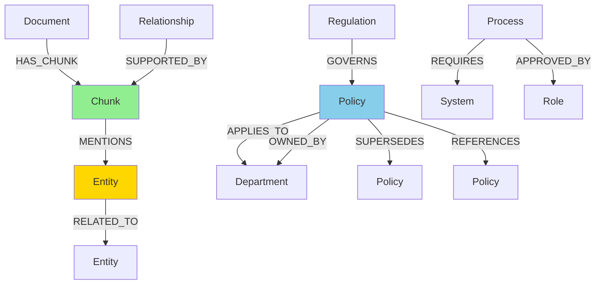
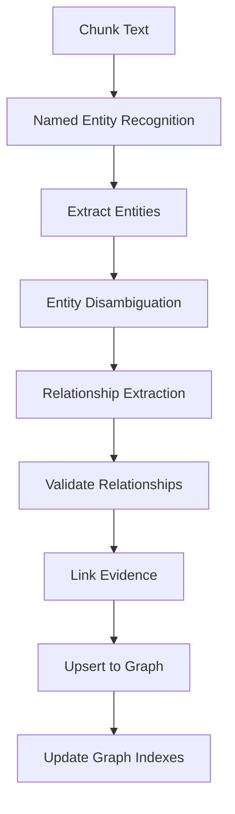

# knowledge-graph-agent

**Domain:** Indexing  
**Status:** 📋 Planned  
**Phase:** 5 - Knowledge Graph  
**Owner:** Knowledge Engineering Team  
**Implementation Week:** Weeks 13-15

---

## Overview

The `knowledge-graph-agent` extracts entities and relationships from chunks and writes them into a knowledge graph database. It enables relationship-based retrieval, multi-hop reasoning, and discovery of connections between concepts that may not be explicitly stated in individual chunks.

The knowledge graph complements vector and keyword search by providing **structured relationship traversal** for complex queries.

---

## Responsibility

### Primary Responsibilities

- Extract entities from chunks using NER (Named Entity Recognition)
- Extract relationships between entities
- Write entities and relationships to graph database (Neo4j)
- Maintain evidence links to source chunks
- Support graph traversal queries
- Handle entity disambiguation and merging
- Maintain tenant isolation in graph
- Track extraction confidence scores
- Support graph updates and deletions

---

## Supported Graph Stores

### Recommended Options

| Graph Database              | Use Case                 | Scalability       |
| --------------------------- | ------------------------ | ----------------- |
| **Neo4j Community Edition** | MVP, single-node         | Up to 10M nodes   |
| **Neo4j Enterprise**        | Production, distributed  | Billions of nodes |
| **JanusGraph**              | Large-scale, distributed | Billions of nodes |

**Recommendation:** Start with Neo4j Community Edition, migrate to Enterprise or JanusGraph if scale exceeds single-node capacity.

---

## Graph Model

### Node Types

```cypher
// Document nodes
(:Document {document_id, tenant_id, title, classification})

// Chunk nodes
(:Chunk {chunk_id, document_id, tenant_id, text, page_start, page_end})

// Entity nodes
(:Entity {entity_id, name, type, tenant_id})
(:Policy {entity_id, name, code, tenant_id})
(:Department {entity_id, name, tenant_id})
(:Role {entity_id, name, tenant_id})
(:System {entity_id, name, tenant_id})
(:Process {entity_id, name, tenant_id})
(:Location {entity_id, name, tenant_id})
(:Regulation {entity_id, name, code, tenant_id})
```

### Relationship Types

```cypher
// Document structure
(:Document)-[:HAS_CHUNK]->(:Chunk)

// Entity mentions
(:Chunk)-[:MENTIONS {confidence, position}]->(:Entity)

// Entity relationships
(:Entity)-[:RELATED_TO {type, confidence}]->(:Entity)
(:Policy)-[:APPLIES_TO]->(:Department)
(:Policy)-[:OWNED_BY]->(:Department)
(:Policy)-[:SUPERSEDES]->(:Policy)
(:Policy)-[:REFERENCES]->(:Policy)
(:Policy)-[:REQUIRES_APPROVAL_FROM]->(:Role)
(:Process)-[:REQUIRES]->(:System)
(:Process)-[:APPROVED_BY]->(:Role)
(:Regulation)-[:GOVERNS]->(:Policy)

// Evidence tracking
(:Relationship)-[:SUPPORTED_BY]->(:Chunk)
```

### Graph Schema Diagram



---

## Architecture

### Extraction Pipeline



---

## API Contract

### Entity Operations

```python
def extract_entities(chunk: Chunk) -> List[Entity]:
    """
    Extract entities from chunk using NER.

    Args:
        chunk: Chunk to extract entities from

    Returns:
        List of extracted entities with types and confidence
    """
    pass

def disambiguate_entity(
    entity_name: str,
    entity_type: str,
    context: str,
    tenant_id: str
) -> Optional[UUID]:
    """
    Disambiguate entity to existing entity ID or create new.

    Args:
        entity_name: Entity name
        entity_type: Entity type
        context: Surrounding context
        tenant_id: Tenant identifier

    Returns:
        Entity ID (existing or new)
    """
    pass

def upsert_graph_entities(entities: List[Entity]) -> bool:
    """
    Upsert entities into graph database.

    Args:
        entities: List of entities to upsert

    Returns:
        Success status
    """
    pass
```

### Relationship Operations

```python
def extract_relationships(chunk: Chunk, entities: List[Entity]) -> List[Relationship]:
    """
    Extract relationships between entities in chunk.

    Args:
        chunk: Chunk containing entities
        entities: Entities found in chunk

    Returns:
        List of relationships with confidence scores
    """
    pass

def upsert_graph_relationships(relationships: List[Relationship]) -> bool:
    """
    Upsert relationships into graph database.

    Args:
        relationships: List of relationships to upsert

    Returns:
        Success status
    """
    pass

def validate_relationship(relationship: Relationship) -> bool:
    """
    Validate relationship has required evidence.

    Args:
        relationship: Relationship to validate

    Returns:
        True if valid, False otherwise
    """
    pass
```

### Graph Traversal

```python
def traverse_graph(
    start_entities: List[str],
    filters: Dict[str, Any],
    max_depth: int = 3,
    relationship_types: Optional[List[str]] = None
) -> List[UUID]:
    """
    Traverse graph from starting entities.

    Args:
        start_entities: Entity names to start from
        filters: Tenant and access filters
        max_depth: Maximum traversal depth
        relationship_types: Relationship types to follow

    Returns:
        List of chunk IDs connected to entities
    """
    pass

def find_path(
    source_entity: str,
    target_entity: str,
    filters: Dict[str, Any],
    max_depth: int = 5
) -> List[Path]:
    """
    Find paths between two entities.

    Args:
        source_entity: Source entity name
        target_entity: Target entity name
        filters: Tenant and access filters
        max_depth: Maximum path length

    Returns:
        List of paths with relationships
    """
    pass
```

---

## Data Models

### Entity

```python
@dataclass
class Entity:
    entity_id: UUID
    name: str
    entity_type: str  # "policy", "department", "role", "system", etc.
    tenant_id: str
    aliases: List[str]
    confidence: float
    source_chunk_ids: List[UUID]
    metadata: Dict[str, Any]
    created_at: datetime
    updated_at: datetime
```

### Relationship

```python
@dataclass
class Relationship:
    relationship_id: UUID
    source_entity_id: UUID
    target_entity_id: UUID
    relationship_type: str  # "APPLIES_TO", "OWNED_BY", etc.
    confidence: float
    source_chunk_id: UUID
    document_id: UUID
    tenant_id: str
    extraction_method: str  # "rule_based", "ml_model", "manual"
    metadata: Dict[str, Any]
    created_at: datetime
```

### Path

```python
@dataclass
class Path:
    entities: List[Entity]
    relationships: List[Relationship]
    length: int
    confidence: float
```

---

## Entity Extraction

### NER with spaCy

```python
import spacy
from spacy.tokens import Doc

class EntityExtractor:
    def __init__(self, model_name: str = "en_core_web_lg"):
        self.nlp = spacy.load(model_name)

        # Add custom entity types
        self.custom_entities = {
            "POLICY": ["policy", "procedure", "guideline"],
            "SYSTEM": ["system", "application", "platform"],
            "PROCESS": ["process", "workflow", "procedure"]
        }

    def extract_entities(self, chunk: Chunk) -> List[Entity]:
        """Extract entities using spaCy NER."""
        doc = self.nlp(chunk.chunk_text)
        entities = []

        for ent in doc.ents:
            entity = Entity(
                entity_id=uuid.uuid4(),
                name=ent.text,
                entity_type=self._map_entity_type(ent.label_),
                tenant_id=chunk.tenant_id,
                aliases=[],
                confidence=self._compute_confidence(ent),
                source_chunk_ids=[chunk.chunk_id],
                metadata={
                    "start_char": ent.start_char,
                    "end_char": ent.end_char,
                    "label": ent.label_
                },
                created_at=datetime.utcnow(),
                updated_at=datetime.utcnow()
            )
            entities.append(entity)

        # Extract custom entities
        entities.extend(self._extract_custom_entities(doc, chunk))

        return entities

    def _map_entity_type(self, spacy_label: str) -> str:
        """Map spaCy entity labels to our types."""
        mapping = {
            "ORG": "department",
            "PERSON": "role",
            "GPE": "location",
            "LAW": "regulation",
            "PRODUCT": "system"
        }
        return mapping.get(spacy_label, "entity")

    def _extract_custom_entities(self, doc: Doc, chunk: Chunk) -> List[Entity]:
        """Extract domain-specific entities using patterns."""
        entities = []

        # Extract policy codes (e.g., FIN-204, HR-301)
        import re
        policy_pattern = r'\b[A-Z]{2,4}-\d{3,4}\b'
        for match in re.finditer(policy_pattern, chunk.chunk_text):
            entities.append(Entity(
                entity_id=uuid.uuid4(),
                name=match.group(),
                entity_type="policy",
                tenant_id=chunk.tenant_id,
                aliases=[],
                confidence=0.95,
                source_chunk_ids=[chunk.chunk_id],
                metadata={"pattern": "policy_code"},
                created_at=datetime.utcnow(),
                updated_at=datetime.utcnow()
            ))

        return entities
```

---

## Relationship Extraction

### Rule-Based Extraction

```python
class RelationshipExtractor:
    def __init__(self):
        self.patterns = self._load_patterns()

    def extract_relationships(
        self,
        chunk: Chunk,
        entities: List[Entity]
    ) -> List[Relationship]:
        """Extract relationships using rules and patterns."""
        relationships = []

        # Pattern: "Policy X applies to Department Y"
        for pattern in self.patterns:
            matches = pattern.match(chunk.chunk_text, entities)
            for match in matches:
                relationship = Relationship(
                    relationship_id=uuid.uuid4(),
                    source_entity_id=match.source_entity.entity_id,
                    target_entity_id=match.target_entity.entity_id,
                    relationship_type=match.relationship_type,
                    confidence=match.confidence,
                    source_chunk_id=chunk.chunk_id,
                    document_id=chunk.document_id,
                    tenant_id=chunk.tenant_id,
                    extraction_method="rule_based",
                    metadata={"pattern": pattern.name},
                    created_at=datetime.utcnow()
                )
                relationships.append(relationship)

        return relationships

    def _load_patterns(self) -> List[Pattern]:
        """Load relationship extraction patterns."""
        return [
            Pattern(
                name="applies_to",
                regex=r"(\w+)\s+applies\s+to\s+(\w+)",
                relationship_type="APPLIES_TO",
                confidence=0.8
            ),
            Pattern(
                name="owned_by",
                regex=r"(\w+)\s+is\s+owned\s+by\s+(\w+)",
                relationship_type="OWNED_BY",
                confidence=0.85
            ),
            Pattern(
                name="requires_approval",
                regex=r"(\w+)\s+requires\s+approval\s+from\s+(\w+)",
                relationship_type="REQUIRES_APPROVAL_FROM",
                confidence=0.9
            )
        ]
```

---

## Neo4j Integration

### Graph Operations

```python
from neo4j import GraphDatabase

class Neo4jGraphStore:
    def __init__(self, uri: str, username: str, password: str):
        self.driver = GraphDatabase.driver(uri, auth=(username, password))

    def upsert_entity(self, entity: Entity):
        """Upsert entity into Neo4j."""
        with self.driver.session() as session:
            session.execute_write(self._create_entity, entity)

    @staticmethod
    def _create_entity(tx, entity: Entity):
        query = """
        MERGE (e:Entity {entity_id: $entity_id, tenant_id: $tenant_id})
        SET e.name = $name,
            e.entity_type = $entity_type,
            e.confidence = $confidence,
            e.updated_at = datetime()
        RETURN e
        """
        tx.run(query,
            entity_id=str(entity.entity_id),
            tenant_id=entity.tenant_id,
            name=entity.name,
            entity_type=entity.entity_type,
            confidence=entity.confidence
        )

    def upsert_relationship(self, relationship: Relationship):
        """Upsert relationship into Neo4j."""
        with self.driver.session() as session:
            session.execute_write(self._create_relationship, relationship)

    @staticmethod
    def _create_relationship(tx, rel: Relationship):
        query = f"""
        MATCH (source:Entity {{entity_id: $source_id, tenant_id: $tenant_id}})
        MATCH (target:Entity {{entity_id: $target_id, tenant_id: $tenant_id}})
        MERGE (source)-[r:{rel.relationship_type}]->(target)
        SET r.confidence = $confidence,
            r.source_chunk_id = $chunk_id,
            r.extraction_method = $method,
            r.created_at = datetime()
        RETURN r
        """
        tx.run(query,
            source_id=str(rel.source_entity_id),
            target_id=str(rel.target_entity_id),
            tenant_id=rel.tenant_id,
            confidence=rel.confidence,
            chunk_id=str(rel.source_chunk_id),
            method=rel.extraction_method
        )

    def traverse_graph(
        self,
        start_entity: str,
        tenant_id: str,
        max_depth: int = 3
    ) -> List[UUID]:
        """Traverse graph and return connected chunk IDs."""
        with self.driver.session() as session:
            result = session.execute_read(
                self._traverse,
                start_entity,
                tenant_id,
                max_depth
            )
            return result

    @staticmethod
    def _traverse(tx, start_entity: str, tenant_id: str, max_depth: int):
        query = """
        MATCH path = (start:Entity {name: $name, tenant_id: $tenant_id})
                     -[*1..{max_depth}]-(connected:Entity)
        MATCH (connected)<-[:MENTIONS]-(chunk:Chunk {tenant_id: $tenant_id})
        RETURN DISTINCT chunk.chunk_id as chunk_id
        """
        result = tx.run(query.format(max_depth=max_depth),
            name=start_entity,
            tenant_id=tenant_id
        )
        return [UUID(record["chunk_id"]) for record in result]
```

---

## Relationship Requirements

### Evidence Tracking

Every graph relationship **must** have evidence:

```python
@dataclass
class RelationshipEvidence:
    relationship_id: UUID
    source_chunk_id: UUID
    document_id: UUID
    confidence: float
    extraction_method: str  # "rule_based", "ml_model", "manual"
    created_at: datetime
```

### Confidence Scoring

```python
def compute_relationship_confidence(
    relationship: Relationship,
    context: str
) -> float:
    """
    Compute confidence score for relationship.

    Factors:
    - Extraction method reliability
    - Pattern match quality
    - Entity confidence
    - Context clarity
    """
    base_confidence = {
        "manual": 1.0,
        "ml_model": 0.85,
        "rule_based": 0.75
    }[relationship.extraction_method]

    # Adjust based on entity confidence
    entity_confidence = (
        relationship.source_entity.confidence +
        relationship.target_entity.confidence
    ) / 2

    return base_confidence * entity_confidence
```

---

## Testing Requirements

### Unit Tests

**Test Coverage Target:** >80%

#### Entity Extraction Tests

- ✅ Extract named policy entity from sample chunk
- ✅ Extract department entity from sample chunk
- ✅ Extract role entity from sample chunk
- ✅ Extract policy code (e.g., FIN-204)
- ✅ Entity disambiguation works correctly

#### Relationship Extraction Tests

- ✅ Extract relationship `Policy APPLIES_TO Department`
- ✅ Extract relationship `Policy OWNED_BY Department`
- ✅ Extract relationship `Process REQUIRES System`
- ✅ Reject relationship without source chunk

#### Confidence Tests

- ✅ Confidence score is between 0 and 1
- ✅ Manual extraction has highest confidence
- ✅ Low-confidence relationships are flagged

### Integration Tests

- ✅ Insert document, chunk, entity, and relationship into graph
- ✅ Traverse from entity to related chunks
- ✅ Confirm graph results resolve back to PostgreSQL chunk IDs
- ✅ Multi-hop traversal works correctly
- ✅ Tenant isolation prevents cross-tenant traversal

### Security Tests

- ✅ Graph traversal must not return unauthorized chunks after ACL validation
- ✅ Confidential graph relationships must not be exposed to unauthorized users
- ✅ Tenant filter prevents cross-tenant entity access

### Performance Tests

- ✅ Extract entities from 1000 chunks in <10 minutes
- ✅ Graph traversal completes in <200ms
- ✅ Entity disambiguation is efficient
- ✅ Bulk entity upsert handles 10,000 entities

---

## Configuration

### Environment Variables

```bash
# Neo4j
NEO4J_URI=bolt://localhost:7687
NEO4J_USERNAME=neo4j
NEO4J_PASSWORD=...

# NER
NER_MODEL=en_core_web_lg
NER_CONFIDENCE_THRESHOLD=0.7

# Extraction
MAX_GRAPH_DEPTH=3
RELATIONSHIP_CONFIDENCE_THRESHOLD=0.6
```

---

## Dependencies

### Upstream Dependencies

- [`canonical-db-agent`](../infrastructure/canonical-db-agent.md) - Provides chunks
- [`chunking-agent`](../ingestion/chunking-agent.md) - Creates chunks
- spaCy - NER
- Neo4j - Graph database

### Downstream Consumers

- [`hybrid-retrieval-agent`](../retrieval/hybrid-retrieval-agent.md) - Queries graph

---

## Monitoring & Observability

### Metrics

```python
# Extraction metrics
knowledge_graph_entities_extracted_total
knowledge_graph_relationships_extracted_total
knowledge_graph_extraction_duration_seconds

# Graph metrics
knowledge_graph_nodes_total
knowledge_graph_relationships_total
knowledge_graph_traversal_duration_seconds
```

---

## Related Documentation

- [System Architecture](../../ARCHITECTURE.md)
- [Phase 5 Implementation](../../phases/phase-5-knowledge-graph/README.md)

---

**Status:** 📋 Ready for Implementation  
**Next Steps:** Begin Week 13 implementation with Neo4j setup and spaCy NER integration.
