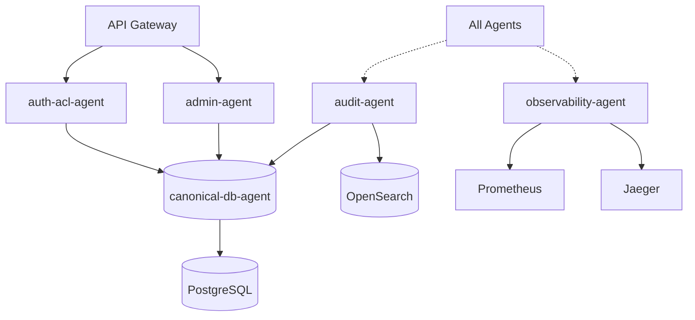

# Infrastructure Domain

**Owner:** Infrastructure Team  
**Status:** Phase 1 - Ready for Implementation  
**Agents:** 5

---

## Overview

The Infrastructure domain provides core foundational services that all other domains depend on. These agents handle data persistence, authentication, authorization, auditing, administration, and observability.

---

## Agents in This Domain

### 1. canonical-db-agent

**File:** [canonical-db-agent.md](./canonical-db-agent.md)  
**Status:** ✅ Specified  
**Phase:** 1  
**Responsibilities:** PostgreSQL schema, canonical records, document/chunk metadata  
**Dependencies:** PostgreSQL 15+

### 2. auth-acl-agent

**File:** [auth-acl-agent.md](./auth-acl-agent.md)  
**Status:** ✅ Specified  
**Phase:** 1  
**Responsibilities:** User identity, roles, departments, groups, access policies  
**Dependencies:** OIDC/OAuth2 provider, PostgreSQL

### 3. audit-agent

**File:** [audit-agent.md](./audit-agent.md)  
**Status:** ✅ Specified  
**Phase:** 8  
**Responsibilities:** Query logging, retrieval audit, compliance reporting  
**Dependencies:** PostgreSQL, OpenSearch (optional)

### 4. admin-agent

**File:** [admin-agent.md](./admin-agent.md)  
**Status:** ✅ Specified  
**Phase:** 8  
**Responsibilities:** Source management, policy management, system operations  
**Dependencies:** PostgreSQL, Qdrant, OpenSearch, Neo4j

### 5. observability-agent

**File:** [observability-agent.md](./observability-agent.md)  
**Status:** ✅ Specified  
**Phase:** 8  
**Responsibilities:** Metrics collection, distributed tracing, alerting  
**Dependencies:** Prometheus, Grafana, OpenTelemetry, Jaeger

---

## Domain Architecture

---

## Integration Points

### Upstream Dependencies

- OIDC/OAuth2 Provider (for authentication)
- API Gateway (for request routing)

### Downstream Services

- PostgreSQL (canonical data store)
- OpenSearch (audit log search)
- Prometheus (metrics storage)
- Grafana (visualization)
- Jaeger (distributed tracing)

### Events Published

- `user.authenticated`
- `access.denied`
- `query.executed`
- `document.created`
- `policy.updated`

### Events Consumed

- All domain events (for auditing)
- All metrics (for observability)

---

## Deployment

### Container Images

- `enterprise-rag/canonical-db:v1.0.0`
- `enterprise-rag/auth-acl:v1.0.0`
- `enterprise-rag/audit:v1.0.0`
- `enterprise-rag/admin:v1.0.0`
- `enterprise-rag/observability:v1.0.0`

### Resource Requirements

- **canonical-db-agent:** 1 CPU, 2GB RAM
- **auth-acl-agent:** 1 CPU, 2GB RAM
- **audit-agent:** 2 CPU, 4GB RAM
- **admin-agent:** 1 CPU, 2GB RAM
- **observability-agent:** 2 CPU, 4GB RAM

### Scaling Strategy

- **canonical-db-agent:** Vertical scaling (connection pooling)
- **auth-acl-agent:** Horizontal scaling (stateless)
- **audit-agent:** Horizontal scaling (queue-based)
- **admin-agent:** Single instance (admin operations)
- **observability-agent:** Horizontal scaling (metrics aggregation)

---

## Testing Strategy

### Unit Tests

- Database operations (CRUD, transactions)
- ACL policy evaluation
- Audit log formatting
- Metrics collection

### Integration Tests

- End-to-end authentication flow
- ACL validation across agents
- Audit trail completeness
- Metrics pipeline

### Performance Tests

- Database query performance (p95 < 50ms)
- ACL validation throughput (>1000 checks/sec)
- Audit log ingestion rate (>10,000 events/sec)
- Metrics collection overhead (<5% CPU)

---

## Security Considerations

- **Authentication:** OIDC/OAuth2 with JWT tokens
- **Authorization:** Row-Level Security (RLS) in PostgreSQL
- **Audit:** Immutable audit logs with integrity checks
- **Secrets:** Stored in Kubernetes secrets or HashiCorp Vault
- **Network:** mTLS between services

---

## Monitoring

### Key Metrics

- `db_query_duration_seconds` - Database query latency
- `auth_requests_total` - Authentication requests
- `acl_checks_total` - Authorization checks
- `audit_events_total` - Audit events logged
- `admin_operations_total` - Admin operations

### Alerts

- High database latency (p95 > 100ms)
- Authentication failures (>5% error rate)
- ACL validation errors
- Audit log backlog (>1000 pending)
- Admin operation failures

### Dashboards

- [Infrastructure Overview Dashboard](../../../operations/dashboards/infrastructure.json)
- [Security Dashboard](../../../operations/dashboards/security.json)

---

## Related Documentation

- [System Architecture](../../ARCHITECTURE.md)
- [Multi-Tenancy Strategy](../../architecture/multi-tenancy.md)
- [Security Model](../../architecture/security-model.md)
- [Deployment Guide](../../operations/deployment-guide.md)

---

## Change Log

### v1.0.0 (2026-05-16)

- Initial domain specification
- 5 agents defined
- Integration points documented
