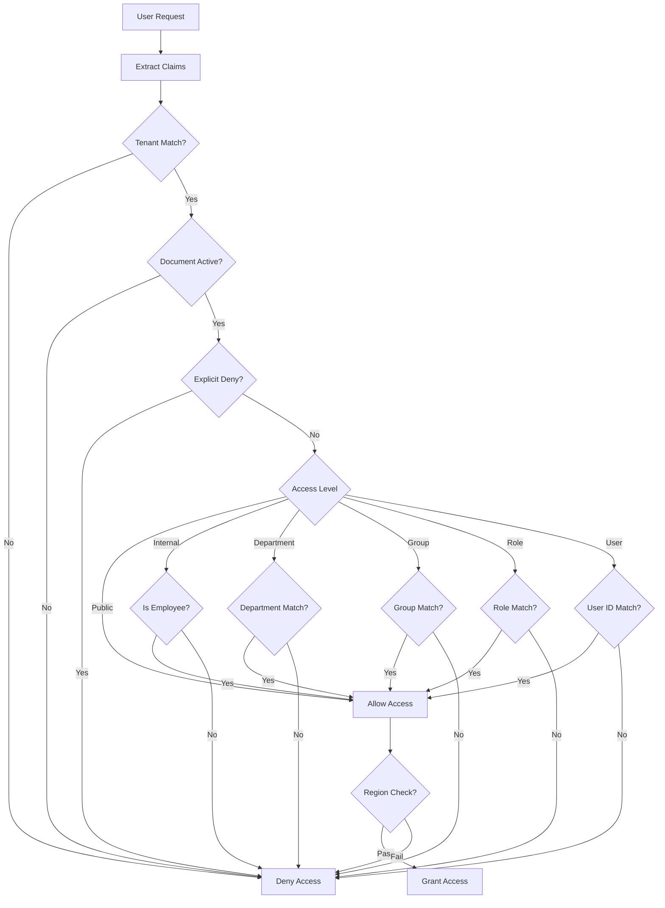

# auth-acl-agent

**Domain:** Infrastructure  
**Status:** 📋 Planned  
**Phase:** 1 - Canonical Foundation  
**Owner:** Security Team  
**Implementation Week:** Week 3

---

## Overview

The `auth-acl-agent` handles authentication claims and access policy evaluation for the Enterprise RAG System. It enforces strict access control across all document categories and ensures that users can only access documents they are authorized to view.

This agent is a **critical security boundary** that prevents unauthorized document leakage at every retrieval and generation stage.

---

## Responsibility

### Primary Responsibilities

- Authenticate user identity claims from OIDC/OAuth2 providers
- Evaluate access policies for documents and chunks
- Support multiple access control models (RBAC, ABAC, department-based, group-based)
- Enforce tenant isolation
- Build retrieval filters for pre-filtering
- Validate chunk access before context building
- Cache access decisions for performance
- Log access denials for security monitoring

### Supported Access Models

- **Public access** - Accessible to all users
- **Employee-wide internal access** - Accessible to all authenticated employees
- **Department-level access** - Accessible to specific departments
- **Role-based access** - Accessible to specific roles
- **Group-based access** - Accessible to specific groups
- **User-specific allow/deny rules** - Explicit user permissions
- **Region-based access** - Accessible to specific regions/countries
- **Tenant isolation** - Strict separation between tenants

---

## Architecture

### Access Decision Flow



### Access Levels

```python
class AccessLevel(Enum):
    PUBLIC = "PUBLIC"
    INTERNAL_GENERAL = "INTERNAL_GENERAL"
    DEPARTMENT_RESTRICTED = "DEPARTMENT_RESTRICTED"
    CONFIDENTIAL = "CONFIDENTIAL"
    REGULATED = "REGULATED"
    EXECUTIVE_ONLY = "EXECUTIVE_ONLY"
```

### User Claims Structure

```python
@dataclass
class UserClaims:
    user_id: str
    email: str
    tenant_id: str
    department: Optional[str]
    groups: List[str]
    role: str
    region: Optional[str]
    country: Optional[str]
    clearance: str
    is_employee: bool = True
```

Example claims from OIDC/OAuth2:

```json
{
  "user_id": "user_123",
  "email": "ada@company.com",
  "tenant_id": "global-company",
  "department": "finance",
  "groups": ["finance", "internal-users"],
  "role": "finance_manager",
  "region": "emea",
  "country": "Germany",
  "clearance": "department_restricted",
  "is_employee": true
}
```

---

## Access Decision Rules

A user can access a document/chunk if **ALL** of the following conditions are met:

### 1. Tenant Isolation

```python
user.tenant_id == document.tenant_id
```

### 2. Document Status

```python
document.status == "active"
```

### 3. No Explicit Deny

```python
user.user_id NOT IN document.access_policy.denied_users
```

### 4. Access Level Check

At least ONE of the following must be true:

```python
# Public access
document.classification == "PUBLIC"

# Internal access
document.classification == "INTERNAL_GENERAL" AND user.is_employee

# Department access
user.department IN document.access_policy.allowed_departments

# Group access
ANY(user.groups) IN document.access_policy.allowed_groups

# Role access
user.role IN document.access_policy.allowed_roles

# User-specific access
user.user_id IN document.access_policy.allowed_users
```

### 5. Region Restrictions

```python
IF document.access_policy.allowed_regions IS NOT EMPTY:
    user.region IN document.access_policy.allowed_regions
    OR user.country IN document.access_policy.allowed_regions
```

---

## API Contract

### Core Operations

```python
def can_access(
    user_claims: UserClaims,
    document_or_chunk: Union[Document, Chunk]
) -> bool:
    """
    Determine if user can access a document or chunk.

    Returns:
        True if access is granted, False otherwise
    """
    pass

def filter_authorized_chunks(
    user_claims: UserClaims,
    chunk_ids: List[UUID]
) -> List[UUID]:
    """
    Filter a list of chunk IDs to only those the user can access.

    This is the critical security boundary before context building.

    Returns:
        List of authorized chunk IDs
    """
    pass

def build_retrieval_filter(
    user_claims: UserClaims
) -> Dict[str, Any]:
    """
    Build metadata filter for pre-filtering retrieval results.

    Used by Qdrant, BM25, and Knowledge Graph retrievers.

    Returns:
        Metadata filter dictionary
    """
    pass

def get_access_reason(
    user_claims: UserClaims,
    document_or_chunk: Union[Document, Chunk]
) -> AccessDecision:
    """
    Get detailed access decision with reasoning.

    Used for debugging and audit logging.

    Returns:
        AccessDecision with granted/denied and reason
    """
    pass
```

### Batch Operations

```python
def batch_check_access(
    user_claims: UserClaims,
    items: List[Union[Document, Chunk]]
) -> Dict[UUID, bool]:
    """
    Check access for multiple items efficiently.

    Returns:
        Dictionary mapping item IDs to access decisions
    """
    pass
```

### Cache Operations

```python
def cache_access_decision(
    user_claims: UserClaims,
    item_id: UUID,
    decision: bool,
    ttl: int = 300
) -> None:
    """Cache access decision for performance."""
    pass

def invalidate_user_cache(user_id: str) -> None:
    """Invalidate all cached decisions for a user."""
    pass

def invalidate_document_cache(document_id: UUID) -> None:
    """Invalidate all cached decisions for a document."""
    pass
```

---

## Data Models

### AccessDecision

```python
@dataclass
class AccessDecision:
    granted: bool
    reason: str
    checked_at: datetime
    user_id: str
    item_id: UUID
    item_type: str  # "document" or "chunk"
```

### AccessPolicy

```python
@dataclass
class AccessPolicy:
    policy_id: UUID
    tenant_id: str
    document_id: Optional[UUID]
    classification: str
    allowed_departments: List[str]
    allowed_groups: List[str]
    allowed_roles: List[str]
    allowed_users: List[str]
    denied_users: List[str]
    allowed_regions: List[str]
    created_at: datetime
    updated_at: datetime
```

---

## Implementation Details

### Access Check Algorithm

```python
def can_access(user_claims: UserClaims, item: Union[Document, Chunk]) -> bool:
    # 1. Check tenant isolation
    if user_claims.tenant_id != item.tenant_id:
        return False

    # 2. Check document status
    if item.status != "active":
        return False

    # 3. Get access policy
    policy = get_access_policy(item.document_id)

    # 4. Check explicit deny
    if user_claims.user_id in policy.denied_users:
        return False

    # 5. Check access level
    if policy.classification == "PUBLIC":
        return True

    if policy.classification == "INTERNAL_GENERAL" and user_claims.is_employee:
        return True

    # Check department access
    if user_claims.department in policy.allowed_departments:
        return _check_region(user_claims, policy)

    # Check group access
    if any(group in policy.allowed_groups for group in user_claims.groups):
        return _check_region(user_claims, policy)

    # Check role access
    if user_claims.role in policy.allowed_roles:
        return _check_region(user_claims, policy)

    # Check user-specific access
    if user_claims.user_id in policy.allowed_users:
        return _check_region(user_claims, policy)

    return False

def _check_region(user_claims: UserClaims, policy: AccessPolicy) -> bool:
    if not policy.allowed_regions:
        return True

    return (
        user_claims.region in policy.allowed_regions or
        user_claims.country in policy.allowed_regions
    )
```

### Retrieval Filter Builder

```python
def build_retrieval_filter(user_claims: UserClaims) -> Dict[str, Any]:
    """Build filter for Qdrant/BM25/Graph pre-filtering."""

    filter_conditions = {
        "must": [
            {"key": "tenant_id", "match": {"value": user_claims.tenant_id}},
            {"key": "status", "match": {"value": "active"}}
        ],
        "should": []
    }

    # Public documents
    filter_conditions["should"].append({
        "key": "classification",
        "match": {"value": "PUBLIC"}
    })

    # Internal documents (if employee)
    if user_claims.is_employee:
        filter_conditions["should"].append({
            "key": "classification",
            "match": {"value": "INTERNAL_GENERAL"}
        })

    # Department-specific documents
    if user_claims.department:
        filter_conditions["should"].append({
            "key": "allowed_departments",
            "match": {"any": [user_claims.department]}
        })

    # Group-specific documents
    if user_claims.groups:
        filter_conditions["should"].append({
            "key": "allowed_groups",
            "match": {"any": user_claims.groups}
        })

    # Role-specific documents
    if user_claims.role:
        filter_conditions["should"].append({
            "key": "allowed_roles",
            "match": {"any": [user_claims.role]}
        })

    return filter_conditions
```

---

## Testing Requirements

### Unit Tests

**Test Coverage Target:** >90% (security-critical component)

#### Access Decision Tests

- ✅ Public document is accessible to all users
- ✅ Internal document is accessible only to employees
- ✅ Finance document is accessible to Finance users
- ✅ Finance document is denied to Engineering users
- ✅ Explicit deny overrides explicit allow
- ✅ Region-specific document is inaccessible outside allowed region
- ✅ Tenant mismatch always denies access
- ✅ Inactive document is denied
- ✅ Deleted document is denied
- ✅ Archived document is denied (unless admin workflow)

#### Group Access Tests

- ✅ User in allowed group can access
- ✅ User not in allowed group cannot access
- ✅ User in multiple groups gets union of permissions

#### Role Access Tests

- ✅ User with allowed role can access
- ✅ User without allowed role cannot access

#### Region Access Tests

- ✅ User in allowed region can access
- ✅ User in allowed country can access
- ✅ User outside allowed region/country cannot access

### Integration Tests

- ✅ Simulate retrieved chunks from Qdrant and validate against PostgreSQL ACLs
- ✅ Simulate BM25 results with unauthorized chunks and confirm they are removed
- ✅ Simulate graph traversal returning restricted chunks and confirm ACL filtering removes them
- ✅ Test batch access check with 1000 chunks completes in <100ms
- ✅ Test cache hit improves performance by >50%

### Security Tests

**Critical Security Scenarios:**

- ✅ Attempt prompt asking for confidential HR salary data as Engineering user; no HR chunks should reach the LLM
- ✅ Attempt broad query like "summarize all company policies"; restricted documents must not be included
- ✅ Attempt to access document from different tenant; access denied
- ✅ Attempt to bypass ACL by manipulating metadata filters; access denied
- ✅ Attempt to access deleted document; access denied
- ✅ User with explicit deny cannot access even if in allowed group
- ✅ Cache poisoning attack; cached decisions are validated

### Performance Tests

- ✅ Single access check completes in <5ms
- ✅ Batch access check for 100 items completes in <50ms
- ✅ Batch access check for 1000 items completes in <200ms
- ✅ Cache hit reduces latency by >80%
- ✅ Filter building completes in <10ms

---

## Caching Strategy

### Cache Key Structure

```python
cache_key = f"acl:{user_id}:{item_id}:{policy_version}"
```

### Cache TTL

- **Access decisions:** 5 minutes (300 seconds)
- **Retrieval filters:** 5 minutes (300 seconds)
- **Access policies:** 10 minutes (600 seconds)

### Cache Invalidation

Invalidate cache when:

- User group membership changes
- User role changes
- User department changes
- Document access policy changes
- Document classification changes
- Document is deleted or archived

### Cache Implementation

```python
# Redis cache
def cache_access_decision(
    user_id: str,
    item_id: UUID,
    decision: bool,
    ttl: int = 300
) -> None:
    key = f"acl:{user_id}:{item_id}"
    redis_client.setex(key, ttl, json.dumps({
        "granted": decision,
        "cached_at": datetime.utcnow().isoformat()
    }))

def get_cached_decision(user_id: str, item_id: UUID) -> Optional[bool]:
    key = f"acl:{user_id}:{item_id}"
    cached = redis_client.get(key)
    if cached:
        data = json.loads(cached)
        return data["granted"]
    return None
```

---

## Dependencies

### Upstream Dependencies

- OIDC/OAuth2 provider (Auth0, Okta, Azure AD, etc.)
- [`canonical-db-agent`](./canonical-db-agent.md) - Access policy storage
- Redis - Caching layer

### Downstream Consumers

- [`hybrid-retrieval-agent`](../retrieval/hybrid-retrieval-agent.md) - Pre-filtering
- [`acl-validation-agent`](../retrieval/acl-validation-agent.md) - Final validation
- [`context-builder-agent`](../generation/context-builder-agent.md) - Context filtering
- [`audit-agent`](../operations/audit-agent.md) - Access denial logging

---

## Configuration

### Environment Variables

```bash
# OIDC/OAuth2
OIDC_ISSUER_URL=https://auth.company.com
OIDC_CLIENT_ID=enterprise-rag-system
OIDC_CLIENT_SECRET=secret

# Cache
REDIS_URL=redis://localhost:6379/0
CACHE_TTL_SECONDS=300

# Security
REQUIRE_TENANT_ID=true
STRICT_TENANT_ISOLATION=true
LOG_ACCESS_DENIALS=true
```

### Configuration File

```yaml
authentication:
  oidc_issuer_url: ${OIDC_ISSUER_URL}
  oidc_client_id: ${OIDC_CLIENT_ID}
  oidc_client_secret: ${OIDC_CLIENT_SECRET}

cache:
  redis_url: ${REDIS_URL}
  ttl_seconds: 300
  enabled: true

security:
  require_tenant_id: true
  strict_tenant_isolation: true
  log_access_denials: true
  cache_access_decisions: true
```

---

## Error Handling

### Error Types

```python
class UnauthorizedAccessError(Exception):
    """User is not authorized to access resource."""
    pass

class InvalidClaimsError(Exception):
    """User claims are invalid or missing required fields."""
    pass

class TenantMismatchError(Exception):
    """User tenant does not match resource tenant."""
    pass

class PolicyNotFoundError(Exception):
    """Access policy not found for resource."""
    pass
```

---

## Monitoring & Observability

### Metrics

```python
# Access decision metrics
auth_acl_access_granted_total
auth_acl_access_denied_total
auth_acl_access_check_duration_seconds

# Cache metrics
auth_acl_cache_hits_total
auth_acl_cache_misses_total
auth_acl_cache_invalidations_total

# Security metrics
auth_acl_tenant_mismatch_total
auth_acl_explicit_deny_total
auth_acl_unauthorized_attempts_total
```

### Logging

```python
# Log access denials
logger.warning("Access denied", extra={
    "user_id": user_id,
    "tenant_id": tenant_id,
    "document_id": document_id,
    "reason": "department_mismatch"
})

# Log suspicious activity
logger.error("Tenant mismatch attempt", extra={
    "user_id": user_id,
    "user_tenant": user_tenant,
    "document_tenant": document_tenant,
    "document_id": document_id
})
```

---

## Security Considerations

### Critical Security Rules

1. **Never trust metadata filters alone** - Always validate against PostgreSQL ACLs
2. **Explicit deny always wins** - Deny overrides all allow rules
3. **Tenant isolation is mandatory** - Cross-tenant access is never allowed
4. **Cache must be validated** - Cached decisions must be revalidated periodically
5. **Log all denials** - Security monitoring requires denial logging

### Threat Model

| Threat                 | Mitigation                                              |
| ---------------------- | ------------------------------------------------------- |
| Metadata filter bypass | Triple ACL enforcement (retrieval, validation, context) |
| Cache poisoning        | Cache keys include policy version, TTL is short         |
| Tenant leakage         | RLS policies + application-level tenant checks          |
| Privilege escalation   | Explicit deny overrides all allow rules                 |
| Stale permissions      | Cache invalidation on policy changes                    |

---

## Related Documentation

- [System Architecture](../../ARCHITECTURE.md)
- [Access Control Model](../../architecture/access-control.md)
- [Triple ACL Enforcement](../../decisions/ADR-010-triple-acl-enforcement.md)
- [Phase 1 Implementation](../../phases/phase-1-canonical-foundation/README.md)
- [canonical-db-agent](./canonical-db-agent.md)
- [acl-validation-agent](../retrieval/acl-validation-agent.md)

---

**Status:** 📋 Ready for Implementation  
**Next Steps:** Begin Week 3 implementation with OIDC integration and access decision logic.
