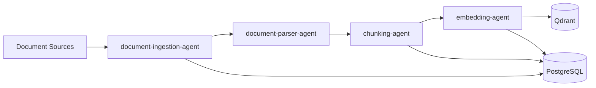

# Ingestion Domain

**Owner:** Data Ingestion Team  
**Status:** Phase 2 - In Development  
**Agents:** 4

---

## Overview

The Ingestion domain handles the complete document processing pipeline from source systems to indexed, searchable chunks. This includes document fetching, parsing, chunking, and embedding generation.

---

## Agents in This Domain

### 1. document-ingestion-agent

**File:** [document-ingestion-agent.md](./document-ingestion-agent.md)  
**Status:** 🟡 In Development  
**Phase:** 2  
**Responsibilities:** Pull documents from external sources, change detection  
**Dependencies:** SharePoint, Google Drive, S3/MinIO

### 2. document-parser-agent

**File:** [document-parser-agent.md](./document-parser-agent.md)  
**Status:** 🟡 In Development  
**Phase:** 2  
**Responsibilities:** Extract text, pages, tables, headings, structure  
**Dependencies:** PyPDF2, python-docx, BeautifulSoup

### 3. chunking-agent

**File:** [chunking-agent.md](./chunking-agent.md)  
**Status:** 📋 Planned  
**Phase:** 2  
**Responsibilities:** Create structured chunks with metadata  
**Dependencies:** spaCy, tiktoken

### 4. embedding-agent

**File:** [embedding-agent.md](./embedding-agent.md)  
**Status:** 📋 Planned  
**Phase:** 3  
**Responsibilities:** Generate embeddings, write to Qdrant  
**Dependencies:** OpenAI API, Qdrant

---

## Domain Architecture

---

## Integration Points

### Upstream Dependencies

- SharePoint API
- Google Drive API
- S3/MinIO API
- Local file system

### Downstream Services

- PostgreSQL (document/chunk metadata)
- Qdrant (vector storage)
- Message Queue (RabbitMQ/Kafka)

### Events Published

- `document.ingested`
- `document.parsed`
- `chunks.created`
- `embeddings.generated`

### Events Consumed

- `document.uploaded` (from admin-agent)
- `source.configured` (from admin-agent)

---

## Related Documentation

- [Chunking Strategy](../../architecture/chunking-strategy.md)
- [Embedding Model Strategy](../../decisions/ADR-001-embedding-strategy.md)
- [Phase 2 Implementation](../../phases/phase-2-ingestion/README.md)
