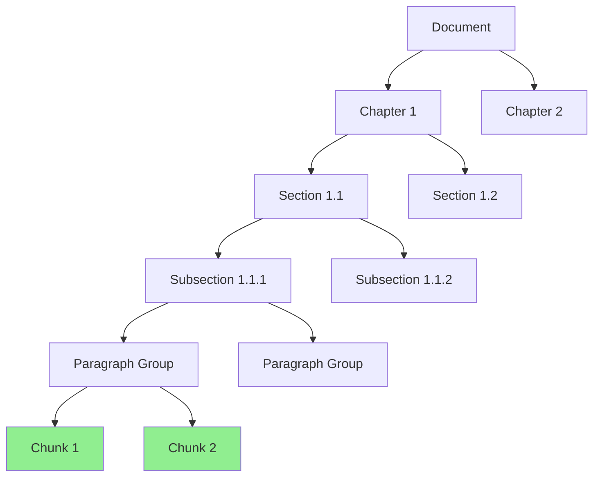

# chunking-agent

**Domain:** Ingestion  
**Status:** 📋 Planned  
**Phase:** 2 - Ingestion & Chunking  
**Owner:** Data Ingestion Team  
**Implementation Week:** Week 6

---

## Overview

The `chunking-agent` creates structured chunks that preserve meaning, section context, and citation metadata. It transforms parsed documents into semantically coherent chunks optimized for retrieval while maintaining enough context for accurate citation and answer generation.

This agent is **critical for retrieval quality** - poor chunking leads to poor retrieval, which leads to poor answers.

---

## Responsibility

### Primary Responsibilities

- Create structure-aware chunks from parsed documents
- Preserve section context and heading hierarchy
- Maintain page references for citation
- Compute token counts for each chunk
- Generate chunk checksums for change detection
- Attach access classification from document metadata
- Respect document structure boundaries
- Handle tables, lists, and code blocks appropriately
- Add controlled overlap within sections
- Store chunks in PostgreSQL via [`canonical-db-agent`](../infrastructure/canonical-db-agent.md)

---

## Chunking Strategy

### Structure-Aware Chunking

The system uses **structure-aware chunking** that respects document hierarchy:

```text
Document
  → Chapter
    → Section
      → Subsection
        → Clause
          → Paragraph group
            → Chunk
```

**Avoid blind fixed-size chunking** for policy documents, as it breaks semantic boundaries.

### Chunking Hierarchy



---

## Chunking Parameters

### Default Parameters

```python
DEFAULT_CHUNK_CONFIG = {
    "target_chunk_size": 512,      # tokens
    "max_chunk_size": 768,          # tokens
    "min_chunk_size": 100,          # tokens
    "overlap_size": 64,             # tokens (within section only)
    "max_table_size": 1024,         # tokens
    "preserve_tables": True,
    "preserve_code_blocks": True,
    "preserve_lists": True,
    "respect_section_boundaries": True,
    "add_heading_context": True
}
```

### Content-Specific Rules

#### Tables

- **Small tables** (< 1024 tokens): Preserve as single chunk
- **Large tables**: Split by row groups, repeat table title and column headers
- Always include table caption if present

#### Code Blocks

- Preserve as single chunk where possible
- If too large, split at logical boundaries (functions, classes)
- Maintain syntax context

#### Lists and Procedures

- Keep logically related steps together
- Preserve list hierarchy
- Maintain numbering context

#### Policy Clauses

- Keep rule, condition, exception, scope, and effective date together
- Do not split in the middle of obligation language
- Preserve clause numbering

---

## API Contract

### Chunking Operations

```python
def create_chunks(
    parsed_document: ParsedDocument,
    document_metadata: Dict[str, Any],
    chunk_config: Optional[ChunkConfig] = None
) -> List[Chunk]:
    """
    Create chunks from parsed document.

    Args:
        parsed_document: Parsed document with structure
        document_metadata: Document metadata (classification, department, etc.)
        chunk_config: Optional chunking configuration

    Returns:
        List of structured chunks
    """
    pass

def compute_chunk_checksum(chunk_text: str) -> str:
    """
    Compute SHA-256 checksum of chunk text.

    Args:
        chunk_text: Chunk text content

    Returns:
        Hex-encoded checksum
    """
    pass

def count_tokens(text: str) -> int:
    """
    Count tokens in text using tiktoken.

    Args:
        text: Text to count tokens for

    Returns:
        Token count
    """
    pass
```

---

## Data Models

### Chunk

```python
@dataclass
class Chunk:
    chunk_id: UUID
    document_id: UUID
    tenant_id: str
    chunk_text: str
    chunk_index: int
    page_start: Optional[int]
    page_end: Optional[int]
    section_title: Optional[str]
    heading_path: List[str]
    classification: str
    department: Optional[str]
    region: Optional[str]
    language: str
    version: str
    source_uri: str
    token_count: int
    checksum: str
    chunk_type: str  # "text", "table", "code", "list"
    metadata: Dict[str, Any]
```

### ChunkConfig

```python
@dataclass
class ChunkConfig:
    target_chunk_size: int = 512
    max_chunk_size: int = 768
    min_chunk_size: int = 100
    overlap_size: int = 64
    max_table_size: int = 1024
    preserve_tables: bool = True
    preserve_code_blocks: bool = True
    preserve_lists: bool = True
    respect_section_boundaries: bool = True
    add_heading_context: bool = True
```

---

## Chunking Algorithm

### Main Algorithm

```python
def create_chunks(
    parsed_document: ParsedDocument,
    document_metadata: Dict[str, Any],
    chunk_config: ChunkConfig
) -> List[Chunk]:
    """Create structure-aware chunks."""

    chunks = []
    chunk_index = 0

    for page in parsed_document.pages:
        # Group blocks by section
        sections = group_blocks_by_section(page.blocks)

        for section in sections:
            # Extract heading path
            heading_path = extract_heading_path(section)

            # Process section blocks
            section_chunks = process_section(
                section,
                heading_path,
                chunk_config
            )

            # Add metadata to chunks
            for chunk in section_chunks:
                chunk.chunk_index = chunk_index
                chunk.document_id = parsed_document.document_id
                chunk.tenant_id = document_metadata["tenant_id"]
                chunk.classification = document_metadata["classification"]
                chunk.department = document_metadata.get("department")
                chunk.region = document_metadata.get("region")
                chunk.language = parsed_document.language
                chunk.version = document_metadata["version"]
                chunk.source_uri = document_metadata["source_uri"]
                chunk.heading_path = heading_path

                chunks.append(chunk)
                chunk_index += 1

    return chunks
```

### Section Processing

```python
def process_section(
    section: Section,
    heading_path: List[str],
    config: ChunkConfig
) -> List[Chunk]:
    """Process section into chunks."""

    chunks = []
    current_chunk_text = []
    current_token_count = 0

    # Add heading context if configured
    if config.add_heading_context and heading_path:
        context = f"Section: {' > '.join(heading_path)}\n\n"
        current_chunk_text.append(context)
        current_token_count = count_tokens(context)

    for block in section.blocks:
        block_text = block.text
        block_tokens = count_tokens(block_text)

        # Handle special block types
        if block.block_type == "table":
            chunks.extend(handle_table(block, config))
            continue

        if block.block_type == "code":
            chunks.extend(handle_code_block(block, config))
            continue

        if block.block_type == "list":
            chunks.extend(handle_list(block, config))
            continue

        # Regular text block
        if current_token_count + block_tokens > config.max_chunk_size:
            # Finalize current chunk
            if current_chunk_text:
                chunks.append(create_chunk_from_text(
                    text="".join(current_chunk_text),
                    page_start=section.page_start,
                    page_end=section.page_end,
                    section_title=section.title
                ))

            # Start new chunk with overlap
            if config.overlap_size > 0:
                overlap_text = get_overlap_text(
                    current_chunk_text,
                    config.overlap_size
                )
                current_chunk_text = [overlap_text]
                current_token_count = count_tokens(overlap_text)
            else:
                current_chunk_text = []
                current_token_count = 0

        current_chunk_text.append(block_text + "\n\n")
        current_token_count += block_tokens

    # Finalize last chunk
    if current_chunk_text:
        chunks.append(create_chunk_from_text(
            text="".join(current_chunk_text),
            page_start=section.page_start,
            page_end=section.page_end,
            section_title=section.title
        ))

    return chunks
```

### Table Handling

```python
def handle_table(table: Table, config: ChunkConfig) -> List[Chunk]:
    """Handle table chunking."""

    table_text = format_table(table)
    table_tokens = count_tokens(table_text)

    # Small table - keep as single chunk
    if table_tokens <= config.max_table_size:
        return [create_chunk_from_text(
            text=table_text,
            page_start=table.page_number,
            page_end=table.page_number,
            section_title=table.caption,
            chunk_type="table"
        )]

    # Large table - split by row groups
    chunks = []
    header_text = format_table_header(table)

    row_groups = split_table_rows(
        table.rows,
        max_tokens=config.max_table_size - count_tokens(header_text)
    )

    for row_group in row_groups:
        chunk_text = header_text + format_rows(row_group)
        chunks.append(create_chunk_from_text(
            text=chunk_text,
            page_start=table.page_number,
            page_end=table.page_number,
            section_title=table.caption,
            chunk_type="table"
        ))

    return chunks
```

---

## Chunk Metadata

### Required Metadata

Every chunk **must** include:

```python
{
    "document_id": UUID,
    "document_version_id": UUID,
    "tenant_id": str,
    "chunk_id": UUID,
    "page_start": int,
    "page_end": int,
    "section_title": str,
    "heading_path": List[str],
    "classification": str,
    "department": str,
    "region": str,
    "language": str,
    "chunk_type": str,
    "token_count": int
}
```

### Example Chunk

```json
{
  "chunk_id": "chunk_001",
  "document_id": "doc_001",
  "tenant_id": "global-company",
  "chunk_text": "Section: Finance Policy > Travel > Expense Claims\n\nEmployees must submit expense claims within 14 days of travel completion. Claims must include original receipts for all expenses over $25.",
  "chunk_index": 0,
  "page_start": 3,
  "page_end": 4,
  "section_title": "Expense Claims",
  "heading_path": ["Finance Policy", "Travel", "Expense Claims"],
  "classification": "INTERNAL_GENERAL",
  "department": "Finance",
  "region": "global",
  "language": "en",
  "version": "v3.2",
  "source_uri": "s3://bucket/finance-policy.pdf",
  "token_count": 45,
  "checksum": "a1b2c3d4...",
  "chunk_type": "text",
  "metadata": {
    "effective_date": "2024-01-01",
    "policy_code": "FIN-204"
  }
}
```

---

## Security Rules

### Non-Negotiable Rules

1. **Never cross access-control boundaries** during chunking
2. **Never cross document-version boundaries**
3. **Never cross classification boundaries**
4. **Never mix content from different tenants**
5. **Always preserve source attribution** for citation

---

## Testing Requirements

### Unit Tests

**Test Coverage Target:** >85%

#### Chunk Structure Tests

- ✅ Chunk contains document ID
- ✅ Chunk contains page range
- ✅ Chunk contains heading path
- ✅ Chunk does not exceed configured token limit
- ✅ Chunk overlap does not cross section boundary
- ✅ Tables are preserved as coherent chunks
- ✅ Code blocks are preserved
- ✅ Lists maintain hierarchy

#### Metadata Tests

- ✅ All required metadata fields are present
- ✅ Classification is inherited from document
- ✅ Tenant ID is correct
- ✅ Page numbers are accurate

#### Checksum Tests

- ✅ Checksum is deterministic
- ✅ Checksum changes when text changes
- ✅ Duplicate chunks have same checksum

### Integration Tests

- ✅ Chunk sample HR policy and verify all chunks resolve to PostgreSQL
- ✅ Confirm chunk count is stable for unchanged document
- ✅ Confirm changed section only changes related chunk checksums
- ✅ Verify chunks can be retrieved by document_id
- ✅ Verify chunk ordering is stable

### Citation Tests

- ✅ Every chunk must have `page_start` and `page_end` when source supports pagination
- ✅ Every chunk must have `source_uri`
- ✅ Heading path is accurate for citation
- ✅ Section title is preserved

### Quality Tests

- ✅ Chunks preserve semantic meaning
- ✅ Chunks have sufficient context for retrieval
- ✅ Overlap improves context continuity
- ✅ Table chunks are readable
- ✅ Code chunks are syntactically coherent

### Performance Tests

- ✅ Chunk 100-page document in <10 seconds
- ✅ Chunk 1000-page document in <60 seconds
- ✅ Token counting is efficient
- ✅ Memory usage is reasonable for large documents

---

## Error Handling

### Error Types

```python
class ChunkingError(Exception):
    """Base chunking error."""
    pass

class InvalidDocumentError(ChunkingError):
    """Document structure is invalid."""
    pass

class TokenLimitExceededError(ChunkingError):
    """Chunk exceeds maximum token limit."""
    pass

class MissingMetadataError(ChunkingError):
    """Required metadata is missing."""
    pass
```

---

## Configuration

### Environment Variables

```bash
# Chunking
TARGET_CHUNK_SIZE=512
MAX_CHUNK_SIZE=768
MIN_CHUNK_SIZE=100
OVERLAP_SIZE=64

# Tables
MAX_TABLE_SIZE=1024
PRESERVE_TABLES=true

# Performance
CHUNKING_WORKERS=4
BATCH_SIZE=100
```

### Configuration File

```yaml
chunking:
  target_chunk_size: 512
  max_chunk_size: 768
  min_chunk_size: 100
  overlap_size: 64
  max_table_size: 1024
  preserve_tables: true
  preserve_code_blocks: true
  preserve_lists: true
  respect_section_boundaries: true
  add_heading_context: true

tokenizer:
  model: "cl100k_base" # OpenAI tiktoken model
```

---

## Dependencies

### Upstream Dependencies

- [`document-parser-agent`](./document-parser-agent.md) - Provides parsed documents
- [`canonical-db-agent`](../infrastructure/canonical-db-agent.md) - Stores chunks
- tiktoken - Token counting

### Downstream Consumers

- [`embedding-agent`](../indexing/embedding-agent.md) - Embeds chunks
- [`bm25-index-agent`](../indexing/bm25-index-agent.md) - Indexes chunks
- [`knowledge-graph-agent`](../indexing/knowledge-graph-agent.md) - Extracts entities from chunks

---

## Monitoring & Observability

### Metrics

```python
# Chunking metrics
chunking_agent_documents_chunked_total
chunking_agent_chunks_created_total
chunking_agent_chunking_duration_seconds

# Quality metrics
chunking_agent_avg_chunk_size_tokens
chunking_agent_chunks_below_min_size_total
chunking_agent_chunks_above_max_size_total

# Performance metrics
chunking_agent_token_counting_duration_seconds
chunking_agent_throughput_chunks_per_second
```

### Logging

```python
logger.info("Document chunked", extra={
    "document_id": document_id,
    "chunk_count": len(chunks),
    "avg_chunk_size": avg_chunk_size,
    "duration_seconds": duration
})

logger.warning("Chunk exceeds max size", extra={
    "chunk_id": chunk_id,
    "token_count": token_count,
    "max_size": max_chunk_size
})
```

---

## Related Documentation

- [System Architecture](../../ARCHITECTURE.md)
- [Phase 2 Implementation](../../phases/phase-2-ingestion-chunking/README.md)
- [document-parser-agent](./document-parser-agent.md)
- [embedding-agent](../indexing/embedding-agent.md)
- [Citation Requirements](../../architecture/citation-requirements.md)

---

**Status:** 📋 Ready for Implementation  
**Next Steps:** Begin Week 6 implementation with structure-aware chunking algorithm.
