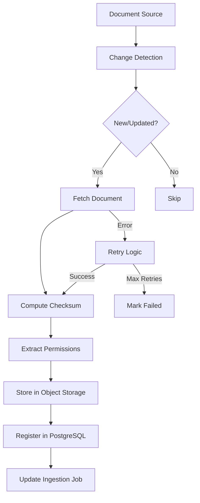

# document-ingestion-agent

**Domain:** Ingestion  
**Status:** 📋 Planned  
**Phase:** 2 - Ingestion & Chunking  
**Owner:** Data Ingestion Team  
**Implementation Week:** Week 4

---

## Overview

The `document-ingestion-agent` pulls documents from configured external sources and registers ingestion jobs. It serves as the entry point for all documents entering the Enterprise RAG System, handling source connectivity, change detection, permission mapping, and initial document registration.

---

## Responsibility

### Primary Responsibilities

- Connect to external document sources
- Detect new, updated, and deleted documents
- Compute document checksums for change detection
- Extract and map source permissions to access policies
- Register documents in PostgreSQL via [`canonical-db-agent`](../infrastructure/canonical-db-agent.md)
- Create and track ingestion jobs
- Store original files in object storage
- Handle ingestion failures and retries
- Support incremental and full sync modes

---

## Supported Sources

### Document Management Systems

- **SharePoint** - Microsoft SharePoint Online and On-Premises
- **Google Drive** - Google Workspace documents
- **Confluence** - Atlassian Confluence pages and attachments
- **Notion** - Notion pages and databases

### Cloud Storage

- **AWS S3** - Amazon S3 buckets
- **MinIO** - Self-hosted S3-compatible storage
- **Azure Blob Storage** - Microsoft Azure storage
- **Google Cloud Storage** - GCP storage buckets

### Version Control

- **Git repositories** - GitHub, GitLab, Bitbucket
- **Internal wikis** - Custom wiki systems

### Direct Upload

- **Local uploads** - Direct file uploads via API or UI

---

## Architecture

### Ingestion Flow



### Source Connector Interface

```python
class SourceConnector(ABC):
    """Base interface for all source connectors."""

    @abstractmethod
    def connect(self, config: Dict[str, Any]) -> bool:
        """Establish connection to source."""
        pass

    @abstractmethod
    def list_documents(self, since: Optional[datetime] = None) -> List[SourceDocument]:
        """List documents, optionally since last sync."""
        pass

    @abstractmethod
    def fetch_document(self, source_uri: str) -> bytes:
        """Fetch document content."""
        pass

    @abstractmethod
    def get_permissions(self, source_uri: str) -> SourcePermissions:
        """Get document permissions from source."""
        pass

    @abstractmethod
    def detect_changes(self, known_documents: List[str]) -> ChangeSet:
        """Detect new, updated, and deleted documents."""
        pass
```

---

## API Contract

### Ingestion Operations

```python
def ingest_source(
    tenant_id: str,
    source_config: SourceConfig
) -> UUID:
    """
    Start ingestion job for a document source.

    Args:
        tenant_id: Tenant identifier
        source_config: Source configuration

    Returns:
        Ingestion job ID
    """
    pass

def fetch_document(source_uri: str) -> bytes:
    """
    Fetch raw document content from source.

    Args:
        source_uri: Source URI

    Returns:
        Raw document bytes
    """
    pass

def compute_checksum(content: bytes) -> str:
    """
    Compute SHA-256 checksum of document content.

    Args:
        content: Document bytes

    Returns:
        Hex-encoded checksum
    """
    pass

def map_source_permissions(
    source_permissions: SourcePermissions
) -> AccessPolicy:
    """
    Map source permissions to access policy.

    Args:
        source_permissions: Permissions from source system

    Returns:
        Access policy for canonical DB
    """
    pass
```

### Job Management

```python
def create_ingestion_job(
    tenant_id: str,
    source_id: UUID,
    sync_mode: str = "incremental"
) -> UUID:
    """Create new ingestion job."""
    pass

def update_job_status(
    job_id: UUID,
    status: str,
    documents_processed: int = 0,
    documents_failed: int = 0,
    error_message: Optional[str] = None
) -> None:
    """Update ingestion job status."""
    pass

def get_job_status(job_id: UUID) -> IngestionJob:
    """Get ingestion job status."""
    pass
```

### Change Detection

```python
def detect_changes(
    source_id: UUID,
    last_sync: Optional[datetime] = None
) -> ChangeSet:
    """
    Detect document changes since last sync.

    Returns:
        ChangeSet with new, updated, and deleted documents
    """
    pass
```

---

## Data Models

### SourceConfig

```python
@dataclass
class SourceConfig:
    source_id: UUID
    tenant_id: str
    source_type: str  # "sharepoint", "google_drive", etc.
    source_name: str
    connection_config: Dict[str, Any]
    sync_schedule: Optional[str]  # Cron expression
    sync_mode: str = "incremental"  # or "full"
    enabled: bool = True
```

### SourceDocument

```python
@dataclass
class SourceDocument:
    source_uri: str
    title: str
    file_type: str
    size_bytes: int
    modified_at: datetime
    checksum: Optional[str]
    permissions: Optional[SourcePermissions]
```

### SourcePermissions

```python
@dataclass
class SourcePermissions:
    classification: str
    allowed_users: List[str]
    allowed_groups: List[str]
    allowed_departments: List[str]
    denied_users: List[str]
    region_restrictions: List[str]
```

### ChangeSet

```python
@dataclass
class ChangeSet:
    new_documents: List[SourceDocument]
    updated_documents: List[SourceDocument]
    deleted_documents: List[str]  # source URIs
    unchanged_documents: List[str]
```

### IngestionJob

```python
@dataclass
class IngestionJob:
    job_id: UUID
    tenant_id: str
    source_id: UUID
    status: str  # "pending", "running", "completed", "failed"
    sync_mode: str
    documents_processed: int
    documents_failed: int
    error_message: Optional[str]
    started_at: Optional[datetime]
    completed_at: Optional[datetime]
    created_at: datetime
```

---

## Source Connectors

### SharePoint Connector

```python
class SharePointConnector(SourceConnector):
    def __init__(self, site_url: str, client_id: str, client_secret: str):
        self.site_url = site_url
        self.client_id = client_id
        self.client_secret = client_secret
        self.client = None

    def connect(self, config: Dict[str, Any]) -> bool:
        """Connect to SharePoint using OAuth2."""
        # Implementation
        pass

    def list_documents(self, since: Optional[datetime] = None) -> List[SourceDocument]:
        """List documents from SharePoint library."""
        # Implementation
        pass

    def get_permissions(self, source_uri: str) -> SourcePermissions:
        """Extract SharePoint permissions."""
        # Map SharePoint groups to departments/groups
        pass
```

### Google Drive Connector

```python
class GoogleDriveConnector(SourceConnector):
    def __init__(self, credentials_path: str):
        self.credentials_path = credentials_path
        self.service = None

    def connect(self, config: Dict[str, Any]) -> bool:
        """Connect to Google Drive using service account."""
        # Implementation
        pass

    def list_documents(self, since: Optional[datetime] = None) -> List[SourceDocument]:
        """List documents from Google Drive."""
        # Implementation
        pass
```

### S3 Connector

```python
class S3Connector(SourceConnector):
    def __init__(self, bucket: str, region: str, access_key: str, secret_key: str):
        self.bucket = bucket
        self.region = region
        self.access_key = access_key
        self.secret_key = secret_key
        self.client = None

    def connect(self, config: Dict[str, Any]) -> bool:
        """Connect to S3."""
        # Implementation
        pass

    def list_documents(self, since: Optional[datetime] = None) -> List[SourceDocument]:
        """List objects from S3 bucket."""
        # Implementation
        pass
```

---

## Permission Mapping

### Mapping Rules

```python
def map_sharepoint_permissions(sp_permissions: Dict) -> AccessPolicy:
    """
    Map SharePoint permissions to access policy.

    Rules:
    - "Everyone" → PUBLIC
    - "Company" group → INTERNAL_GENERAL
    - Department groups → DEPARTMENT_RESTRICTED
    - Specific users → User-specific access
    """
    classification = "INTERNAL_GENERAL"
    allowed_departments = []
    allowed_groups = []

    for group in sp_permissions.get("groups", []):
        if group == "Everyone":
            classification = "PUBLIC"
        elif group == "Company":
            classification = "INTERNAL_GENERAL"
        elif group.startswith("Dept_"):
            dept = group.replace("Dept_", "")
            allowed_departments.append(dept)
            classification = "DEPARTMENT_RESTRICTED"

    return AccessPolicy(
        classification=classification,
        allowed_departments=allowed_departments,
        allowed_groups=allowed_groups,
        # ...
    )
```

---

## Testing Requirements

### Unit Tests

**Test Coverage Target:** >80%

#### Checksum Tests

- ✅ Checksum changes when document content changes
- ✅ Same document content produces same checksum
- ✅ Checksum is deterministic (same input = same output)

#### Permission Mapping Tests

- ✅ Source permission mapping works for known folder rules
- ✅ SharePoint "Everyone" maps to PUBLIC
- ✅ SharePoint department groups map to DEPARTMENT_RESTRICTED
- ✅ Google Drive shared folders map correctly
- ✅ S3 bucket policies map correctly

#### File Type Tests

- ✅ Supported file types are accepted
- ✅ Unsupported file types are rejected or marked unsupported
- ✅ File type detection works correctly

#### Change Detection Tests

- ✅ Detect new documents
- ✅ Detect updated documents (checksum changed)
- ✅ Detect deleted documents
- ✅ Unchanged documents are skipped

### Integration Tests

- ✅ Ingest sample PDF into object storage and PostgreSQL
- ✅ Ingest updated document and create new version
- ✅ Detect deleted document and mark as deleted
- ✅ Full sync ingests all documents
- ✅ Incremental sync only processes changes
- ✅ Failed ingestion creates retry job

### Security Tests

- ✅ Verify source permissions are not dropped during ingestion
- ✅ Verify confidential folders map to confidential access policies
- ✅ Verify tenant isolation during ingestion
- ✅ Verify credentials are not logged

### Performance Tests

- ✅ Ingest 1,000 documents in <10 minutes
- ✅ Change detection for 10,000 documents in <30 seconds
- ✅ Parallel ingestion of 10 sources completes successfully

---

## Error Handling

### Error Types

```python
class SourceConnectionError(Exception):
    """Cannot connect to document source."""
    pass

class DocumentFetchError(Exception):
    """Cannot fetch document from source."""
    pass

class PermissionMappingError(Exception):
    """Cannot map source permissions."""
    pass

class UnsupportedFileTypeError(Exception):
    """File type is not supported."""
    pass

class IngestionJobError(Exception):
    """Ingestion job failed."""
    pass
```

### Retry Strategy

```python
# Exponential backoff with jitter
MAX_RETRIES = 3
BASE_DELAY = 1  # seconds
MAX_DELAY = 60  # seconds

def retry_with_backoff(func, *args, **kwargs):
    for attempt in range(MAX_RETRIES):
        try:
            return func(*args, **kwargs)
        except Exception as e:
            if attempt == MAX_RETRIES - 1:
                raise
            delay = min(BASE_DELAY * (2 ** attempt) + random.uniform(0, 1), MAX_DELAY)
            time.sleep(delay)
```

---

## Configuration

### Environment Variables

```bash
# Object Storage
OBJECT_STORAGE_TYPE=s3  # or "minio", "azure"
OBJECT_STORAGE_BUCKET=enterprise-rag-documents
OBJECT_STORAGE_REGION=us-east-1
OBJECT_STORAGE_ACCESS_KEY=...
OBJECT_STORAGE_SECRET_KEY=...

# Ingestion
INGESTION_BATCH_SIZE=100
INGESTION_MAX_RETRIES=3
INGESTION_TIMEOUT_SECONDS=300
```

### Source Configuration Example

```yaml
sources:
  - source_id: "sharepoint-001"
    tenant_id: "global-company"
    source_type: "sharepoint"
    source_name: "Company SharePoint"
    connection_config:
      site_url: "https://company.sharepoint.com/sites/docs"
      client_id: "${SHAREPOINT_CLIENT_ID}"
      client_secret: "${SHAREPOINT_CLIENT_SECRET}"
      library: "Shared Documents"
    sync_schedule: "0 */6 * * *" # Every 6 hours
    sync_mode: "incremental"
    enabled: true
```

---

## Dependencies

### Upstream Dependencies

- Document sources (SharePoint, Google Drive, etc.)
- Object storage (S3, MinIO, Azure Blob)
- [`canonical-db-agent`](../infrastructure/canonical-db-agent.md) - Document registration

### Downstream Consumers

- [`document-parser-agent`](./document-parser-agent.md) - Parses ingested documents
- [`admin-agent`](../operations/admin-agent.md) - Monitors ingestion jobs

---

## Monitoring & Observability

### Metrics

```python
# Ingestion metrics
document_ingestion_jobs_total
document_ingestion_documents_processed_total
document_ingestion_documents_failed_total
document_ingestion_duration_seconds

# Source metrics
document_ingestion_source_connection_errors_total
document_ingestion_source_fetch_errors_total

# Performance metrics
document_ingestion_batch_size
document_ingestion_throughput_docs_per_second
```

### Logging

```python
logger.info("Ingestion job started", extra={
    "job_id": job_id,
    "tenant_id": tenant_id,
    "source_id": source_id,
    "sync_mode": sync_mode
})

logger.error("Document fetch failed", extra={
    "source_uri": source_uri,
    "error": str(e),
    "retry_attempt": attempt
})
```

---

## Related Documentation

- [System Architecture](../../ARCHITECTURE.md)
- [Phase 2 Implementation](../../phases/phase-2-ingestion-chunking/README.md)
- [canonical-db-agent](../infrastructure/canonical-db-agent.md)
- [document-parser-agent](./document-parser-agent.md)
- [chunking-agent](./chunking-agent.md)

---

**Status:** 📋 Ready for Implementation  
**Next Steps:** Begin Week 4 implementation with SharePoint and Google Drive connectors.
