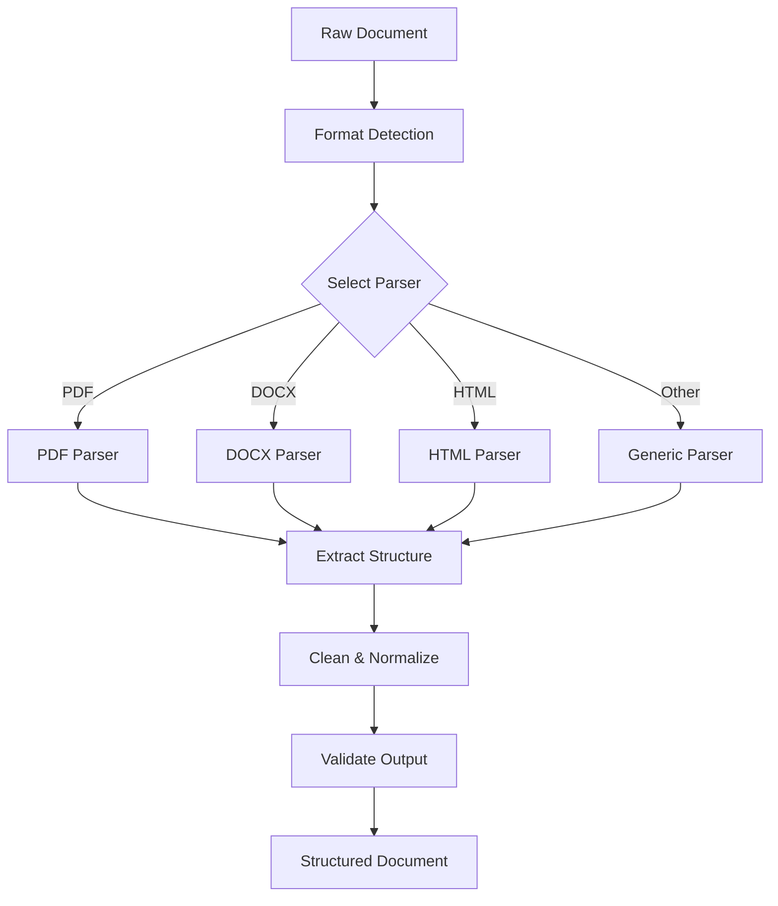

# document-parser-agent

**Domain:** Ingestion  
**Status:** 📋 Planned  
**Phase:** 2 - Ingestion & Chunking  
**Owner:** Data Ingestion Team  
**Implementation Week:** Week 5

---

## Overview

The `document-parser-agent` extracts structured content from raw documents. It transforms unstructured document files into structured, machine-readable format that preserves document hierarchy, page numbers, tables, and other semantic elements critical for accurate chunking and citation.

---

## Responsibility

### Primary Responsibilities

- Extract plain text from various document formats
- Preserve document structure (headings, sections, paragraphs)
- Extract and preserve page numbers
- Parse tables with structure preservation
- Extract lists and maintain hierarchy
- Identify and extract captions and footnotes
- Maintain source offsets for citation
- Handle multi-language documents
- Remove repeated headers/footers where configured

---

## Supported Formats

### Document Formats

- **PDF** - Portable Document Format (text-based and OCR)
- **DOCX** - Microsoft Word documents
- **PPTX** - Microsoft PowerPoint presentations
- **ODT** - OpenDocument Text

### Web Formats

- **HTML** - Web pages and documentation
- **Markdown** - Markdown documents
- **TXT** - Plain text files

### Data Formats

- **CSV** - Comma-separated values
- **XLSX** - Microsoft Excel spreadsheets
- **JSON** - Structured data (for API documentation)

---

## Architecture

### Parsing Pipeline



### Parser Interface

```python
class DocumentParser(ABC):
    """Base interface for all document parsers."""

    @abstractmethod
    def can_parse(self, file_type: str) -> bool:
        """Check if parser supports file type."""
        pass

    @abstractmethod
    def parse(self, content: bytes, metadata: Dict[str, Any]) -> ParsedDocument:
        """Parse document and return structured content."""
        pass

    @abstractmethod
    def extract_metadata(self, content: bytes) -> Dict[str, Any]:
        """Extract document metadata."""
        pass
```

---

## API Contract

### Parsing Operations

```python
def parse_document(
    document_id: UUID,
    content: bytes,
    file_type: str,
    metadata: Optional[Dict[str, Any]] = None
) -> ParsedDocument:
    """
    Parse document and extract structured content.

    Args:
        document_id: Document identifier
        content: Raw document bytes
        file_type: File extension (pdf, docx, etc.)
        metadata: Optional document metadata

    Returns:
        ParsedDocument with structured content
    """
    pass

def extract_text(content: bytes, file_type: str) -> str:
    """
    Extract plain text from document.

    Args:
        content: Raw document bytes
        file_type: File extension

    Returns:
        Plain text content
    """
    pass

def extract_structure(
    content: bytes,
    file_type: str
) -> List[DocumentBlock]:
    """
    Extract structured blocks (headings, paragraphs, tables).

    Args:
        content: Raw document bytes
        file_type: File extension

    Returns:
        List of structured document blocks
    """
    pass
```

---

## Data Models

### ParsedDocument

```python
@dataclass
class ParsedDocument:
    document_id: UUID
    file_type: str
    language: str
    page_count: int
    pages: List[Page]
    metadata: Dict[str, Any]
    parsing_errors: List[str]
```

### Page

```python
@dataclass
class Page:
    page_number: int
    text: str
    blocks: List[DocumentBlock]
    images: List[Image]
    tables: List[Table]
```

### DocumentBlock

```python
@dataclass
class DocumentBlock:
    block_type: str  # "heading", "paragraph", "list", "code", "quote"
    text: str
    level: Optional[int]  # For headings
    start_offset: int
    end_offset: int
    page_number: int
    metadata: Dict[str, Any]
```

### Table

```python
@dataclass
class Table:
    table_id: str
    caption: Optional[str]
    headers: List[str]
    rows: List[List[str]]
    page_number: int
    start_offset: int
    end_offset: int
```

### Image

```python
@dataclass
class Image:
    image_id: str
    caption: Optional[str]
    alt_text: Optional[str]
    page_number: int
    width: int
    height: int
```

---

## Parser Implementations

### PDF Parser

```python
class PDFParser(DocumentParser):
    """Parse PDF documents using PyMuPDF (fitz)."""

    def __init__(self):
        self.ocr_enabled = True
        self.extract_images = False

    def parse(self, content: bytes, metadata: Dict[str, Any]) -> ParsedDocument:
        """
        Parse PDF document.

        Features:
        - Text extraction with position
        - Table detection and extraction
        - Heading detection using font size
        - Page number preservation
        - OCR for scanned PDFs
        """
        import fitz  # PyMuPDF

        doc = fitz.open(stream=content, filetype="pdf")
        pages = []

        for page_num in range(len(doc)):
            page = doc[page_num]

            # Extract text with positions
            text = page.get_text()

            # Extract blocks
            blocks = self._extract_blocks(page)

            # Extract tables
            tables = self._extract_tables(page)

            pages.append(Page(
                page_number=page_num + 1,
                text=text,
                blocks=blocks,
                images=[],
                tables=tables
            ))

        return ParsedDocument(
            document_id=metadata["document_id"],
            file_type="pdf",
            language=metadata.get("language", "en"),
            page_count=len(pages),
            pages=pages,
            metadata=metadata,
            parsing_errors=[]
        )

    def _extract_blocks(self, page) -> List[DocumentBlock]:
        """Extract structured blocks from PDF page."""
        blocks = []
        dict_blocks = page.get_text("dict")["blocks"]

        for block in dict_blocks:
            if block["type"] == 0:  # Text block
                # Detect headings by font size
                is_heading, level = self._detect_heading(block)

                block_type = "heading" if is_heading else "paragraph"

                blocks.append(DocumentBlock(
                    block_type=block_type,
                    text=self._extract_block_text(block),
                    level=level if is_heading else None,
                    start_offset=block["bbox"][1],
                    end_offset=block["bbox"][3],
                    page_number=page.number + 1,
                    metadata={}
                ))

        return blocks

    def _detect_heading(self, block) -> Tuple[bool, Optional[int]]:
        """Detect if block is a heading based on font size."""
        # Implementation
        pass
```

### DOCX Parser

```python
class DOCXParser(DocumentParser):
    """Parse Microsoft Word documents using python-docx."""

    def parse(self, content: bytes, metadata: Dict[str, Any]) -> ParsedDocument:
        """
        Parse DOCX document.

        Features:
        - Heading hierarchy preservation
        - Table extraction with structure
        - List extraction with nesting
        - Style-based formatting
        """
        from docx import Document

        doc = Document(io.BytesIO(content))
        pages = []
        current_page = []

        for element in doc.element.body:
            if element.tag.endswith('p'):  # Paragraph
                para = element
                block = self._parse_paragraph(para)
                current_page.append(block)

            elif element.tag.endswith('tbl'):  # Table
                table = self._parse_table(element)
                current_page.append(table)

        # DOCX doesn't have explicit pages, create logical pages
        pages.append(Page(
            page_number=1,
            text=self._extract_text(doc),
            blocks=current_page,
            images=[],
            tables=[]
        ))

        return ParsedDocument(
            document_id=metadata["document_id"],
            file_type="docx",
            language=metadata.get("language", "en"),
            page_count=1,
            pages=pages,
            metadata=metadata,
            parsing_errors=[]
        )
```

### HTML Parser

```python
class HTMLParser(DocumentParser):
    """Parse HTML documents using BeautifulSoup."""

    def parse(self, content: bytes, metadata: Dict[str, Any]) -> ParsedDocument:
        """
        Parse HTML document.

        Features:
        - Heading hierarchy (h1-h6)
        - Table extraction
        - List extraction
        - Link preservation
        - Code block extraction
        """
        from bs4 import BeautifulSoup

        soup = BeautifulSoup(content, 'html.parser')
        blocks = []

        # Extract headings
        for heading in soup.find_all(['h1', 'h2', 'h3', 'h4', 'h5', 'h6']):
            level = int(heading.name[1])
            blocks.append(DocumentBlock(
                block_type="heading",
                text=heading.get_text(strip=True),
                level=level,
                start_offset=0,
                end_offset=0,
                page_number=1,
                metadata={}
            ))

        # Extract paragraphs
        for para in soup.find_all('p'):
            blocks.append(DocumentBlock(
                block_type="paragraph",
                text=para.get_text(strip=True),
                level=None,
                start_offset=0,
                end_offset=0,
                page_number=1,
                metadata={}
            ))

        # Extract tables
        tables = self._extract_html_tables(soup)

        pages = [Page(
            page_number=1,
            text=soup.get_text(),
            blocks=blocks,
            images=[],
            tables=tables
        )]

        return ParsedDocument(
            document_id=metadata["document_id"],
            file_type="html",
            language=metadata.get("language", "en"),
            page_count=1,
            pages=pages,
            metadata=metadata,
            parsing_errors=[]
        )
```

---

## Output Format

### Example Output

```json
{
  "document_id": "doc_001",
  "file_type": "pdf",
  "language": "en",
  "page_count": 3,
  "pages": [
    {
      "page_number": 1,
      "text": "Travel Policy\n\nEmployees must submit expense claims within 14 days...",
      "blocks": [
        {
          "block_type": "heading",
          "text": "Travel Policy",
          "level": 1,
          "start_offset": 0,
          "end_offset": 100,
          "page_number": 1,
          "metadata": {}
        },
        {
          "block_type": "paragraph",
          "text": "Employees must submit expense claims within 14 days...",
          "level": null,
          "start_offset": 100,
          "end_offset": 500,
          "page_number": 1,
          "metadata": {}
        }
      ],
      "images": [],
      "tables": [
        {
          "table_id": "table_001",
          "caption": "Expense Limits",
          "headers": ["Category", "Limit", "Approval Required"],
          "rows": [
            ["Meals", "$50", "No"],
            ["Lodging", "$200", "Yes"]
          ],
          "page_number": 1,
          "start_offset": 500,
          "end_offset": 800
        }
      ]
    }
  ],
  "metadata": {
    "author": "Finance Department",
    "created_date": "2024-01-15",
    "modified_date": "2024-03-20"
  },
  "parsing_errors": []
}
```

---

## Testing Requirements

### Unit Tests

**Test Coverage Target:** >80%

#### Text Extraction Tests

- ✅ Extract page numbers from sample PDF
- ✅ Extract headings from DOCX
- ✅ Extract table rows from PDF/DOCX
- ✅ Preserve bullet list structure
- ✅ Remove repeated headers/footers where configured
- ✅ Extract text from multi-column PDF

#### Structure Tests

- ✅ Detect heading hierarchy correctly
- ✅ Preserve table structure
- ✅ Maintain list nesting
- ✅ Extract code blocks from Markdown

#### Format Tests

- ✅ Parse PDF successfully
- ✅ Parse DOCX successfully
- ✅ Parse HTML successfully
- ✅ Parse Markdown successfully
- ✅ Handle corrupted files gracefully

### Integration Tests

- ✅ Parse a policy PDF and confirm page-to-text mapping
- ✅ Parse a DOCX and confirm section hierarchy
- ✅ Parse HTML and preserve headings and links
- ✅ Parse multi-language document correctly
- ✅ Parse document with tables and verify structure

### Quality Tests

- ✅ Confirm parser does not merge unrelated pages
- ✅ Confirm text extraction includes enough context for citation
- ✅ Confirm table extraction preserves column relationships
- ✅ Confirm heading detection accuracy >95%

### Performance Tests

- ✅ Parse 100-page PDF in <30 seconds
- ✅ Parse 50-page DOCX in <10 seconds
- ✅ Parse HTML document in <5 seconds
- ✅ Handle 1000-page PDF without memory issues

---

## Error Handling

### Error Types

```python
class ParsingError(Exception):
    """Base parsing error."""
    pass

class UnsupportedFormatError(ParsingError):
    """File format is not supported."""
    pass

class CorruptedFileError(ParsingError):
    """File is corrupted or unreadable."""
    pass

class OCRError(ParsingError):
    """OCR processing failed."""
    pass
```

---

## Configuration

### Environment Variables

```bash
# Parsing
ENABLE_OCR=true
OCR_LANGUAGE=eng
MAX_FILE_SIZE_MB=100
PARSING_TIMEOUT_SECONDS=300

# PDF
PDF_EXTRACT_IMAGES=false
PDF_DETECT_TABLES=true

# Performance
PARSING_WORKERS=4
```

---

## Dependencies

### Upstream Dependencies

- [`document-ingestion-agent`](./document-ingestion-agent.md) - Provides raw documents
- PyMuPDF (fitz) - PDF parsing
- python-docx - DOCX parsing
- BeautifulSoup4 - HTML parsing
- Tesseract OCR - OCR for scanned documents

### Downstream Consumers

- [`chunking-agent`](./chunking-agent.md) - Consumes parsed documents

---

## Monitoring & Observability

### Metrics

```python
# Parsing metrics
document_parser_documents_parsed_total
document_parser_parsing_duration_seconds
document_parser_parsing_errors_total

# Format metrics
document_parser_format_pdf_total
document_parser_format_docx_total
document_parser_format_html_total
```

---

## Related Documentation

- [Phase 2 Implementation](../../phases/phase-2-ingestion-chunking/README.md)
- [document-ingestion-agent](./document-ingestion-agent.md)
- [chunking-agent](./chunking-agent.md)

---

**Status:** 📋 Ready for Implementation  
**Next Steps:** Begin Week 5 implementation with PDF and DOCX parsers.
