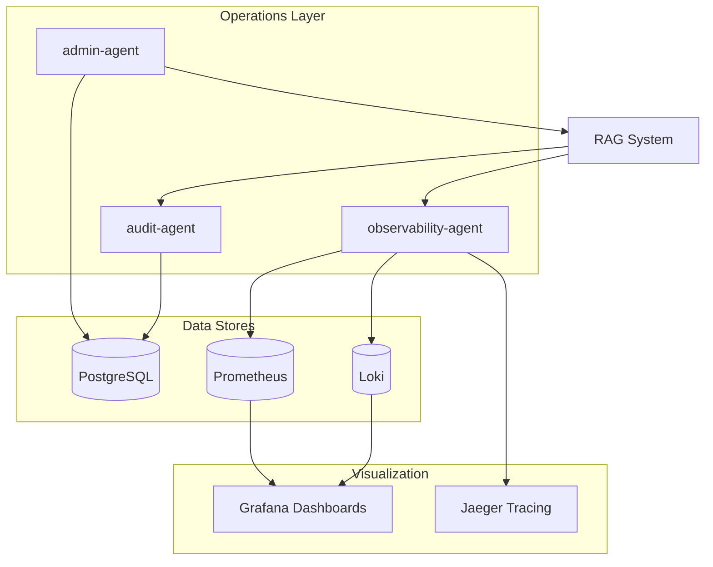

# Operations Domain

**Owner:** Platform Operations Team  
**Status:** Phase 8 - Planned  
**Agents:** 3

---

## Overview

The Operations domain provides audit logging, system administration, and observability for the entire RAG platform.

---

## Agents in This Domain

### 1. audit-agent

**File:** [audit-agent.md](./audit-agent.md)  
**Status:** 📋 Planned  
**Phase:** 8  
**Responsibilities:** Log queries, retrieved chunks, denied chunks, citations, and responses  
**Dependencies:** PostgreSQL (audit logs)

### 2. admin-agent

**File:** [admin-agent.md](./admin-agent.md)  
**Status:** 📋 Planned  
**Phase:** 8  
**Responsibilities:** Manage sources, ingestion status, reindexing, and policy rules  
**Dependencies:** PostgreSQL, Qdrant, OpenSearch, Neo4j

### 3. observability-agent

**File:** [observability-agent.md](./observability-agent.md)  
**Status:** 📋 Planned  
**Phase:** 8  
**Responsibilities:** Monitor latency, errors, retrieval quality, and security signals  
**Dependencies:** Prometheus, Grafana, OpenTelemetry, Jaeger

---

## Domain Architecture

---

## Integration Points

### Upstream Dependencies

- All RAG components (for monitoring)
- User actions (for audit logging)
- Admin requests (for management operations)

### Downstream Services

- PostgreSQL (audit storage)
- Prometheus (metrics)
- Loki (logs)
- Grafana (visualization)
- Jaeger (tracing)

### Events Published

- `audit.query_logged`
- `audit.denial_logged`
- `admin.source_added`
- `admin.reindex_triggered`
- `observability.alert_fired`

### Events Consumed

- `query.completed` (from rag-orchestrator)
- `retrieval.denied` (from acl-validation-agent)
- `ingestion.completed` (from document-ingestion-agent)

---

## Key Metrics

### Query Metrics

- `retrieval_latency_ms`
- `vector_search_latency_ms`
- `bm25_search_latency_ms`
- `graph_search_latency_ms`
- `acl_validation_latency_ms`
- `reranker_latency_ms`
- `llm_latency_ms`

### Quality Metrics

- `citation_validation_failures`
- `unauthorized_retrieval_attempts`
- `empty_answer_rate`
- `insufficient_context_rate`
- `uncited_claim_rate`

### System Metrics

- `ingestion_failure_rate`
- `embedding_failure_rate`
- `cache_hit_rate`
- `error_rate`

---

## Audit Requirements

Every query must log:

- `user_id`
- `tenant_id`
- `query`
- `timestamp`
- `query_intent`
- `retrieved_chunk_ids`
- `authorized_chunk_ids`
- `denied_chunk_ids`
- `cited_chunk_ids`
- `retrieval_sources`
- `model_used`
- `answer_hash`
- `latency`
- `feedback`

---

## Admin Capabilities

- Add/remove document sources
- Trigger ingestion jobs
- Trigger reindexing
- View ingestion failures
- View chunk metadata
- Manage access policies
- Archive/delete documents
- Review unresolved conflicts
- View popular unanswered questions

---

## Related Documentation

- [Audit Requirements](../../architecture/audit-requirements.md)
- [Observability Stack](../../architecture/observability-stack.md)
- [Admin Portal Design](../../architecture/admin-portal.md)
- [Phase 8 Implementation](../../phases/phase-8-audit-observability/README.md)
