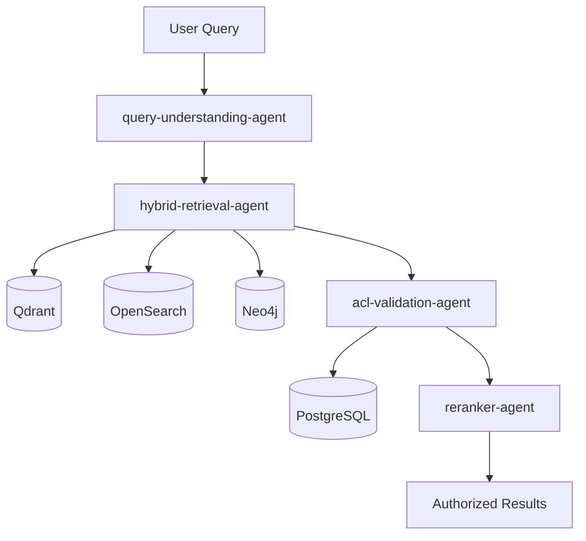

# Retrieval Domain

**Owner:** Search & Retrieval Team  
**Status:** Phase 6 - Planned  
**Agents:** 4

---

## Overview

The Retrieval domain orchestrates hybrid search across vector, keyword, and graph indexes, validates access control, and reranks results for relevance.

---

## Agents in This Domain

### 1. query-understanding-agent

**File:** [query-understanding-agent.md](./query-understanding-agent.md)  
**Status:** 📋 Planned  
**Phase:** 6  
**Responsibilities:** Classify query intent, extract entities/keywords  
**Dependencies:** spaCy, LLM API (optional)

### 2. hybrid-retrieval-agent

**File:** [hybrid-retrieval-agent.md](./hybrid-retrieval-agent.md)  
**Status:** 📋 Planned  
**Phase:** 6  
**Responsibilities:** Run vector, BM25, and graph retrieval in parallel  
**Dependencies:** Qdrant, OpenSearch, Neo4j

### 3. acl-validation-agent

**File:** [acl-validation-agent.md](./acl-validation-agent.md)  
**Status:** 📋 Planned  
**Phase:** 6  
**Responsibilities:** Validate candidate chunks against PostgreSQL ACLs  
**Dependencies:** PostgreSQL, auth-acl-agent

### 4. reranker-agent

**File:** [reranker-agent.md](./reranker-agent.md)  
**Status:** 📋 Planned  
**Phase:** 6  
**Responsibilities:** Rerank authorized chunks for relevance  
**Dependencies:** Cohere Rerank API (optional)

---

## Domain Architecture

---

## Integration Points

### Upstream Dependencies

- User query (from API Gateway)
- User claims (from auth-acl-agent)

### Downstream Services

- Qdrant (vector search)
- OpenSearch (keyword search)
- Neo4j (graph traversal)
- PostgreSQL (ACL validation)

### Events Published

- `query.analyzed`
- `retrieval.completed`
- `access.denied` (for unauthorized chunks)
- `results.reranked`

### Events Consumed

- `query.submitted` (from API Gateway)

---

## Related Documentation

- [Hybrid Retrieval Strategy](../../architecture/hybrid-retrieval.md)
- [ACL Validation](../../architecture/security-model.md)
- [Reranking Decision](../../decisions/ADR-009-reranking-model.md)
- [Phase 6 Implementation](../../phases/phase-6-hybrid-retrieval/README.md)
