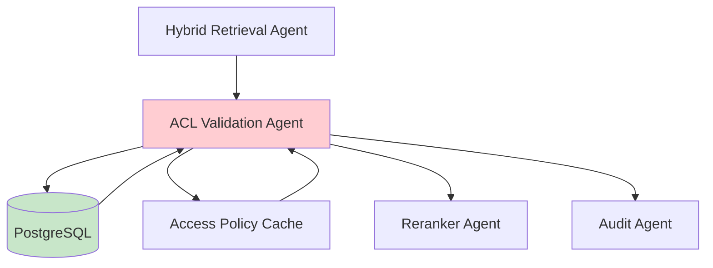
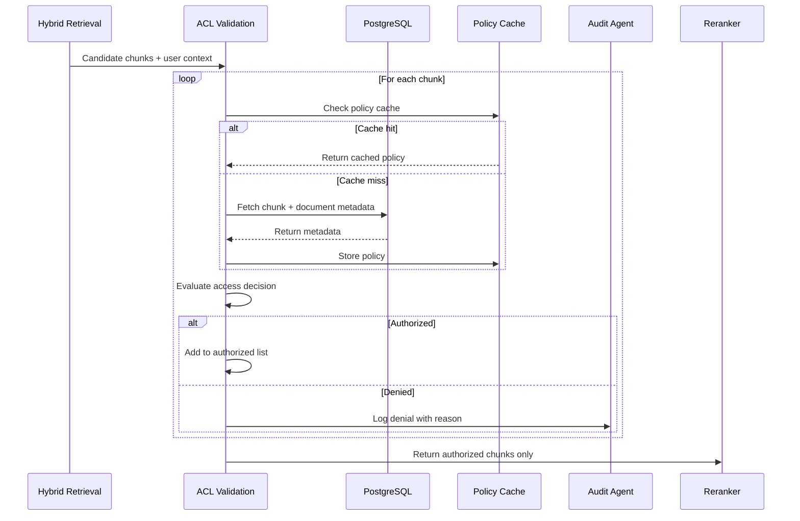

# ACL Validation Agent

**Domain:** Retrieval  
**Version:** 1.0  
**Last Updated:** 2026-05-17  
**Owner:** Retrieval Team  
**Status:** Specification

---

## Overview

The ACL Validation Agent is a **mandatory security boundary** that validates every candidate chunk against PostgreSQL access control rules before any text reaches the LLM. This agent enforces the **Triple ACL Enforcement** architecture by performing final authorization checks after initial retrieval filtering.

### Purpose

- Validate all candidate chunks against canonical PostgreSQL ACL rules
- Prevent unauthorized document leakage at the retrieval-to-generation boundary
- Log denied chunks for security auditing
- Provide detailed denial reasons for debugging and compliance
- Enforce tenant isolation at the validation layer

### Importance

ACL validation is **critical** for:

- **Security:** Prevents unauthorized access to confidential documents
- **Compliance:** Ensures regulatory requirements are met (GDPR, HIPAA, SOC 2)
- **Audit Trail:** Logs all access decisions for compliance reporting
- **Defense in Depth:** Final validation layer before LLM context building
- **Zero Trust:** Never trust retrieval metadata filters alone

---

## Responsibility

### Primary Responsibilities

1. **Chunk Authorization**
   - Fetch chunk metadata from PostgreSQL
   - Fetch document access policies
   - Evaluate user claims against access rules
   - Return only authorized chunks

2. **Access Decision Logic**
   - Check tenant isolation
   - Check document status (active/deleted/archived)
   - Check classification level
   - Check department/group/role permissions
   - Check region restrictions
   - Check explicit allow/deny rules

3. **Denial Logging**
   - Log every denied chunk with reason
   - Log user context and query context
   - Preserve denial evidence for audit
   - Track unauthorized access attempts

4. **Performance Optimization**
   - Batch chunk validation
   - Cache access policy summaries
   - Minimize database round trips

### Out of Scope

- Initial retrieval filtering (handled by [`hybrid-retrieval-agent`](./hybrid-retrieval-agent.md))
- User authentication (handled by [`auth-acl-agent`](../infrastructure/auth-acl-agent.md))
- Result reranking (handled by [`reranker-agent`](./reranker-agent.md))

---

## Architecture

### System Context



### Validation Pipeline



---

## API Contract

### Core Interface

```python
from typing import List, Dict, Any, Optional
from dataclasses import dataclass
from enum import Enum
from datetime import datetime

class DenialReason(Enum):
    """Reasons for access denial."""
    TENANT_MISMATCH = "tenant_mismatch"
    DOCUMENT_DELETED = "document_deleted"
    DOCUMENT_ARCHIVED = "document_archived"
    DOCUMENT_INACTIVE = "document_inactive"
    CLASSIFICATION_DENIED = "classification_denied"
    DEPARTMENT_DENIED = "department_denied"
    GROUP_DENIED = "group_denied"
    ROLE_DENIED = "role_denied"
    REGION_DENIED = "region_denied"
    EXPLICIT_DENY = "explicit_deny"
    CHUNK_NOT_FOUND = "chunk_not_found"
    POLICY_EVALUATION_ERROR = "policy_evaluation_error"

@dataclass
class UserClaims:
    """User identity and access claims."""
    user_id: str
    tenant_id: str
    email: str
    department: Optional[str]
    groups: List[str]
    role: Optional[str]
    region: Optional[str]
    clearance: Optional[str]

@dataclass
class AccessDecision:
    """Access decision result."""
    chunk_id: str
    authorized: bool
    reason: Optional[DenialReason]
    details: Optional[str]
    evaluated_at: str

@dataclass
class ValidationResult:
    """Result from ACL validation."""
    authorized_chunk_ids: List[str]
    denied_chunk_ids: List[str]
    decisions: List[AccessDecision]
    validation_time_ms: float
    cache_hit_rate: float

class ACLValidationAgent:
    """ACL Validation Agent interface."""

    def validate_chunks(
        self,
        candidate_chunk_ids: List[str],
        user_claims: UserClaims
    ) -> ValidationResult:
        """
        Validate candidate chunks against access control rules.

        Args:
            candidate_chunk_ids: List of chunk IDs to validate
            user_claims: User identity and access claims

        Returns:
            ValidationResult with authorized and denied chunks
        """
        pass

    def can_access_chunk(
        self,
        chunk_metadata: Dict[str, Any],
        user_claims: UserClaims
    ) -> AccessDecision:
        """
        Determine if user can access a specific chunk.

        Args:
            chunk_metadata: Chunk metadata from PostgreSQL
            user_claims: User claims

        Returns:
            AccessDecision with authorization result
        """
        pass
```

---

## Implementation Details

### Access Decision Logic

```python
def can_access_chunk(
    self,
    chunk_metadata: Dict[str, Any],
    user_claims: UserClaims
) -> AccessDecision:
    """Evaluate access decision with comprehensive rule checking."""

    try:
        # Rule 1: Tenant isolation (MANDATORY)
        if chunk_metadata["tenant_id"] != user_claims.tenant_id:
            return AccessDecision(
                chunk_id=chunk_metadata["chunk_id"],
                authorized=False,
                reason=DenialReason.TENANT_MISMATCH,
                details=f"Tenant mismatch",
                evaluated_at=datetime.utcnow().isoformat()
            )

        # Rule 2: Document status (MANDATORY)
        if chunk_metadata["status"] == "deleted":
            return AccessDecision(
                chunk_id=chunk_metadata["chunk_id"],
                authorized=False,
                reason=DenialReason.DOCUMENT_DELETED,
                details="Document has been deleted",
                evaluated_at=datetime.utcnow().isoformat()
            )

        if chunk_metadata["status"] != "active":
            return AccessDecision(
                chunk_id=chunk_metadata["chunk_id"],
                authorized=False,
                reason=DenialReason.DOCUMENT_INACTIVE,
                details=f"Document status is {chunk_metadata['status']}",
                evaluated_at=datetime.utcnow().isoformat()
            )

        # Rule 3: Explicit deny (HIGHEST PRIORITY)
        if user_claims.user_id in chunk_metadata.get("denied_users", []):
            return AccessDecision(
                chunk_id=chunk_metadata["chunk_id"],
                authorized=False,
                reason=DenialReason.EXPLICIT_DENY,
                details="User is explicitly denied access",
                evaluated_at=datetime.utcnow().isoformat()
            )

        # Rule 4: Public documents (ALLOW ALL)
        if chunk_metadata["classification"] == "PUBLIC":
            return AccessDecision(
                chunk_id=chunk_metadata["chunk_id"],
                authorized=True,
                reason=None,
                details="Public document",
                evaluated_at=datetime.utcnow().isoformat()
            )

        # Rule 5: Internal general documents (ALLOW ALL EMPLOYEES)
        if chunk_metadata["classification"] == "INTERNAL_GENERAL":
            return AccessDecision(
                chunk_id=chunk_metadata["chunk_id"],
                authorized=True,
                reason=None,
                details="Internal general document",
                evaluated_at=datetime.utcnow().isoformat()
            )

        # Rule 6: Department restrictions
        allowed_departments = chunk_metadata.get("allowed_departments", [])
        if allowed_departments:
            if not user_claims.department or user_claims.department not in allowed_departments:
                return AccessDecision(
                    chunk_id=chunk_metadata["chunk_id"],
                    authorized=False,
                    reason=DenialReason.DEPARTMENT_DENIED,
                    details=f"User department not in allowed departments",
                    evaluated_at=datetime.utcnow().isoformat()
                )

        # Rule 7: Group restrictions
        allowed_groups = chunk_metadata.get("allowed_groups", [])
        if allowed_groups:
            user_groups_set = set(user_claims.groups)
            allowed_groups_set = set(allowed_groups)
            if not user_groups_set.intersection(allowed_groups_set):
                return AccessDecision(
                    chunk_id=chunk_metadata["chunk_id"],
                    authorized=False,
                    reason=DenialReason.GROUP_DENIED,
                    details=f"User groups not in allowed groups",
                    evaluated_at=datetime.utcnow().isoformat()
                )

        # Rule 8: Region restrictions
        if chunk_metadata.get("region"):
            if not user_claims.region or user_claims.region != chunk_metadata["region"]:
                return AccessDecision(
                    chunk_id=chunk_metadata["chunk_id"],
                    authorized=False,
                    reason=DenialReason.REGION_DENIED,
                    details=f"User region does not match document region",
                    evaluated_at=datetime.utcnow().isoformat()
                )

        # All checks passed
        return AccessDecision(
            chunk_id=chunk_metadata["chunk_id"],
            authorized=True,
            reason=None,
            details="Access granted",
            evaluated_at=datetime.utcnow().isoformat()
        )

    except Exception as e:
        logger.error("access_decision_error", chunk_id=chunk_metadata["chunk_id"], error=str(e))
        return AccessDecision(
            chunk_id=chunk_metadata["chunk_id"],
            authorized=False,
            reason=DenialReason.POLICY_EVALUATION_ERROR,
            details=f"Policy evaluation failed: {e}",
            evaluated_at=datetime.utcnow().isoformat()
        )
```

### Batch Validation

```python
async def validate_chunks(
    self,
    candidate_chunk_ids: List[str],
    user_claims: UserClaims
) -> ValidationResult:
    """Validate chunks with batch processing and caching."""

    start_time = time.time()

    # Fetch chunk metadata from PostgreSQL
    chunk_metadata_map = await self.fetch_chunk_metadata(
        candidate_chunk_ids,
        user_claims.tenant_id
    )

    # Validate each chunk
    decisions = []
    cache_hits = 0

    for chunk_id in candidate_chunk_ids:
        # Check if chunk exists
        if chunk_id not in chunk_metadata_map:
            decision = AccessDecision(
                chunk_id=chunk_id,
                authorized=False,
                reason=DenialReason.CHUNK_NOT_FOUND,
                details="Chunk not found in database",
                evaluated_at=datetime.utcnow().isoformat()
            )
            decisions.append(decision)
            continue

        chunk_metadata = chunk_metadata_map[chunk_id]

        # Check cache
        cache_key = f"acl:{user_claims.tenant_id}:{user_claims.user_id}:{chunk_id}"
        cached_decision = await self.cache.get(cache_key)

        if cached_decision:
            cache_hits += 1
            decisions.append(cached_decision)
            continue

        # Evaluate access
        decision = self.can_access_chunk(chunk_metadata, user_claims)
        decisions.append(decision)

        # Cache decision (short TTL for security)
        await self.cache.set(cache_key, decision, ttl=300)  # 5 minutes

        # Log denials
        if not decision.authorized:
            self.log_denial(decision, user_claims)

    # Separate authorized and denied
    authorized_chunk_ids = [d.chunk_id for d in decisions if d.authorized]
    denied_chunk_ids = [d.chunk_id for d in decisions if not d.authorized]

    validation_time_ms = (time.time() - start_time) * 1000
    cache_hit_rate = cache_hits / len(candidate_chunk_ids) if candidate_chunk_ids else 0

    logger.info(
        "acl_validation_complete",
        total_chunks=len(candidate_chunk_ids),
        authorized_count=len(authorized_chunk_ids),
        denied_count=len(denied_chunk_ids),
        cache_hit_rate=cache_hit_rate,
        validation_time_ms=validation_time_ms
    )

    return ValidationResult(
        authorized_chunk_ids=authorized_chunk_ids,
        denied_chunk_ids=denied_chunk_ids,
        decisions=decisions,
        validation_time_ms=validation_time_ms,
        cache_hit_rate=cache_hit_rate
    )
```

### Metadata Fetching

```python
async def fetch_chunk_metadata(
    self,
    chunk_ids: List[str],
    tenant_id: str
) -> Dict[str, Dict[str, Any]]:
    """Fetch chunk metadata from PostgreSQL with RLS."""

    if not chunk_ids:
        return {}

    async with self.db_pool.acquire() as conn:
        # Set tenant context for RLS
        await conn.execute("SET app.current_tenant_id = $1", tenant_id)

        # Fetch chunks with document metadata
        query = """
        SELECT
            c.chunk_id,
            c.document_id,
            c.tenant_id,
            d.status,
            d.classification,
            d.department,
            d.allowed_departments,
            d.allowed_groups,
            d.allowed_roles,
            d.denied_users,
            d.region
        FROM document_chunks c
        JOIN documents d ON c.document_id = d.document_id
        WHERE c.chunk_id = ANY($1)
        AND c.tenant_id = $2
        """

        rows = await conn.fetch(query, chunk_ids, tenant_id)

        # Convert to dictionary
        metadata_map = {}
        for row in rows:
            metadata_map[row["chunk_id"]] = dict(row)

        return metadata_map
```

---

## Testing Requirements

### Unit Tests

```python
def test_tenant_isolation():
    """Test tenant isolation enforcement."""
    agent = ACLValidationAgent()

    chunk_metadata = {
        "chunk_id": "chunk_001",
        "tenant_id": "tenant_a",
        "status": "active",
        "classification": "INTERNAL_GENERAL"
    }

    user_claims = UserClaims(
        user_id="user_001",
        tenant_id="tenant_b",  # Different tenant
        email="user@example.com",
        department="Engineering",
        groups=["internal-users"],
        role="engineer",
        region="US",
        clearance="standard"
    )

    decision = agent.can_access_chunk(chunk_metadata, user_claims)

    assert decision.authorized is False
    assert decision.reason == DenialReason.TENANT_MISMATCH

def test_deleted_document_denied():
    """Test deleted documents are denied."""
    agent = ACLValidationAgent()

    chunk_metadata = {
        "chunk_id": "chunk_001",
        "tenant_id": "tenant_a",
        "status": "deleted",
        "classification": "PUBLIC"
    }

    user_claims = UserClaims(
        user_id="user_001",
        tenant_id="tenant_a",
        email="user@example.com",
        department="Engineering",
        groups=["internal-users"],
        role="engineer",
        region="US",
        clearance="standard"
    )

    decision = agent.can_access_chunk(chunk_metadata, user_claims)

    assert decision.authorized is False
    assert decision.reason == DenialReason.DOCUMENT_DELETED

def test_public_document_allowed():
    """Test public documents are accessible to all."""
    agent = ACLValidationAgent()

    chunk_metadata = {
        "chunk_id": "chunk_001",
        "tenant_id": "tenant_a",
        "status": "active",
        "classification": "PUBLIC"
    }

    user_claims = UserClaims(
        user_id="user_001",
        tenant_id="tenant_a",
        email="user@example.com",
        department="Engineering",
        groups=["internal-users"],
        role="engineer",
        region="US",
        clearance="standard"
    )

    decision = agent.can_access_chunk(chunk_metadata, user_claims)

    assert decision.authorized is True
    assert decision.reason is None

def test_department_restriction():
    """Test department-restricted documents."""
    agent = ACLValidationAgent()

    chunk_metadata = {
        "chunk_id": "chunk_001",
        "tenant_id": "tenant_a",
        "status": "active",
        "classification": "DEPARTMENT_RESTRICTED",
        "allowed_departments": ["Finance", "HR"]
    }

    # Engineering user should be denied
    user_claims_eng = UserClaims(
        user_id="user_001",
        tenant_id="tenant_a",
        email="eng@example.com",
        department="Engineering",
        groups=["internal-users"],
        role="engineer",
        region="US",
        clearance="standard"
    )

    decision_eng = agent.can_access_chunk(chunk_metadata, user_claims_eng)
    assert decision_eng.authorized is False
    assert decision_eng.reason == DenialReason.DEPARTMENT_DENIED

    # Finance user should be allowed
    user_claims_fin = UserClaims(
        user_id="user_002",
        tenant_id="tenant_a",
        email="fin@example.com",
        department="Finance",
        groups=["internal-users"],
        role="analyst",
        region="US",
        clearance="standard"
    )

    decision_fin = agent.can_access_chunk(chunk_metadata, user_claims_fin)
    assert decision_fin.authorized is True
```

### Integration Tests

```python
async def test_batch_validation():
    """Test batch chunk validation."""
    agent = ACLValidationAgent()

    candidate_chunk_ids = [
        "chunk_001",  # Public - should be authorized
        "chunk_002",  # Finance only - should be denied for Engineering user
        "chunk_003",  # Internal general - should be authorized
        "chunk_004",  # Deleted - should be denied
    ]

    user_claims = UserClaims(
        user_id="user_001",
        tenant_id="tenant_a",
        email="user@example.com",
        department="Engineering",
        groups=["internal-users"],
        role="engineer",
        region="US",
        clearance="standard"
    )

    result = await agent.validate_chunks(candidate_chunk_ids, user_claims)

    assert len(result.authorized_chunk_ids) == 2  # chunk_001, chunk_003
    assert len(result.denied_chunk_ids) == 2  # chunk_002, chunk_004
    assert result.validation_time_ms < 500  # Performance target
```

---

## Configuration

### Environment Variables

```bash
# PostgreSQL
POSTGRES_HOST=localhost
POSTGRES_PORT=5432
POSTGRES_DB=enterprise_rag
POSTGRES_USER=rag_user
POSTGRES_PASSWORD=secure_password

# Redis Cache
REDIS_HOST=localhost
REDIS_PORT=6379
REDIS_PASSWORD=redis_password

# ACL Configuration
ACL_CACHE_ENABLED=true
ACL_CACHE_TTL=300  # 5 minutes
ACL_VALIDATION_TIMEOUT=5000  # ms
ACL_FAIL_CLOSED=true  # Deny on error
```

---

## Dependencies

### Upstream Dependencies

- **[`hybrid-retrieval-agent`](./hybrid-retrieval-agent.md):** Provides candidate chunks
- **[`canonical-db-agent`](../infrastructure/canonical-db-agent.md):** Provides chunk metadata
- **[`auth-acl-agent`](../infrastructure/auth-acl-agent.md):** Provides user claims

### Downstream Dependencies

- **[`reranker-agent`](./reranker-agent.md):** Receives authorized chunks
- **[`audit-agent`](../operations/audit-agent.md):** Receives denial logs
- **PostgreSQL:** Canonical database with RLS
- **Redis:** Access decision cache

### External Dependencies

```python
# requirements.txt
asyncpg>=0.29.0
redis>=5.0.0
pydantic>=2.0.0
```

---

## Monitoring & Observability

### Metrics

```python
# Prometheus metrics
acl_validation_requests_total = Counter(
    "acl_validation_requests_total",
    "Total ACL validation requests",
    ["tenant_id"]
)

acl_authorized_chunks_total = Counter(
    "acl_authorized_chunks_total",
    "Total authorized chunks",
    ["tenant_id"]
)

acl_denied_chunks_total = Counter(
    "acl_denied_chunks_total",
    "Total denied chunks",
    ["tenant_id", "denial_reason"]
)

acl_validation_duration_seconds = Histogram(
    "acl_validation_duration_seconds",
    "ACL validation duration"
)

acl_cache_hit_rate = Histogram(
    "acl_cache_hit_rate",
    "ACL cache hit rate"
)
```

### Logging

```python
import structlog

logger = structlog.get_logger()

# Log validation result
logger.info(
    "acl_validation_completed",
    authorized_count=len(result.authorized_chunk_ids),
    denied_count=len(result.denied_chunk_ids),
    cache_hit_rate=result.cache_hit_rate,
    validation_time_ms=result.validation_time_ms
)

# Log denials (WARNING level)
logger.warning(
    "access_denied",
    chunk_id=decision.chunk_id,
    user_id=user_claims.user_id,
    denial_reason=decision.reason.value,
    details=decision.details
)
```

---

## Related Documentation

- [AGENTS.md](../../AGENTS.md) - Master agent index
- [ARCHITECTURE.md](../../ARCHITECTURE.md) - System architecture
- [hybrid-retrieval-agent.md](./hybrid-retrieval-agent.md) - Hybrid retrieval
- [reranker-agent.md](./reranker-agent.md) - Result reranking
- [auth-acl-agent.md](../infrastructure/auth-acl-agent.md) - Authentication and authorization
- [canonical-db-agent.md](../infrastructure/canonical-db-agent.md) - PostgreSQL schema

---

**Version History:**

- 1.0 (2026-05-17): Initial specification
