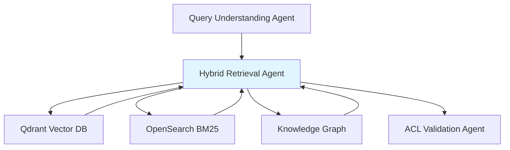
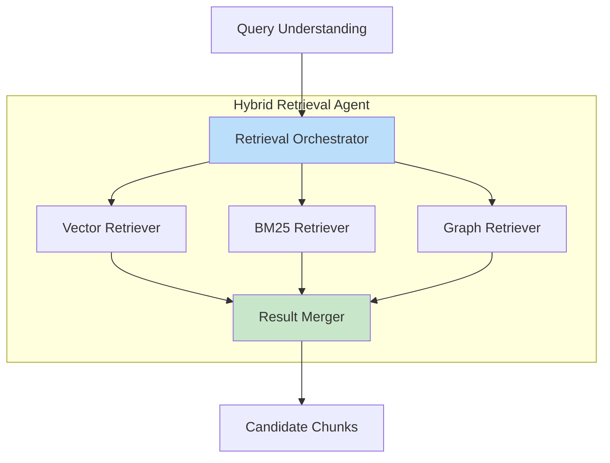
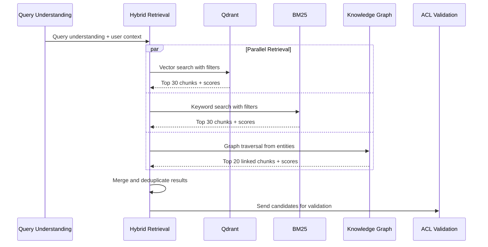

# Hybrid Retrieval Agent

**Domain:** Retrieval  
**Version:** 1.0  
**Last Updated:** 2026-05-17  
**Owner:** Retrieval Team  
**Status:** Specification

---

## Overview

The Hybrid Retrieval Agent orchestrates parallel retrieval from multiple sources (Qdrant vector search, BM25 keyword search, and Knowledge Graph traversal) to find the most relevant document chunks for a given query.

### Purpose

- Execute parallel retrieval across vector, keyword, and graph databases
- Apply initial metadata filters based on user access context
- Merge and deduplicate results from multiple sources
- Preserve retrieval provenance for downstream reranking
- Optimize retrieval strategy based on query understanding

### Importance

Hybrid retrieval is critical for:

- **Recall:** Different retrieval methods capture different types of relevance
- **Precision:** Combining signals improves result quality
- **Robustness:** Fallback when one retrieval method fails
- **Coverage:** Vector for semantic, BM25 for exact terms, graph for relationships

---

## Responsibility

### Primary Responsibilities

1. **Vector Retrieval**
   - Query Qdrant with embedding vector
   - Apply tenant and access-level filters
   - Retrieve top-k candidates with scores

2. **BM25 Retrieval**
   - Query OpenSearch with keywords and exact terms
   - Apply tenant and access-level filters
   - Retrieve top-k candidates with BM25 scores

3. **Knowledge Graph Retrieval**
   - Traverse graph from extracted entities
   - Follow relationships to related chunks
   - Apply tenant and access-level filters
   - Retrieve linked chunks with relationship scores

4. **Result Merging**
   - Combine results from all sources
   - Deduplicate by chunk_id
   - Preserve retrieval source labels
   - Preserve all scores for reranking

5. **Metadata Filtering**
   - Apply tenant isolation
   - Apply document status filters (active only)
   - Apply initial access-level filters
   - Apply region/department hints from query understanding

### Out of Scope

- Query understanding (handled by [`query-understanding-agent`](./query-understanding-agent.md))
- Final access control validation (handled by [`acl-validation-agent`](./acl-validation-agent.md))
- Result reranking (handled by [`reranker-agent`](./reranker-agent.md))
- Answer generation (handled by [`llm-answer-agent`](../generation/llm-answer-agent.md))

---

## Architecture

### System Context



### Component Architecture



### Retrieval Pipeline



---

## API Contract

### Core Interface

```python
from typing import List, Dict, Any, Optional
from dataclasses import dataclass
from enum import Enum

class RetrievalSource(Enum):
    """Retrieval source types."""
    VECTOR = "vector"
    BM25 = "bm25"
    KNOWLEDGE_GRAPH = "knowledge_graph"

@dataclass
class RetrievalScore:
    """Score from a specific retrieval source."""
    source: RetrievalSource
    score: float
    rank: int
    metadata: Dict[str, Any]

@dataclass
class CandidateChunk:
    """Candidate chunk from retrieval."""
    chunk_id: str
    document_id: str
    tenant_id: str
    text: str
    retrieval_sources: List[RetrievalSource]
    scores: Dict[RetrievalSource, float]
    ranks: Dict[RetrievalSource, int]
    metadata: Dict[str, Any]

@dataclass
class RetrievalConfig:
    """Configuration for retrieval."""
    vector_top_k: int = 30
    bm25_top_k: int = 30
    graph_top_k: int = 20
    enable_vector: bool = True
    enable_bm25: bool = True
    enable_graph: bool = True
    min_vector_score: float = 0.5
    min_bm25_score: float = 5.0
    max_graph_depth: int = 2

@dataclass
class RetrievalResult:
    """Result from hybrid retrieval."""
    candidates: List[CandidateChunk]
    total_retrieved: int
    vector_count: int
    bm25_count: int
    graph_count: int
    deduplicated_count: int
    retrieval_time_ms: float
    metadata: Dict[str, Any]

class HybridRetrievalAgent:
    """Hybrid Retrieval Agent interface."""

    def retrieve(
        self,
        query_understanding: QueryUnderstanding,
        user_context: Dict[str, Any],
        config: Optional[RetrievalConfig] = None
    ) -> RetrievalResult:
        """
        Retrieve candidate chunks using hybrid retrieval.

        Args:
            query_understanding: Query understanding from query-understanding-agent
            user_context: User context with tenant_id, department, region, etc.
            config: Optional retrieval configuration

        Returns:
            RetrievalResult with candidate chunks

        Raises:
            RetrievalError: If retrieval fails
            ValueError: If inputs are invalid
        """
        pass

    def retrieve_vector(
        self,
        embedding: List[float],
        filters: Dict[str, Any],
        top_k: int = 30
    ) -> List[CandidateChunk]:
        """
        Retrieve chunks using vector similarity search.

        Args:
            embedding: Query embedding vector
            filters: Metadata filters (tenant_id, classification, etc.)
            top_k: Number of results to retrieve

        Returns:
            List of candidate chunks with vector scores
        """
        pass

    def retrieve_bm25(
        self,
        keywords: List[str],
        exact_terms: List[str],
        filters: Dict[str, Any],
        top_k: int = 30
    ) -> List[CandidateChunk]:
        """
        Retrieve chunks using BM25 keyword search.

        Args:
            keywords: Keywords for search
            exact_terms: Exact terms that must match
            filters: Metadata filters
            top_k: Number of results to retrieve

        Returns:
            List of candidate chunks with BM25 scores
        """
        pass

    def retrieve_graph(
        self,
        entities: List[Entity],
        filters: Dict[str, Any],
        max_depth: int = 2,
        top_k: int = 20
    ) -> List[CandidateChunk]:
        """
        Retrieve chunks using knowledge graph traversal.

        Args:
            entities: Entities extracted from query
            filters: Metadata filters
            max_depth: Maximum traversal depth
            top_k: Number of results to retrieve

        Returns:
            List of candidate chunks with graph scores
        """
        pass

    def merge_results(
        self,
        vector_results: List[CandidateChunk],
        bm25_results: List[CandidateChunk],
        graph_results: List[CandidateChunk]
    ) -> List[CandidateChunk]:
        """
        Merge and deduplicate results from multiple sources.

        Args:
            vector_results: Results from vector search
            bm25_results: Results from BM25 search
            graph_results: Results from graph traversal

        Returns:
            Merged and deduplicated candidate chunks
        """
        pass

    def build_filters(
        self,
        user_context: Dict[str, Any],
        query_understanding: QueryUnderstanding
    ) -> Dict[str, Any]:
        """
        Build metadata filters for retrieval.

        Args:
            user_context: User context
            query_understanding: Query understanding

        Returns:
            Dictionary of filters for retrieval
        """
        pass
```

---

## Data Models

### Retrieval Filters

```python
from typing import List, Optional

@dataclass
class RetrievalFilters:
    """Filters for retrieval."""
    tenant_id: str
    status: str = "active"
    classification_levels: Optional[List[str]] = None
    allowed_departments: Optional[List[str]] = None
    allowed_groups: Optional[List[str]] = None
    region: Optional[str] = None
    language: Optional[str] = None
    document_type: Optional[str] = None
    version_status: str = "current"  # current, archived, all

    def to_qdrant_filter(self) -> Dict[str, Any]:
        """Convert to Qdrant filter format."""
        must_conditions = [
            {"key": "tenant_id", "match": {"value": self.tenant_id}},
            {"key": "status", "match": {"value": self.status}}
        ]

        if self.classification_levels:
            must_conditions.append({
                "key": "classification",
                "match": {"any": self.classification_levels}
            })

        if self.allowed_departments:
            must_conditions.append({
                "key": "allowed_departments",
                "match": {"any": self.allowed_departments}
            })

        if self.region:
            must_conditions.append({
                "key": "region",
                "match": {"value": self.region}
            })

        return {"must": must_conditions}

    def to_opensearch_filter(self) -> Dict[str, Any]:
        """Convert to OpenSearch filter format."""
        must_conditions = [
            {"term": {"tenant_id": self.tenant_id}},
            {"term": {"status": self.status}}
        ]

        if self.classification_levels:
            must_conditions.append({
                "terms": {"classification": self.classification_levels}
            })

        if self.allowed_departments:
            must_conditions.append({
                "terms": {"allowed_departments": self.allowed_departments}
            })

        if self.region:
            must_conditions.append({
                "term": {"region": self.region}
            })

        return {"bool": {"must": must_conditions}}

    def to_neo4j_filter(self) -> str:
        """Convert to Neo4j Cypher WHERE clause."""
        conditions = [
            f"chunk.tenant_id = '{self.tenant_id}'",
            f"chunk.status = '{self.status}'"
        ]

        if self.classification_levels:
            levels = "', '".join(self.classification_levels)
            conditions.append(f"chunk.classification IN ['{levels}']")

        if self.region:
            conditions.append(f"chunk.region = '{self.region}'")

        return " AND ".join(conditions)
```

---

## Implementation Details

### Hybrid Retrieval Orchestration

```python
import asyncio
from typing import List, Dict, Any

async def retrieve(
    self,
    query_understanding: QueryUnderstanding,
    user_context: Dict[str, Any],
    config: Optional[RetrievalConfig] = None
) -> RetrievalResult:
    """Execute hybrid retrieval with parallel execution."""

    start_time = time.time()
    config = config or RetrievalConfig()

    # Build filters
    filters = self.build_filters(user_context, query_understanding)

    # Prepare retrieval tasks
    tasks = []

    # Vector retrieval
    if config.enable_vector:
        embedding = await self._get_query_embedding(query_understanding.normalized_query)
        tasks.append(
            self.retrieve_vector(embedding, filters, config.vector_top_k)
        )
    else:
        tasks.append(asyncio.coroutine(lambda: [])())

    # BM25 retrieval
    if config.enable_bm25:
        tasks.append(
            self.retrieve_bm25(
                query_understanding.keywords,
                query_understanding.exact_terms,
                filters,
                config.bm25_top_k
            )
        )
    else:
        tasks.append(asyncio.coroutine(lambda: [])())

    # Graph retrieval
    if config.enable_graph and query_understanding.requires_graph:
        tasks.append(
            self.retrieve_graph(
                query_understanding.entities,
                filters,
                config.max_graph_depth,
                config.graph_top_k
            )
        )
    else:
        tasks.append(asyncio.coroutine(lambda: [])())

    # Execute parallel retrieval
    vector_results, bm25_results, graph_results = await asyncio.gather(*tasks)

    # Merge results
    candidates = self.merge_results(vector_results, bm25_results, graph_results)

    # Calculate metrics
    retrieval_time_ms = (time.time() - start_time) * 1000

    return RetrievalResult(
        candidates=candidates,
        total_retrieved=len(vector_results) + len(bm25_results) + len(graph_results),
        vector_count=len(vector_results),
        bm25_count=len(bm25_results),
        graph_count=len(graph_results),
        deduplicated_count=len(candidates),
        retrieval_time_ms=retrieval_time_ms,
        metadata={
            "query": query_understanding.original_query,
            "intent": query_understanding.intent.value,
            "filters": filters
        }
    )
```

### Vector Retrieval

```python
from qdrant_client import QdrantClient
from qdrant_client.models import Filter, FieldCondition, MatchValue

async def retrieve_vector(
    self,
    embedding: List[float],
    filters: Dict[str, Any],
    top_k: int = 30
) -> List[CandidateChunk]:
    """Retrieve using Qdrant vector search."""

    try:
        # Get tenant's active collection
        collection_name = self._get_active_collection(filters["tenant_id"])

        # Build Qdrant filter
        qdrant_filter = RetrievalFilters(**filters).to_qdrant_filter()

        # Search
        results = await self.qdrant_client.search(
            collection_name=collection_name,
            query_vector=embedding,
            query_filter=qdrant_filter,
            limit=top_k,
            with_payload=True,
            score_threshold=self.config.min_vector_score
        )

        # Convert to CandidateChunk
        candidates = []
        for idx, result in enumerate(results):
            candidate = CandidateChunk(
                chunk_id=result.id,
                document_id=result.payload["document_id"],
                tenant_id=result.payload["tenant_id"],
                text=result.payload.get("text", ""),
                retrieval_sources=[RetrievalSource.VECTOR],
                scores={RetrievalSource.VECTOR: result.score},
                ranks={RetrievalSource.VECTOR: idx + 1},
                metadata=result.payload
            )
            candidates.append(candidate)

        logger.info(
            "vector_retrieval_complete",
            retrieved_count=len(candidates),
            top_score=candidates[0].scores[RetrievalSource.VECTOR] if candidates else 0
        )

        return candidates

    except Exception as e:
        logger.error("vector_retrieval_failed", error=str(e))
        return []  # Graceful degradation
```

### BM25 Retrieval

```python
from opensearchpy import AsyncOpenSearch

async def retrieve_bm25(
    self,
    keywords: List[str],
    exact_terms: List[str],
    filters: Dict[str, Any],
    top_k: int = 30
) -> List[CandidateChunk]:
    """Retrieve using OpenSearch BM25."""

    try:
        # Build query
        must_clauses = []

        # Keyword match
        if keywords:
            must_clauses.append({
                "match": {
                    "text": {
                        "query": " ".join(keywords),
                        "operator": "or"
                    }
                }
            })

        # Exact term match (boost)
        for term in exact_terms:
            must_clauses.append({
                "match_phrase": {
                    "text": {
                        "query": term,
                        "boost": 2.0
                    }
                }
            })

        # Build filter
        opensearch_filter = RetrievalFilters(**filters).to_opensearch_filter()

        # Search
        response = await self.opensearch_client.search(
            index=self._get_index_name(filters["tenant_id"]),
            body={
                "query": {
                    "bool": {
                        "must": must_clauses,
                        "filter": opensearch_filter["bool"]["must"]
                    }
                },
                "size": top_k,
                "min_score": self.config.min_bm25_score
            }
        )

        # Convert to CandidateChunk
        candidates = []
        for idx, hit in enumerate(response["hits"]["hits"]):
            candidate = CandidateChunk(
                chunk_id=hit["_id"],
                document_id=hit["_source"]["document_id"],
                tenant_id=hit["_source"]["tenant_id"],
                text=hit["_source"]["text"],
                retrieval_sources=[RetrievalSource.BM25],
                scores={RetrievalSource.BM25: hit["_score"]},
                ranks={RetrievalSource.BM25: idx + 1},
                metadata=hit["_source"]
            )
            candidates.append(candidate)

        logger.info(
            "bm25_retrieval_complete",
            retrieved_count=len(candidates),
            top_score=candidates[0].scores[RetrievalSource.BM25] if candidates else 0
        )

        return candidates

    except Exception as e:
        logger.error("bm25_retrieval_failed", error=str(e))
        return []  # Graceful degradation
```

### Knowledge Graph Retrieval

```python
from neo4j import AsyncGraphDatabase

async def retrieve_graph(
    self,
    entities: List[Entity],
    filters: Dict[str, Any],
    max_depth: int = 2,
    top_k: int = 20
) -> List[CandidateChunk]:
    """Retrieve using knowledge graph traversal."""

    try:
        if not entities:
            return []

        # Build Cypher query
        entity_ids = [e.graph_node_id for e in entities if e.graph_node_id]
        if not entity_ids:
            return []

        where_clause = RetrievalFilters(**filters).to_neo4j_filter()

        cypher = f"""
        MATCH (entity:Entity)
        WHERE entity.id IN $entity_ids
        MATCH (entity)-[r*1..{max_depth}]-(related:Entity)
        MATCH (related)-[:MENTIONED_IN]->(chunk:Chunk)
        WHERE {where_clause}
        RETURN DISTINCT chunk.chunk_id AS chunk_id,
               chunk.document_id AS document_id,
               chunk.tenant_id AS tenant_id,
               chunk.text AS text,
               chunk AS metadata,
               COUNT(r) AS relationship_count,
               MIN(LENGTH(r)) AS min_distance
        ORDER BY relationship_count DESC, min_distance ASC
        LIMIT $top_k
        """

        # Execute query
        async with self.neo4j_driver.session() as session:
            result = await session.run(
                cypher,
                entity_ids=entity_ids,
                top_k=top_k
            )
            records = await result.data()

        # Convert to CandidateChunk
        candidates = []
        for idx, record in enumerate(records):
            # Graph score based on relationship count and distance
            graph_score = record["relationship_count"] / (record["min_distance"] + 1)

            candidate = CandidateChunk(
                chunk_id=record["chunk_id"],
                document_id=record["document_id"],
                tenant_id=record["tenant_id"],
                text=record["text"],
                retrieval_sources=[RetrievalSource.KNOWLEDGE_GRAPH],
                scores={RetrievalSource.KNOWLEDGE_GRAPH: graph_score},
                ranks={RetrievalSource.KNOWLEDGE_GRAPH: idx + 1},
                metadata=dict(record["metadata"])
            )
            candidates.append(candidate)

        logger.info(
            "graph_retrieval_complete",
            retrieved_count=len(candidates),
            entity_count=len(entity_ids)
        )

        return candidates

    except Exception as e:
        logger.error("graph_retrieval_failed", error=str(e))
        return []  # Graceful degradation
```

### Result Merging

```python
def merge_results(
    self,
    vector_results: List[CandidateChunk],
    bm25_results: List[CandidateChunk],
    graph_results: List[CandidateChunk]
) -> List[CandidateChunk]:
    """Merge and deduplicate results from multiple sources."""

    # Index by chunk_id
    merged: Dict[str, CandidateChunk] = {}

    # Add vector results
    for candidate in vector_results:
        merged[candidate.chunk_id] = candidate

    # Merge BM25 results
    for candidate in bm25_results:
        if candidate.chunk_id in merged:
            # Merge scores and sources
            existing = merged[candidate.chunk_id]
            existing.retrieval_sources.append(RetrievalSource.BM25)
            existing.scores[RetrievalSource.BM25] = candidate.scores[RetrievalSource.BM25]
            existing.ranks[RetrievalSource.BM25] = candidate.ranks[RetrievalSource.BM25]
        else:
            merged[candidate.chunk_id] = candidate

    # Merge graph results
    for candidate in graph_results:
        if candidate.chunk_id in merged:
            existing = merged[candidate.chunk_id]
            existing.retrieval_sources.append(RetrievalSource.KNOWLEDGE_GRAPH)
            existing.scores[RetrievalSource.KNOWLEDGE_GRAPH] = candidate.scores[RetrievalSource.KNOWLEDGE_GRAPH]
            existing.ranks[RetrievalSource.KNOWLEDGE_GRAPH] = candidate.ranks[RetrievalSource.KNOWLEDGE_GRAPH]
        else:
            merged[candidate.chunk_id] = candidate

    # Convert to list and sort by number of sources (more sources = higher confidence)
    candidates = list(merged.values())
    candidates.sort(key=lambda c: len(c.retrieval_sources), reverse=True)

    logger.info(
        "results_merged",
        total_before_dedup=len(vector_results) + len(bm25_results) + len(graph_results),
        total_after_dedup=len(candidates),
        multi_source_count=len([c for c in candidates if len(c.retrieval_sources) > 1])
    )

    return candidates
```

### Filter Building

```python
def build_filters(
    self,
    user_context: Dict[str, Any],
    query_understanding: QueryUnderstanding
) -> Dict[str, Any]:
    """Build metadata filters for retrieval."""

    filters = {
        "tenant_id": user_context["tenant_id"],
        "status": "active",
        "version_status": "current"
    }

    # Access level filters (initial, will be validated by ACL agent)
    if "classification_levels" in user_context:
        filters["classification_levels"] = user_context["classification_levels"]

    if "allowed_departments" in user_context:
        filters["allowed_departments"] = user_context["allowed_departments"]

    if "allowed_groups" in user_context:
        filters["allowed_groups"] = user_context["allowed_groups"]

    # Query hints override user context
    if query_understanding.department_hint:
        filters["allowed_departments"] = [query_understanding.department_hint]

    if query_understanding.region_hint:
        filters["region"] = query_understanding.region_hint

    if query_understanding.document_type_hint:
        filters["document_type"] = query_understanding.document_type_hint

    # Language filter
    if query_understanding.language:
        filters["language"] = query_understanding.language

    return filters
```

---

## Testing Requirements

### Unit Tests

```python
def test_vector_retrieval():
    """Test vector retrieval."""
    agent = HybridRetrievalAgent()

    embedding = [0.1] * 1536  # Mock embedding
    filters = {
        "tenant_id": "test-tenant",
        "status": "active"
    }

    results = await agent.retrieve_vector(embedding, filters, top_k=10)

    assert len(results) <= 10
    assert all(r.tenant_id == "test-tenant" for r in results)
    assert all(RetrievalSource.VECTOR in r.retrieval_sources for r in results)
    assert all(RetrievalSource.VECTOR in r.scores for r in results)

def test_bm25_retrieval():
    """Test BM25 retrieval."""
    agent = HybridRetrievalAgent()

    keywords = ["travel", "expense", "policy"]
    exact_terms = ["FIN-204"]
    filters = {
        "tenant_id": "test-tenant",
        "status": "active"
    }

    results = await agent.retrieve_bm25(keywords, exact_terms, filters, top_k=10)

    assert len(results) <= 10
    assert all(r.tenant_id == "test-tenant" for r in results)
    assert all(RetrievalSource.BM25 in r.retrieval_sources for r in results)

def test_graph_retrieval():
    """Test knowledge graph retrieval."""
    agent = HybridRetrievalAgent()

    entities = [
        Entity(text="FIN-204", type="POLICY", graph_node_id="policy_fin_204", ...),
        Entity(text="Finance", type="DEPARTMENT", graph_node_id="dept_finance", ...)
    ]
    filters = {
        "tenant_id": "test-tenant",
        "status": "active"
    }

    results = await agent.retrieve_graph(entities, filters, max_depth=2, top_k=10)

    assert len(results) <= 10
    assert all(r.tenant_id == "test-tenant" for r in results)
    assert all(RetrievalSource.KNOWLEDGE_GRAPH in r.retrieval_sources for r in results)

def test_result_merging():
    """Test result merging and deduplication."""
    agent = HybridRetrievalAgent()

    # Create overlapping results
    vector_results = [
        CandidateChunk(
            chunk_id="chunk_001",
            retrieval_sources=[RetrievalSource.VECTOR],
            scores={RetrievalSource.VECTOR: 0.85},
            ...
        ),
        CandidateChunk(
            chunk_id="chunk_002",
            retrieval_sources=[RetrievalSource.VECTOR],
            scores={RetrievalSource.VECTOR: 0.75},
            ...
        )
    ]

    bm25_results = [
        CandidateChunk(
            chunk_id="chunk_001",  # Duplicate
            retrieval_sources=[RetrievalSource.BM25],
            scores={RetrievalSource.BM25: 15.2},
            ...
        ),
        CandidateChunk(
            chunk_id="chunk_003",
            retrieval_sources=[RetrievalSource.BM25],
            scores={RetrievalSource.BM25: 12.8},
            ...
        )
    ]

    graph_results = [
        CandidateChunk(
            chunk_id="chunk_001",  # Duplicate
            retrieval_sources=[RetrievalSource.KNOWLEDGE_GRAPH],
            scores={RetrievalSource.KNOWLEDGE_GRAPH: 3.5},
            ...
        )
    ]

    merged = agent.merge_results(vector_results, bm25_results, graph_results)

    # Verify deduplication
    assert len(merged) == 3  # chunk_001, chunk_002, chunk_003

    # Verify chunk_001 has all three sources
    chunk_001 = next(c for c in merged if c.chunk_id == "chunk_001")
    assert len(chunk_001.retrieval_sources) == 3
    assert RetrievalSource.VECTOR in chunk_001.scores
    assert RetrievalSource.BM25 in chunk_001.scores
    assert RetrievalSource.KNOWLEDGE_GRAPH in chunk_001.scores

    # Verify multi-source chunks are ranked first
    assert merged[0].chunk_id == "chunk_001"

def test_filter_building():
    """Test filter building from user context and query understanding."""
    agent = HybridRetrievalAgent()

    user_context = {
        "tenant_id": "test-tenant",
        "department": "Finance",
        "allowed_departments": ["Finance", "HR"],
        "classification_levels": ["PUBLIC", "INTERNAL_GENERAL"]
    }

    query_understanding = QueryUnderstanding(
        department_hint="Engineering",  # Override
        region_hint="Germany",
        language="en",
        ...
    )

    filters = agent.build_filters(user_context, query_understanding)

    assert filters["tenant_id"] == "test-tenant"
    assert filters["allowed_departments"] == ["Engineering"]  # Query hint overrides
    assert filters["region"] == "Germany"
    assert filters["language"] == "en"
```

### Integration Tests

```python
def test_hybrid_retrieval_end_to_end():
    """Test complete hybrid retrieval pipeline."""
    agent = HybridRetrievalAgent()

    query_understanding = QueryUnderstanding(
        original_query="What is the difference between FIN-204 and FIN-301?",
        normalized_query="what is the difference between fin-204 and fin-301",
        intent=QueryIntent.COMPARISON,
        entities=[
            Entity(text="FIN-204", type="POLICY", graph_node_id="policy_fin_204", ...),
            Entity(text="FIN-301", type="POLICY", graph_node_id="policy_fin_301", ...)
        ],
        keywords=["difference", "between"],
        exact_terms=["FIN-204", "FIN-301"],
        requires_graph=True,
        requires_citation=True,
        ...
    )

    user_context = {
        "tenant_id": "test-tenant",
        "department": "Finance",
        "allowed_departments": ["Finance"]
    }

    result = await agent.retrieve(query_understanding, user_context)

    # Verify result structure
    assert isinstance(result, RetrievalResult)
    assert len(result.candidates) > 0
    assert result.total_retrieved >= result.deduplicated_count

    # Verify all candidates have required fields
    for candidate in result.candidates:
        assert candidate.chunk_id
        assert candidate.document_id
        assert candidate.tenant_id == "test-tenant"
        assert len(candidate.retrieval_sources) > 0
        assert len(candidate.scores) > 0

    # Verify retrieval sources
    assert result.vector_count > 0 or result.bm25_count > 0 or result.graph_count > 0

def test_parallel_retrieval_performance():
    """Test that parallel retrieval is faster than sequential."""
    agent = HybridRetrievalAgent()

    query_understanding = QueryUnderstanding(...)
    user_context = {...}

    # Parallel retrieval
    start = time.time()
    result_parallel = await agent.retrieve(query_understanding, user_context)
    duration_parallel = time.time() - start

    # Sequential retrieval (for comparison)
    start = time.time()
    vector_results = await agent.retrieve_vector(...)
    bm25_results = await agent.retrieve_bm25(...)
    graph_results = await agent.retrieve_graph(...)
    duration_sequential = time.time() - start

    # Parallel should be significantly faster
    assert duration_parallel < duration_sequential * 0.7

def test_graceful_degradation():
    """Test graceful degradation when one retrieval source fails."""
    agent = HybridRetrievalAgent()

    # Simulate Qdrant failure
    agent.qdrant_client = None

    query_understanding = QueryUnderstanding(...)
    user_context = {...}

    result = await agent.retrieve(query_understanding, user_context)

    # Should still return results from BM25 and graph
    assert result.vector_count == 0
    assert result.bm25_count > 0 or result.graph_count > 0
    assert len(result.candidates) > 0
```

### Performance Tests

```python
def test_retrieval_latency():
    """Test retrieval latency targets."""
    agent = HybridRetrievalAgent()

    query_understanding = QueryUnderstanding(...)
    user_context = {...}

    start = time.time()
    result = await agent.retrieve(query_understanding, user_context)
    duration = time.time() - start

    # Target: <500ms for hybrid retrieval
    assert duration < 0.5
    assert result.retrieval_time_ms < 500

def test_high_concurrency():
    """Test retrieval under high concurrency."""
    agent = HybridRetrievalAgent()

    # Simulate 50 concurrent requests
    tasks = []
    for i in range(50):
        query_understanding = QueryUnderstanding(...)
        user_context = {...}
        tasks.append(agent.retrieve(query_understanding, user_context))

    start = time.time()
    results = await asyncio.gather(*tasks)
    duration = time.time() - start

    # All requests should complete
    assert len(results) == 50
    assert all(isinstance(r, RetrievalResult) for r in results)

    # Average latency should remain reasonable
    avg_latency = duration / 50
    assert avg_latency < 1.0  # <1s average
```

---

## Error Handling

### Error Types

```python
class RetrievalError(Exception):
    """Base exception for retrieval errors."""
    pass

class VectorRetrievalError(RetrievalError):
    """Raised when vector retrieval fails."""
    pass

class BM25RetrievalError(RetrievalError):
    """Raised when BM25 retrieval fails."""
    pass

class GraphRetrievalError(RetrievalError):
    """Raised when graph retrieval fails."""
    pass

class FilterBuildError(RetrievalError):
    """Raised when filter building fails."""
    pass
```

### Error Handling Strategy

```python
async def retrieve(
    self,
    query_understanding: QueryUnderstanding,
    user_context: Dict[str, Any],
    config: Optional[RetrievalConfig] = None
) -> RetrievalResult:
    """Retrieve with comprehensive error handling and graceful degradation."""

    start_time = time.time()
    config = config or RetrievalConfig()

    try:
        # Build filters
        try:
            filters = self.build_filters(user_context, query_understanding)
        except Exception as e:
            logger.error("filter_build_failed", error=str(e))
            raise FilterBuildError(f"Failed to build filters: {e}")

        # Execute retrievals with individual error handling
        vector_results = []
        bm25_results = []
        graph_results = []

        # Vector retrieval (with fallback)
        if config.enable_vector:
            try:
                embedding = await self._get_query_embedding(query_understanding.normalized_query)
                vector_results = await self.retrieve_vector(embedding, filters, config.vector_top_k)
            except Exception as e:
                logger.warning("vector_retrieval_failed", error=str(e))
                # Continue without vector results

        # BM25 retrieval (with fallback)
        if config.enable_bm25:
            try:
                bm25_results = await self.retrieve_bm25(
                    query_understanding.keywords,
                    query_understanding.exact_terms,
                    filters,
                    config.bm25_top_k
                )
            except Exception as e:
                logger.warning("bm25_retrieval_failed", error=str(e))
                # Continue without BM25 results

        # Graph retrieval (with fallback)
        if config.enable_graph and query_understanding.requires_graph:
            try:
                graph_results = await self.retrieve_graph(
                    query_understanding.entities,
                    filters,
                    config.max_graph_depth,
                    config.graph_top_k
                )
            except Exception as e:
                logger.warning("graph_retrieval_failed", error=str(e))
                # Continue without graph results

        # Check if we have any results
        if not vector_results and not bm25_results and not graph_results:
            logger.error("all_retrievals_failed")
            raise RetrievalError("All retrieval sources failed")

        # Merge results
        candidates = self.merge_results(vector_results, bm25_results, graph_results)

        retrieval_time_ms = (time.time() - start_time) * 1000

        return RetrievalResult(
            candidates=candidates,
            total_retrieved=len(vector_results) + len(bm25_results) + len(graph_results),
            vector_count=len(vector_results),
            bm25_count=len(bm25_results),
            graph_count=len(graph_results),
            deduplicated_count=len(candidates),
            retrieval_time_ms=retrieval_time_ms,
            metadata={
                "query": query_understanding.original_query,
                "intent": query_understanding.intent.value,
                "filters": filters
            }
        )

    except RetrievalError:
        raise
    except Exception as e:
        logger.error("unexpected_retrieval_error", error=str(e))
        raise RetrievalError(f"Retrieval failed: {e}")
```

---

## Configuration

### Environment Variables

```bash
# Qdrant
QDRANT_HOST=localhost
QDRANT_PORT=6333
QDRANT_API_KEY=your_api_key
QDRANT_TIMEOUT=30

# OpenSearch
OPENSEARCH_HOST=localhost
OPENSEARCH_PORT=9200
OPENSEARCH_USERNAME=admin
OPENSEARCH_PASSWORD=admin
OPENSEARCH_TIMEOUT=30

# Neo4j
NEO4J_URI=bolt://localhost:7687
NEO4J_USERNAME=neo4j
NEO4J_PASSWORD=password
NEO4J_TIMEOUT=30

# Retrieval Configuration
VECTOR_TOP_K=30
BM25_TOP_K=30
GRAPH_TOP_K=20
MIN_VECTOR_SCORE=0.5
MIN_BM25_SCORE=5.0
MAX_GRAPH_DEPTH=2

# Performance
RETRIEVAL_TIMEOUT=5000  # ms
ENABLE_PARALLEL_RETRIEVAL=true
```

### Configuration File

```yaml
# config/hybrid_retrieval.yaml

hybrid_retrieval:
  # Retrieval sources
  sources:
    vector:
      enabled: true
      top_k: 30
      min_score: 0.5
      timeout_ms: 2000

    bm25:
      enabled: true
      top_k: 30
      min_score: 5.0
      timeout_ms: 2000

    knowledge_graph:
      enabled: true
      top_k: 20
      max_depth: 2
      timeout_ms: 2000

  # Merging strategy
  merging:
    deduplication: true
    preserve_all_scores: true
    sort_by_source_count: true

  # Performance
  performance:
    parallel_execution: true
    max_concurrent_retrievals: 3
    total_timeout_ms: 5000

  # Graceful degradation
  degradation:
    allow_partial_results: true
    min_sources_required: 1
```

---

## Dependencies

### Upstream Dependencies

- **[`query-understanding-agent`](./query-understanding-agent.md):** Provides query understanding
- **[`embedding-agent`](../indexing/embedding-agent.md):** Generates query embeddings
- **[`auth-acl-agent`](../infrastructure/auth-acl-agent.md):** Provides user context

### Downstream Dependencies

- **[`acl-validation-agent`](./acl-validation-agent.md):** Validates retrieved chunks
- **[`reranker-agent`](./reranker-agent.md):** Reranks candidates
- **Qdrant:** Vector database
- **OpenSearch:** BM25 search engine
- **Neo4j:** Knowledge graph database

### External Dependencies

```python
# requirements.txt
qdrant-client>=1.7.0
opensearch-py>=2.4.0
neo4j>=5.14.0
asyncio>=3.4.3
```

---

## Monitoring & Observability

### Metrics

```python
# Prometheus metrics
retrieval_requests_total = Counter(
    "retrieval_requests_total",
    "Total retrieval requests",
    ["tenant_id", "intent"]
)

retrieval_duration_seconds = Histogram(
    "retrieval_duration_seconds",
    "Retrieval duration",
    ["source"]  # vector, bm25, graph, total
)

retrieval_results_count = Histogram(
    "retrieval_results_count",
    "Number of results retrieved",
    ["source"]
)

retrieval_errors_total = Counter(
    "retrieval_errors_total",
    "Retrieval errors",
    ["source", "error_type"]
)

retrieval_deduplication_rate = Histogram(
    "retrieval_deduplication_rate",
    "Deduplication rate (deduplicated / total)"
)

retrieval_multi_source_rate = Histogram(
    "retrieval_multi_source_rate",
    "Rate of chunks found by multiple sources"
)
```

### Logging

```python
import structlog

logger = structlog.get_logger()

# Log retrieval request
logger.info(
    "retrieval_started",
    query=query_understanding.original_query,
    intent=query_understanding.intent,
    tenant_id=user_context["tenant_id"],
    filters=filters
)

# Log retrieval results
logger.info(
    "retrieval_completed",
    total_retrieved=result.total_retrieved,
    vector_count=result.vector_count,
    bm25_count=result.bm25_count,
    graph_count=result.graph_count,
    deduplicated_count=result.deduplicated_count,
    retrieval_time_ms=result.retrieval_time_ms,
    tenant_id=user_context["tenant_id"]
)

# Log errors
logger.error(
    "retrieval_failed",
    query=query_understanding.original_query,
    error=str(error),
    error_type=type(error).__name__,
    tenant_id=user_context["tenant_id"]
)
```

### Health Checks

```python
async def health_check() -> Dict[str, Any]:
    """Check hybrid retrieval agent health."""

    health = {
        "status": "healthy",
        "checks": {}
    }
    # Check Qdrant
    try:
        await self.qdrant_client.get_collections()
        health["checks"]["qdrant"] = "ok"
    except Exception as e:
        health["status"] = "degraded"
        health["checks"]["qdrant"] = f"error: {e}"

    # Check OpenSearch
    try:
        await self.opensearch_client.ping()
        health["checks"]["opensearch"] = "ok"
    except Exception as e:
        health["status"] = "degraded"
        health["checks"]["opensearch"] = f"error: {e}"

    # Check Neo4j
    try:
        async with self.neo4j_driver.session() as session:
            await session.run("RETURN 1")
        health["checks"]["neo4j"] = "ok"
    except Exception as e:
        health["status"] = "degraded"
        health["checks"]["neo4j"] = f"error: {e}"

    return health
```

---

## Related Documentation

- [AGENTS.md](../../AGENTS.md) - Master agent index
- [ARCHITECTURE.md](../../ARCHITECTURE.md) - System architecture
- [query-understanding-agent.md](./query-understanding-agent.md) - Query understanding
- [acl-validation-agent.md](./acl-validation-agent.md) - Access control validation
- [reranker-agent.md](./reranker-agent.md) - Result reranking
- [embedding-agent.md](../indexing/embedding-agent.md) - Embedding generation
- [bm25-index-agent.md](../indexing/bm25-index-agent.md) - BM25 indexing
- [knowledge-graph-agent.md](../indexing/knowledge-graph-agent.md) - Knowledge graph construction

---

**Version History:**

- 1.0 (2026-05-17): Initial specification
