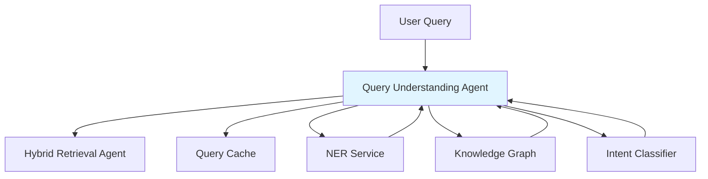
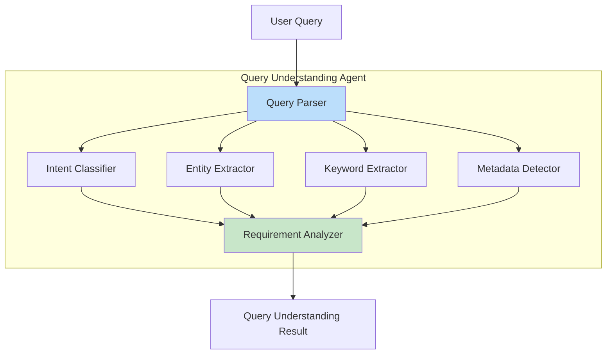
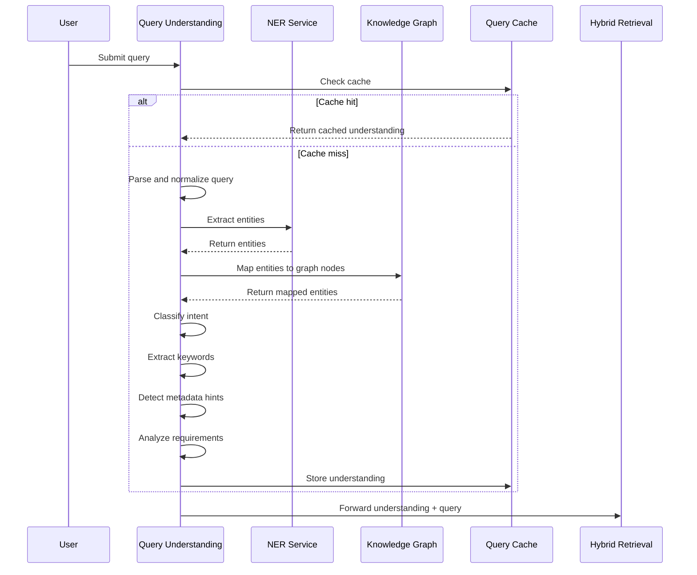

# Query Understanding Agent

**Domain:** Retrieval  
**Version:** 1.0  
**Last Updated:** 2026-05-17  
**Owner:** Retrieval Team  
**Status:** Specification

---

## Overview

The Query Understanding Agent analyzes user queries before retrieval to extract intent, entities, keywords, and metadata hints that optimize retrieval strategy and improve answer quality.

### Purpose

- Classify query intent to route to appropriate retrieval strategies
- Extract entities for knowledge graph traversal
- Extract keywords for BM25 search optimization
- Detect document category, department, and region hints
- Determine whether citations are required
- Identify multi-hop reasoning requirements

### Importance

Query understanding is critical for:

- **Retrieval Quality:** Better understanding leads to better retrieval
- **Performance:** Intent-based routing avoids unnecessary retrieval operations
- **User Experience:** Faster, more relevant answers
- **Cost Optimization:** Reduces unnecessary LLM calls for simple queries

---

## Responsibility

### Primary Responsibilities

1. **Intent Classification**
   - Classify query into predefined intent categories
   - Detect whether query requires document retrieval
   - Identify comparison or conflict analysis requirements

2. **Entity Extraction**
   - Extract named entities (policies, departments, systems, locations)
   - Map entities to knowledge graph nodes where possible
   - Preserve entity context and relationships

3. **Keyword Extraction**
   - Extract significant keywords for BM25 search
   - Identify exact terms (policy codes, error codes, acronyms)
   - Generate query expansion terms where appropriate

4. **Metadata Detection**
   - Detect department hints from query context
   - Detect region or country hints
   - Detect document type hints (policy, procedure, guide)
   - Detect temporal hints (current, archived, effective date)

5. **Requirement Analysis**
   - Determine if citations are required
   - Determine if knowledge graph traversal is needed
   - Determine if multi-hop reasoning is required
   - Estimate query complexity

### Out of Scope

- Actual document retrieval (handled by [`hybrid-retrieval-agent`](./hybrid-retrieval-agent.md))
- Access control validation (handled by [`acl-validation-agent`](./acl-validation-agent.md))
- Answer generation (handled by [`llm-answer-agent`](../generation/llm-answer-agent.md))

---

## Architecture

### System Context



### Component Architecture



### Processing Pipeline



---

## API Contract

### Core Interface

```python
from typing import List, Optional, Dict, Any
from dataclasses import dataclass
from enum import Enum

class QueryIntent(Enum):
    """Query intent categories."""
    FACT_LOOKUP = "fact_lookup"
    POLICY_EXPLANATION = "policy_explanation"
    PROCEDURE_LOOKUP = "procedure_lookup"
    COMPARISON = "comparison"
    CONFLICT_CHECK = "conflict_check"
    SUMMARIZATION = "summarization"
    SOURCE_LOOKUP = "source_lookup"
    TROUBLESHOOTING = "troubleshooting"
    MULTI_HOP_REASONING = "multi_hop_reasoning"
    GENERAL_QUESTION = "general_question"

@dataclass
class Entity:
    """Extracted entity."""
    text: str
    type: str  # policy, department, system, location, person, date, etc.
    start_pos: int
    end_pos: int
    confidence: float
    graph_node_id: Optional[str] = None
    metadata: Dict[str, Any] = None

@dataclass
class QueryUnderstanding:
    """Query understanding result."""
    original_query: str
    normalized_query: str
    intent: QueryIntent
    intent_confidence: float
    entities: List[Entity]
    keywords: List[str]
    exact_terms: List[str]
    expansion_terms: List[str]
    department_hint: Optional[str]
    region_hint: Optional[str]
    document_type_hint: Optional[str]
    temporal_hint: Optional[str]
    requires_graph: bool
    requires_citation: bool
    requires_multi_hop: bool
    complexity_score: float
    language: str
    metadata: Dict[str, Any]

class QueryUnderstandingAgent:
    """Query Understanding Agent interface."""

    def understand_query(
        self,
        query: str,
        user_context: Optional[Dict[str, Any]] = None,
        tenant_id: Optional[str] = None
    ) -> QueryUnderstanding:
        """
        Analyze query and extract understanding.

        Args:
            query: User query text
            user_context: Optional user context (department, region, etc.)
            tenant_id: Tenant identifier for caching

        Returns:
            QueryUnderstanding object with extracted information

        Raises:
            ValueError: If query is empty or invalid
            QueryUnderstandingError: If analysis fails
        """
        pass

    def classify_intent(
        self,
        query: str,
        entities: List[Entity]
    ) -> tuple[QueryIntent, float]:
        """
        Classify query intent.

        Args:
            query: Normalized query text
            entities: Extracted entities

        Returns:
            Tuple of (intent, confidence_score)
        """
        pass

    def extract_entities(
        self,
        query: str,
        language: str = "en"
    ) -> List[Entity]:
        """
        Extract named entities from query.

        Args:
            query: Query text
            language: Query language code

        Returns:
            List of extracted entities
        """
        pass

    def extract_keywords(
        self,
        query: str,
        entities: List[Entity]
    ) -> tuple[List[str], List[str], List[str]]:
        """
        Extract keywords, exact terms, and expansion terms.

        Args:
            query: Query text
            entities: Extracted entities

        Returns:
            Tuple of (keywords, exact_terms, expansion_terms)
        """
        pass

    def detect_metadata_hints(
        self,
        query: str,
        entities: List[Entity],
        user_context: Optional[Dict[str, Any]] = None
    ) -> Dict[str, Optional[str]]:
        """
        Detect metadata hints from query.

        Args:
            query: Query text
            entities: Extracted entities
            user_context: User context

        Returns:
            Dictionary with department_hint, region_hint, document_type_hint, temporal_hint
        """
        pass

    def analyze_requirements(
        self,
        query: str,
        intent: QueryIntent,
        entities: List[Entity]
    ) -> Dict[str, Any]:
        """
        Analyze query requirements.

        Args:
            query: Query text
            intent: Classified intent
            entities: Extracted entities

        Returns:
            Dictionary with requires_graph, requires_citation, requires_multi_hop, complexity_score
        """
        pass
```

---

## Data Models

### Intent Classification Model

```python
from typing import Dict, List

INTENT_PATTERNS = {
    QueryIntent.FACT_LOOKUP: [
        r"what is",
        r"who is",
        r"when is",
        r"where is",
        r"how many",
        r"how much"
    ],
    QueryIntent.POLICY_EXPLANATION: [
        r"explain.*policy",
        r"what does.*policy.*say",
        r"policy.*about",
        r"according to.*policy"
    ],
    QueryIntent.PROCEDURE_LOOKUP: [
        r"how do i",
        r"how to",
        r"steps to",
        r"process for",
        r"procedure for"
    ],
    QueryIntent.COMPARISON: [
        r"difference between",
        r"compare",
        r"versus",
        r"vs",
        r"which is better"
    ],
    QueryIntent.CONFLICT_CHECK: [
        r"conflict",
        r"contradict",
        r"inconsistent",
        r"disagree"
    ],
    QueryIntent.TROUBLESHOOTING: [
        r"error",
        r"not working",
        r"failed",
        r"issue with",
        r"problem with"
    ]
}

ENTITY_TYPES = {
    "POLICY": ["policy", "guideline", "standard", "regulation"],
    "DEPARTMENT": ["finance", "hr", "engineering", "legal", "sales"],
    "SYSTEM": ["jira", "confluence", "slack", "github"],
    "LOCATION": ["country", "region", "office", "city"],
    "DATE": ["date", "time", "deadline", "effective"],
    "PERSON": ["manager", "approver", "owner"],
    "PROCESS": ["approval", "workflow", "procedure"],
    "DOCUMENT": ["form", "template", "report"]
}
```

### Keyword Extraction Rules

```python
from typing import Set

# Stop words to exclude from keywords
STOP_WORDS: Set[str] = {
    "a", "an", "the", "is", "are", "was", "were",
    "in", "on", "at", "to", "for", "of", "with",
    "what", "when", "where", "who", "how", "why"
}

# Exact term patterns (preserve as-is)
EXACT_TERM_PATTERNS = [
    r"[A-Z]{2,}-\d+",  # Policy codes: FIN-204, HR-301
    r"[A-Z]{3,}",      # Acronyms: GDPR, HIPAA, SOC2
    r"\d{3,}",         # Error codes: 404, 500
    r"v\d+\.\d+",      # Versions: v3.2, v1.0
]

# Query expansion rules
EXPANSION_RULES = {
    "expense": ["reimbursement", "claim", "payment"],
    "travel": ["trip", "journey", "business travel"],
    "approve": ["approval", "authorize", "sign off"],
    "policy": ["guideline", "rule", "standard"],
}
```

---

## Implementation Details

### Intent Classification Algorithm

```python
def classify_intent(
    self,
    query: str,
    entities: List[Entity]
) -> tuple[QueryIntent, float]:
    """Classify query intent using pattern matching and ML."""

    # Normalize query
    normalized = query.lower().strip()

    # Pattern-based classification
    pattern_scores = {}
    for intent, patterns in INTENT_PATTERNS.items():
        score = 0.0
        for pattern in patterns:
            if re.search(pattern, normalized):
                score += 1.0
        if score > 0:
            pattern_scores[intent] = score / len(patterns)

    # Entity-based classification
    entity_scores = {}
    if any(e.type == "POLICY" for e in entities):
        entity_scores[QueryIntent.POLICY_EXPLANATION] = 0.8
    if any(e.type == "PROCESS" for e in entities):
        entity_scores[QueryIntent.PROCEDURE_LOOKUP] = 0.7
    if len([e for e in entities if e.type == "POLICY"]) >= 2:
        entity_scores[QueryIntent.COMPARISON] = 0.6

    # Combine scores
    combined_scores = {}
    for intent in QueryIntent:
        pattern_score = pattern_scores.get(intent, 0.0)
        entity_score = entity_scores.get(intent, 0.0)
        combined_scores[intent] = (pattern_score * 0.6) + (entity_score * 0.4)

    # Get best intent
    if not combined_scores:
        return QueryIntent.GENERAL_QUESTION, 0.5

    best_intent = max(combined_scores.items(), key=lambda x: x[1])
    return best_intent[0], best_intent[1]
```

### Entity Extraction

```python
import spacy

def extract_entities(
    self,
    query: str,
    language: str = "en"
) -> List[Entity]:
    """Extract entities using spaCy NER."""

    # Load spaCy model
    nlp = spacy.load(f"{language}_core_web_lg")
    doc = nlp(query)

    entities = []

    # Extract spaCy entities
    for ent in doc.ents:
        entity = Entity(
            text=ent.text,
            type=ent.label_,
            start_pos=ent.start_char,
            end_pos=ent.end_char,
            confidence=0.8,  # spaCy doesn't provide confidence
            metadata={"source": "spacy"}
        )
        entities.append(entity)

    # Extract custom entities (policy codes, etc.)
    for pattern_type, pattern in EXACT_TERM_PATTERNS:
        for match in re.finditer(pattern, query):
            entity = Entity(
                text=match.group(),
                type=pattern_type,
                start_pos=match.start(),
                end_pos=match.end(),
                confidence=1.0,
                metadata={"source": "regex"}
            )
            entities.append(entity)

    # Map entities to knowledge graph nodes
    entities = self._map_to_graph_nodes(entities)

    return entities
```

### Keyword Extraction

```python
def extract_keywords(
    self,
    query: str,
    entities: List[Entity]
) -> tuple[List[str], List[str], List[str]]:
    """Extract keywords, exact terms, and expansion terms."""

    # Tokenize and normalize
    tokens = query.lower().split()

    # Extract exact terms (preserve case)
    exact_terms = []
    for pattern in EXACT_TERM_PATTERNS:
        exact_terms.extend(re.findall(pattern, query))

    # Extract keywords (exclude stop words and entity text)
    entity_texts = {e.text.lower() for e in entities}
    keywords = [
        token for token in tokens
        if token not in STOP_WORDS
        and token not in entity_texts
        and len(token) > 2
    ]

    # Generate expansion terms
    expansion_terms = []
    for keyword in keywords:
        if keyword in EXPANSION_RULES:
            expansion_terms.extend(EXPANSION_RULES[keyword])

    return keywords, exact_terms, expansion_terms
```

### Metadata Detection

```python
def detect_metadata_hints(
    self,
    query: str,
    entities: List[Entity],
    user_context: Optional[Dict[str, Any]] = None
) -> Dict[str, Optional[str]]:
    """Detect metadata hints from query and context."""

    hints = {
        "department_hint": None,
        "region_hint": None,
        "document_type_hint": None,
        "temporal_hint": None
    }

    # Department detection
    for entity in entities:
        if entity.type == "DEPARTMENT":
            hints["department_hint"] = entity.text
            break

    # Region detection
    for entity in entities:
        if entity.type in ["LOCATION", "GPE"]:
            hints["region_hint"] = entity.text
            break

    # Document type detection
    doc_type_patterns = {
        "policy": r"policy|guideline|standard",
        "procedure": r"procedure|process|workflow",
        "form": r"form|template",
        "guide": r"guide|manual|handbook"
    }
    for doc_type, pattern in doc_type_patterns.items():
        if re.search(pattern, query.lower()):
            hints["document_type_hint"] = doc_type
            break

    # Temporal detection
    temporal_patterns = {
        "current": r"current|latest|active",
        "archived": r"old|previous|archived",
        "effective": r"effective|valid|applicable"
    }
    for temporal, pattern in temporal_patterns.items():
        if re.search(pattern, query.lower()):
            hints["temporal_hint"] = temporal
            break

    # Use user context as fallback
    if user_context:
        if not hints["department_hint"] and "department" in user_context:
            hints["department_hint"] = user_context["department"]
        if not hints["region_hint"] and "region" in user_context:
            hints["region_hint"] = user_context["region"]

    return hints
```

### Requirement Analysis

```python
def analyze_requirements(
    self,
    query: str,
    intent: QueryIntent,
    entities: List[Entity]
) -> Dict[str, Any]:
    """Analyze query requirements."""

    # Graph requirement
    requires_graph = (
        intent in [QueryIntent.MULTI_HOP_REASONING, QueryIntent.COMPARISON]
        or len(entities) >= 3
        or any(e.type in ["PROCESS", "SYSTEM"] for e in entities)
    )

    # Citation requirement
    requires_citation = (
        intent not in [QueryIntent.GENERAL_QUESTION]
        and any(e.type in ["POLICY", "PROCEDURE"] for e in entities)
    )

    # Multi-hop requirement
    requires_multi_hop = (
        intent == QueryIntent.MULTI_HOP_REASONING
        or "and" in query.lower()
        or len(entities) >= 4
    )

    # Complexity score (0.0 to 1.0)
    complexity_score = min(1.0, (
        (len(entities) * 0.1) +
        (0.3 if requires_graph else 0.0) +
        (0.3 if requires_multi_hop else 0.0) +
        (len(query.split()) * 0.01)
    ))

    return {
        "requires_graph": requires_graph,
        "requires_citation": requires_citation,
        "requires_multi_hop": requires_multi_hop,
        "complexity_score": complexity_score
    }
```

---

## Testing Requirements

### Unit Tests

```python
def test_intent_classification():
    """Test intent classification accuracy."""
    agent = QueryUnderstandingAgent()

    # Fact lookup
    intent, conf = agent.classify_intent("What is the travel policy?", [])
    assert intent == QueryIntent.FACT_LOOKUP
    assert conf > 0.5

    # Policy explanation
    intent, conf = agent.classify_intent(
        "Explain the expense reimbursement policy",
        [Entity(text="expense reimbursement policy", type="POLICY", ...)]
    )
    assert intent == QueryIntent.POLICY_EXPLANATION
    assert conf > 0.7

    # Procedure lookup
    intent, conf = agent.classify_intent("How do I submit an expense claim?", [])
    assert intent == QueryIntent.PROCEDURE_LOOKUP

    # Comparison
    intent, conf = agent.classify_intent(
        "What is the difference between FIN-204 and FIN-301?",
        [
            Entity(text="FIN-204", type="POLICY", ...),
            Entity(text="FIN-301", type="POLICY", ...)
        ]
    )
    assert intent == QueryIntent.COMPARISON

def test_entity_extraction():
    """Test entity extraction."""
    agent = QueryUnderstandingAgent()

    # Policy code extraction
    entities = agent.extract_entities("What does FIN-204 say about travel?")
    policy_entities = [e for e in entities if e.type == "POLICY"]
    assert len(policy_entities) >= 1
    assert "FIN-204" in [e.text for e in policy_entities]

    # Department extraction
    entities = agent.extract_entities("Finance department expense policy")
    dept_entities = [e for e in entities if e.type == "DEPARTMENT"]
    assert len(dept_entities) >= 1

    # Location extraction
    entities = agent.extract_entities("Leave policy for employees in Germany")
    loc_entities = [e for e in entities if e.type in ["LOCATION", "GPE"]]
    assert len(loc_entities) >= 1

def test_keyword_extraction():
    """Test keyword extraction."""
    agent = QueryUnderstandingAgent()

    query = "How do I submit expense claims for travel in Germany?"
    entities = agent.extract_entities(query)
    keywords, exact_terms, expansion_terms = agent.extract_keywords(query, entities)

    # Keywords should exclude stop words
    assert "how" not in keywords
    assert "do" not in keywords
    assert "i" not in keywords

    # Keywords should include significant terms
    assert "submit" in keywords or "expense" in keywords

    # Expansion terms should be generated
    assert len(expansion_terms) > 0

def test_metadata_detection():
    """Test metadata hint detection."""
    agent = QueryUnderstandingAgent()

    query = "What is the current Finance travel policy?"
    entities = agent.extract_entities(query)
    hints = agent.detect_metadata_hints(query, entities)

    assert hints["department_hint"] == "Finance"
    assert hints["document_type_hint"] == "policy"
    assert hints["temporal_hint"] == "current"

def test_requirement_analysis():
    """Test requirement analysis."""
    agent = QueryUnderstandingAgent()

    # Simple query
    reqs = agent.analyze_requirements(
        "What is the travel policy?",
        QueryIntent.FACT_LOOKUP,
        []
    )
    assert reqs["complexity_score"] < 0.5

    # Complex multi-hop query
    entities = [
        Entity(text="production logs", type="SYSTEM", ...),
        Entity(text="Germany", type="LOCATION", ...),
        Entity(text="Engineering", type="DEPARTMENT", ...)
    ]
    reqs = agent.analyze_requirements(
        "Who approves production log access in Germany for Engineering?",
        QueryIntent.MULTI_HOP_REASONING,
        entities
    )
    assert reqs["requires_graph"] is True
    assert reqs["requires_multi_hop"] is True
    assert reqs["complexity_score"] > 0.5
```

### Integration Tests

```python
def test_end_to_end_understanding():
    """Test complete query understanding pipeline."""
    agent = QueryUnderstandingAgent()

    query = "What is the difference between FIN-204 and FIN-301 for travel in Germany?"
    understanding = agent.understand_query(query, tenant_id="test-tenant")

    # Verify intent
    assert understanding.intent == QueryIntent.COMPARISON
    assert understanding.intent_confidence > 0.6

    # Verify entities
    assert len(understanding.entities) >= 3
    policy_entities = [e for e in understanding.entities if e.type == "POLICY"]
    assert len(policy_entities) >= 2

    # Verify keywords
    assert len(understanding.keywords) > 0
    assert len(understanding.exact_terms) >= 2  # FIN-204, FIN-301

    # Verify metadata hints
    assert understanding.region_hint == "Germany"
    assert understanding.document_type_hint == "policy"

    # Verify requirements
    assert understanding.requires_citation is True
    assert understanding.complexity_score > 0.4

def test_caching():
    """Test query understanding caching."""
    agent = QueryUnderstandingAgent()

    query = "What is the travel policy?"
    tenant_id = "test-tenant"

    # First call (cache miss)
    start = time.time()
    result1 = agent.understand_query(query, tenant_id=tenant_id)
    duration1 = time.time() - start

    # Second call (cache hit)
    start = time.time()
    result2 = agent.understand_query(query, tenant_id=tenant_id)
    duration2 = time.time() - start

    # Verify results are identical
    assert result1.intent == result2.intent
    assert result1.entities == result2.entities

    # Verify cache improves performance
    assert duration2 < duration1 * 0.5  # At least 50% faster
```

### Performance Tests

```python
def test_understanding_latency():
    """Test query understanding latency."""
    agent = QueryUnderstandingAgent()

    queries = [
        "What is the travel policy?",
        "How do I submit expense claims?",
        "What is the difference between FIN-204 and FIN-301?",
        "Who approves production log access in Germany?"
    ]

    for query in queries:
        start = time.time()
        understanding = agent.understand_query(query)
        duration = time.time() - start

        # Target: <100ms for query understanding
        assert duration < 0.1, f"Query understanding took {duration}s (target: <0.1s)"

def test_entity_extraction_performance():
    """Test entity extraction performance."""
    agent = QueryUnderstandingAgent()

    # Long query with many entities
    query = "What is the difference between FIN-204, FIN-301, HR-102, and ENG-501 for Finance, HR, and Engineering departments in Germany, France, and UK?"

    start = time.time()
    entities = agent.extract_entities(query)
    duration = time.time() - start

    # Target: <50ms for entity extraction
    assert duration < 0.05
    assert len(entities) >= 10
```

---

## Error Handling

### Error Types

```python
class QueryUnderstandingError(Exception):
    """Base exception for query understanding errors."""
    pass

class EmptyQueryError(QueryUnderstandingError):
    """Raised when query is empty or whitespace only."""
    pass

class LanguageNotSupportedError(QueryUnderstandingError):
    """Raised when query language is not supported."""
    pass

class EntityExtractionError(QueryUnderstandingError):
    """Raised when entity extraction fails."""
    pass

class IntentClassificationError(QueryUnderstandingError):
    """Raised when intent classification fails."""
    pass
```

### Error Handling Strategy

```python
def understand_query(
    self,
    query: str,
    user_context: Optional[Dict[str, Any]] = None,
    tenant_id: Optional[str] = None
) -> QueryUnderstanding:
    """Understand query with comprehensive error handling."""

    try:
        # Validate input
        if not query or not query.strip():
            raise EmptyQueryError("Query cannot be empty")

        # Detect language
        language = self._detect_language(query)
        if language not in SUPPORTED_LANGUAGES:
            raise LanguageNotSupportedError(f"Language {language} not supported")

        # Extract entities (with fallback)
        try:
            entities = self.extract_entities(query, language)
        except Exception as e:
            logger.warning(f"Entity extraction failed: {e}")
            entities = []  # Continue with empty entities

        # Classify intent (with fallback)
        try:
            intent, confidence = self.classify_intent(query, entities)
        except Exception as e:
            logger.warning(f"Intent classification failed: {e}")
            intent = QueryIntent.GENERAL_QUESTION
            confidence = 0.5

        # Extract keywords (with fallback)
        try:
            keywords, exact_terms, expansion_terms = self.extract_keywords(query, entities)
        except Exception as e:
            logger.warning(f"Keyword extraction failed: {e}")
            keywords = query.lower().split()
            exact_terms = []
            expansion_terms = []

        # Detect metadata hints (with fallback)
        try:
            hints = self.detect_metadata_hints(query, entities, user_context)
        except Exception as e:
            logger.warning(f"Metadata detection failed: {e}")
            hints = {
                "department_hint": None,
                "region_hint": None,
                "document_type_hint": None,
                "temporal_hint": None
            }

        # Analyze requirements (with fallback)
        try:
            requirements = self.analyze_requirements(query, intent, entities)
        except Exception as e:
            logger.warning(f"Requirement analysis failed: {e}")
            requirements = {
                "requires_graph": False,
                "requires_citation": True,
                "requires_multi_hop": False,
                "complexity_score": 0.5
            }

        # Build result
        return QueryUnderstanding(
            original_query=query,
            normalized_query=query.strip(),
            intent=intent,
            intent_confidence=confidence,
            entities=entities,
            keywords=keywords,
            exact_terms=exact_terms,
            expansion_terms=expansion_terms,
            department_hint=hints["department_hint"],
            region_hint=hints["region_hint"],
            document_type_hint=hints["document_type_hint"],
            temporal_hint=hints["temporal_hint"],
            requires_graph=requirements["requires_graph"],
            requires_citation=requirements["requires_citation"],
            requires_multi_hop=requirements["requires_multi_hop"],
            complexity_score=requirements["complexity_score"],
            language=language,
            metadata={}
        )

    except QueryUnderstandingError:
        raise
    except Exception as e:
        logger.error(f"Unexpected error in query understanding: {e}")
        raise QueryUnderstandingError(f"Query understanding failed: {e}")
```

---

## Configuration

### Environment Variables

```bash
# NER Service
SPACY_MODEL=en_core_web_lg
SPACY_BATCH_SIZE=32

# Intent Classification
INTENT_CONFIDENCE_THRESHOLD=0.5
INTENT_CLASSIFIER_MODEL=pattern_based  # or ml_based

# Caching
QUERY_CACHE_ENABLED=true
QUERY_CACHE_TTL=3600  # 1 hour
QUERY_CACHE_MAX_SIZE=10000

# Knowledge Graph
KG_ENTITY_MAPPING_ENABLED=true
KG_ENDPOINT=http://neo4j:7474

# Performance
ENTITY_EXTRACTION_TIMEOUT=5000  # ms
INTENT_CLASSIFICATION_TIMEOUT=2000  # ms
```

### Configuration File

```yaml
# config/query_understanding.yaml

query_understanding:
  # Language support
  supported_languages:
    - en
    - de
    - fr
    - es

  # Entity extraction
  entity_extraction:
    provider: spacy
    model: en_core_web_lg
    confidence_threshold: 0.7
    custom_patterns:
      - type: POLICY
        pattern: "[A-Z]{2,}-\\d+"
      - type: VERSION
        pattern: "v\\d+\\.\\d+"

  # Intent classification
  intent_classification:
    method: pattern_based # or ml_based
    confidence_threshold: 0.5
    fallback_intent: general_question

  # Keyword extraction
  keyword_extraction:
    min_keyword_length: 3
    max_keywords: 20
    stop_words_file: config/stop_words.txt
    expansion_rules_file: config/expansion_rules.json

  # Caching
  caching:
    enabled: true
    ttl: 3600
    max_size: 10000
    key_prefix: "query_understanding:"

  # Performance
  performance:
    max_query_length: 1000
    entity_extraction_timeout: 5000
    intent_classification_timeout: 2000
```

---

## Dependencies

### Upstream Dependencies

- **User Input:** Receives queries from users via API Gateway
- **User Context:** Receives user context from [`auth-acl-agent`](../infrastructure/auth-acl-agent.md)

### Downstream Dependencies

- **[`hybrid-retrieval-agent`](./hybrid-retrieval-agent.md):** Provides query understanding for retrieval optimization
- **Query Cache:** Stores understanding results for performance
- **NER Service:** Uses spaCy for entity extraction
- **Knowledge Graph:** Maps entities to graph nodes

### External Dependencies

```python
# requirements.txt
spacy>=3.7.0
spacy-transformers>=1.3.0  # Optional for better accuracy
redis>=5.0.0
pydantic>=2.0.0
```

---

## Monitoring & Observability

### Metrics

```python
# Prometheus metrics
query_understanding_requests_total = Counter(
    "query_understanding_requests_total",
    "Total query understanding requests",
    ["tenant_id", "intent", "language"]
)

query_understanding_duration_seconds = Histogram(
    "query_understanding_duration_seconds",
    "Query understanding duration",
    ["component"]  # entity_extraction, intent_classification, etc.
)

query_understanding_cache_hits_total = Counter(
    "query_understanding_cache_hits_total",
    "Query understanding cache hits",
    ["tenant_id"]
)

query_understanding_errors_total = Counter(
    "query_understanding_errors_total",
    "Query understanding errors",
    ["error_type", "tenant_id"]
)

entity_extraction_count = Histogram(
    "entity_extraction_count",
    "Number of entities extracted per query",
    ["entity_type"]
)

intent_confidence_score = Histogram(
    "intent_confidence_score",
    "Intent classification confidence scores",
    ["intent"]
)
```

### Logging

```python
import structlog

logger = structlog.get_logger()

# Log query understanding
logger.info(
    "query_understood",
    query=query,
    intent=understanding.intent,
    intent_confidence=understanding.intent_confidence,
    entity_count=len(understanding.entities),
    keyword_count=len(understanding.keywords),
    complexity_score=understanding.complexity_score,
    duration_ms=duration_ms,
    tenant_id=tenant_id
)

# Log entity extraction
logger.debug(
    "entities_extracted",
    query=query,
    entities=[
        {
            "text": e.text,
            "type": e.type,
            "confidence": e.confidence
        }
        for e in entities
    ],
    tenant_id=tenant_id
)

# Log errors
logger.error(
    "query_understanding_failed",
    query=query,
    error=str(error),
    error_type=type(error).__name__,
    tenant_id=tenant_id
)
```

### Health Checks

```python
def health_check() -> Dict[str, Any]:
    """Check query understanding agent health."""

    health = {
        "status": "healthy",
        "checks": {}
    }

    # Check spaCy model
    try:
        nlp = spacy.load("en_core_web_lg")
        health["checks"]["spacy_model"] = "ok"
    except Exception as e:
        health["status"] = "unhealthy"
        health["checks"]["spacy_model"] = f"error: {e}"

    # Check cache connection
    try:
        cache.ping()
        health["checks"]["cache"] = "ok"
    except Exception as e:
        health["status"] = "degraded"
        health["checks"]["cache"] = f"error: {e}"

    # Check knowledge graph connection
    try:
        kg_client.ping()
        health["checks"]["knowledge_graph"] = "ok"
    except Exception as e:
        health["status"] = "degraded"
        health["checks"]["knowledge_graph"] = f"error: {e}"

    return health
```

---

## Related Documentation

- [AGENTS.md](../../AGENTS.md) - Master agent index
- [ARCHITECTURE.md](../../ARCHITECTURE.md) - System architecture
- [hybrid-retrieval-agent.md](./hybrid-retrieval-agent.md) - Hybrid retrieval orchestration
- [acl-validation-agent.md](./acl-validation-agent.md) - Access control validation
- [auth-acl-agent.md](../infrastructure/auth-acl-agent.md) - Authentication and authorization
- [knowledge-graph-agent.md](../indexing/knowledge-graph-agent.md) - Knowledge graph construction

---

**Version History:**

- 1.0 (2026-05-17): Initial specification
