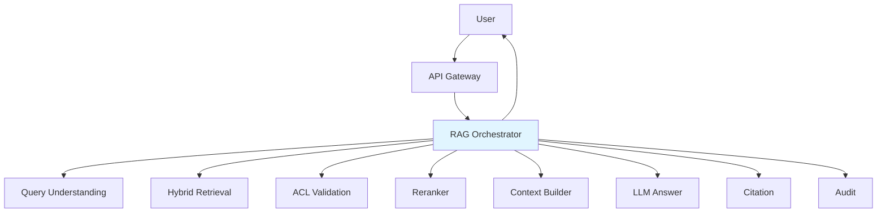
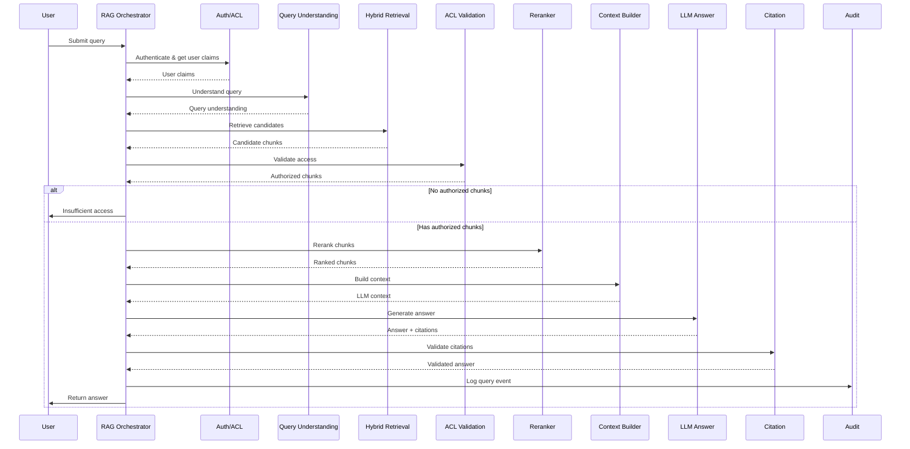

# RAG Orchestrator

**Domain:** Retrieval  
**Version:** 1.0  
**Last Updated:** 2026-05-17  
**Owner:** Retrieval Team  
**Status:** Specification

---

## Overview

The RAG Orchestrator coordinates the end-to-end Retrieval-Augmented Generation workflow, managing the complete pipeline from user query to cited answer while enforcing security, quality, and performance requirements.

### Purpose

- Orchestrate the complete RAG pipeline
- Coordinate all retrieval and generation agents
- Enforce security boundaries at each stage
- Manage error handling and fallback strategies
- Track performance and quality metrics
- Ensure citation integrity

### Importance

The orchestrator is critical for:

- **System Integration:** Coordinates 10+ agents in correct sequence
- **Security Enforcement:** Ensures no unauthorized data reaches LLM
- **Quality Assurance:** Validates citations and answer quality
- **Performance Management:** Optimizes latency and resource usage
- **Observability:** Provides end-to-end tracing and metrics

---

## Responsibility

### Primary Responsibilities

1. **Pipeline Orchestration**
   - Execute RAG pipeline in correct sequence
   - Manage agent dependencies
   - Handle parallel execution where possible
   - Coordinate timeouts and retries

2. **Security Enforcement**
   - Validate user authentication
   - Enforce ACL at every stage
   - Prevent unauthorized data leakage
   - Log security events

3. **Quality Assurance**
   - Validate citation integrity
   - Check answer completeness
   - Detect insufficient context
   - Enforce citation requirements

4. **Error Handling**
   - Graceful degradation strategies
   - Fallback mechanisms
   - Error recovery
   - User-friendly error messages

5. **Performance Management**
   - Monitor pipeline latency
   - Optimize parallel execution
   - Manage resource allocation
   - Implement caching strategies

### Out of Scope

- Individual agent implementation (delegated to specialized agents)
- User interface rendering (handled by frontend)
- Long-term storage (handled by [`audit-agent`](../operations/audit-agent.md))

---

## Architecture

### System Context



### RAG Pipeline



---

## API Contract

### Core Interface

```python
from typing import Dict, Any, Optional
from dataclasses import dataclass
from enum import Enum

class RAGStatus(Enum):
    """RAG pipeline status."""
    SUCCESS = "success"
    INSUFFICIENT_ACCESS = "insufficient_access"
    INSUFFICIENT_CONTEXT = "insufficient_context"
    CITATION_VALIDATION_FAILED = "citation_validation_failed"
    ERROR = "error"

@dataclass
class RAGRequest:
    """RAG request."""
    query: str
    user_id: str
    tenant_id: str
    session_id: Optional[str] = None
    conversation_history: Optional[list] = None
    config: Optional[Dict[str, Any]] = None

@dataclass
class RAGResponse:
    """RAG response."""
    answer: str
    citations: list
    status: RAGStatus
    metadata: Dict[str, Any]
    performance: Dict[str, float]
    trace_id: str

class RAGOrchestrator:
    """RAG Orchestrator interface."""

    async def process_query(
        self,
        request: RAGRequest
    ) -> RAGResponse:
        """
        Process user query through complete RAG pipeline.

        Args:
            request: RAG request with query and user context

        Returns:
            RAGResponse with answer, citations, and metadata
        """
        pass

    async def execute_pipeline(
        self,
        query: str,
        user_claims: UserClaims,
        config: Dict[str, Any]
    ) -> RAGResponse:
        """
        Execute RAG pipeline stages.

        Args:
            query: User query
            user_claims: User authentication claims
            config: Pipeline configuration

        Returns:
            RAGResponse with results
        """
        pass

    def validate_request(
        self,
        request: RAGRequest
    ) -> tuple[bool, Optional[str]]:
        """
        Validate RAG request.

        Args:
            request: RAG request

        Returns:
            Tuple of (is_valid, error_message)
        """
        pass
```

---

## Implementation Details

### Pipeline Execution

```python
import asyncio
from datetime import datetime
import uuid

async def process_query(
    self,
    request: RAGRequest
) -> RAGResponse:
    """Process query through complete RAG pipeline."""

    trace_id = str(uuid.uuid4())
    start_time = time.time()

    try:
        # Validate request
        is_valid, error_msg = self.validate_request(request)
        if not is_valid:
            return RAGResponse(
                answer="",
                citations=[],
                status=RAGStatus.ERROR,
                metadata={"error": error_msg},
                performance={},
                trace_id=trace_id
            )

        # Get user claims
        user_claims = await self.auth_agent.get_user_claims(
            request.user_id,
            request.tenant_id
        )

        # Execute pipeline
        response = await self.execute_pipeline(
            request.query,
            user_claims,
            request.config or {}
        )

        # Add trace ID
        response.trace_id = trace_id

        # Calculate total time
        total_time = (time.time() - start_time) * 1000
        response.performance["total_time_ms"] = total_time

        logger.info(
            "rag_query_complete",
            trace_id=trace_id,
            user_id=request.user_id,
            tenant_id=request.tenant_id,
            status=response.status.value,
            total_time_ms=total_time
        )

        return response

    except Exception as e:
        logger.error(
            "rag_query_failed",
            trace_id=trace_id,
            error=str(e),
            user_id=request.user_id
        )

        return RAGResponse(
            answer="An error occurred while processing your query.",
            citations=[],
            status=RAGStatus.ERROR,
            metadata={"error": str(e)},
            performance={"total_time_ms": (time.time() - start_time) * 1000},
            trace_id=trace_id
        )
```

### Pipeline Stages

```python
async def execute_pipeline(
    self,
    query: str,
    user_claims: UserClaims,
    config: Dict[str, Any]
) -> RAGResponse:
    """Execute RAG pipeline stages."""

    performance = {}

    # Stage 1: Query Understanding
    start = time.time()
    query_understanding = await self.query_understanding_agent.understand_query(
        query,
        user_context={"department": user_claims.department, "region": user_claims.region},
        tenant_id=user_claims.tenant_id
    )
    performance["query_understanding_ms"] = (time.time() - start) * 1000

    # Stage 2: Hybrid Retrieval
    start = time.time()
    retrieval_result = await self.hybrid_retrieval_agent.retrieve(
        query_understanding,
        user_context={
            "tenant_id": user_claims.tenant_id,
            "department": user_claims.department,
            "groups": user_claims.groups,
            "region": user_claims.region
        }
    )
    performance["retrieval_ms"] = retrieval_result.retrieval_time_ms

    # Stage 3: ACL Validation
    start = time.time()
    validation_result = await self.acl_validation_agent.validate_chunks(
        [c.chunk_id for c in retrieval_result.candidates],
        user_claims
    )
    performance["acl_validation_ms"] = validation_result.validation_time_ms

    # Check if user has access to any chunks
    if not validation_result.authorized_chunk_ids:
        return RAGResponse(
            answer="I don't have access to documents that can answer your question.",
            citations=[],
            status=RAGStatus.INSUFFICIENT_ACCESS,
            metadata={
                "query": query,
                "denied_count": len(validation_result.denied_chunk_ids)
            },
            performance=performance,
            trace_id=""
        )

    # Filter to authorized chunks only
    authorized_chunks = [
        c for c in retrieval_result.candidates
        if c.chunk_id in validation_result.authorized_chunk_ids
    ]

    # Stage 4: Reranking
    start = time.time()
    reranking_result = await self.reranker_agent.rerank(
        authorized_chunks,
        query_understanding,
        top_k=config.get("top_k", 10)
    )
    performance["reranking_ms"] = reranking_result.reranking_time_ms

    # Stage 5: Context Building
    start = time.time()
    context_result = await self.context_builder_agent.build_context(
        reranking_result.ranked_chunks,
        query_understanding,
        max_tokens=config.get("max_context_tokens", 4000)
    )
    performance["context_building_ms"] = (time.time() - start) * 1000

    # Check if we have sufficient context
    if not context_result.chunks:
        return RAGResponse(
            answer="I don't have enough information to answer your question.",
            citations=[],
            status=RAGStatus.INSUFFICIENT_CONTEXT,
            metadata={"query": query},
            performance=performance,
            trace_id=""
        )

    # Stage 6: LLM Answer Generation
    start = time.time()
    answer_result = await self.llm_answer_agent.generate_answer(
        query,
        context_result.context,
        query_understanding
    )
    performance["llm_generation_ms"] = (time.time() - start) * 1000

    # Stage 7: Citation Validation
    start = time.time()
    citation_result = await self.citation_agent.validate_citations(
        answer_result.answer,
        answer_result.citations,
        context_result.chunks
    )
    performance["citation_validation_ms"] = (time.time() - start) * 1000

    # Check citation validation
    if not citation_result.validated:
        logger.warning(
            "citation_validation_failed",
            query=query,
            user_id=user_claims.user_id
        )
        # Continue but mark status
        status = RAGStatus.CITATION_VALIDATION_FAILED
    else:
        status = RAGStatus.SUCCESS

    # Stage 8: Audit Logging (async, don't wait)
    asyncio.create_task(
        self.audit_agent.log_query_event({
            "query": query,
            "user_id": user_claims.user_id,
            "tenant_id": user_claims.tenant_id,
            "retrieved_chunks": [c.chunk_id for c in retrieval_result.candidates],
            "authorized_chunks": validation_result.authorized_chunk_ids,
            "denied_chunks": validation_result.denied_chunk_ids,
            "cited_chunks": [c["chunk_id"] for c in citation_result.citations],
            "answer_hash": hashlib.sha256(answer_result.answer.encode()).hexdigest(),
            "performance": performance
        })
    )

    return RAGResponse(
        answer=answer_result.answer,
        citations=citation_result.citations,
        status=status,
        metadata={
            "query": query,
            "intent": query_understanding.intent.value,
            "retrieved_count": len(retrieval_result.candidates),
            "authorized_count": len(validation_result.authorized_chunk_ids),
            "denied_count": len(validation_result.denied_chunk_ids),
            "context_chunks": len(context_result.chunks)
        },
        performance=performance,
        trace_id=""
    )
```

### Request Validation

```python
def validate_request(
    self,
    request: RAGRequest
) -> tuple[bool, Optional[str]]:
    """Validate RAG request."""

    # Check required fields
    if not request.query or not request.query.strip():
        return False, "Query cannot be empty"

    if not request.user_id:
        return False, "User ID is required"

    if not request.tenant_id:
        return False, "Tenant ID is required"

    # Check query length
    if len(request.query) > 1000:
        return False, "Query exceeds maximum length of 1000 characters"

    # Check for potential injection attempts
    if self._contains_injection_patterns(request.query):
        logger.warning(
            "potential_injection_attempt",
            query=request.query,
            user_id=request.user_id
        )
        return False, "Query contains invalid patterns"

    return True, None

def _contains_injection_patterns(self, query: str) -> bool:
    """Check for potential injection patterns."""

    injection_patterns = [
        r"<script",
        r"javascript:",
        r"onerror=",
        r"onclick=",
        r"eval\(",
        r"exec\("
    ]

    query_lower = query.lower()
    for pattern in injection_patterns:
        if re.search(pattern, query_lower):
            return True

    return False
```

---

## Testing Requirements

### Unit Tests

```python
def test_request_validation():
    """Test request validation."""
    orchestrator = RAGOrchestrator()

    # Valid request
    valid_request = RAGRequest(
        query="What is the travel policy?",
        user_id="user_001",
        tenant_id="tenant_a"
    )
    is_valid, error = orchestrator.validate_request(valid_request)
    assert is_valid is True
    assert error is None

    # Empty query
    empty_query = RAGRequest(
        query="",
        user_id="user_001",
        tenant_id="tenant_a"
    )
    is_valid, error = orchestrator.validate_request(empty_query)
    assert is_valid is False
    assert "empty" in error.lower()

    # Missing user ID
    no_user = RAGRequest(
        query="test",
        user_id="",
        tenant_id="tenant_a"
    )
    is_valid, error = orchestrator.validate_request(no_user)
    assert is_valid is False

def test_injection_detection():
    """Test injection pattern detection."""
    orchestrator = RAGOrchestrator()

    # Normal query
    assert orchestrator._contains_injection_patterns("What is the policy?") is False

    # Script injection
    assert orchestrator._contains_injection_patterns("<script>alert('xss')</script>") is True

    # JavaScript injection
    assert orchestrator._contains_injection_patterns("javascript:alert(1)") is True
```

### Integration Tests

```python
async def test_end_to_end_rag_pipeline():
    """Test complete RAG pipeline."""
    orchestrator = RAGOrchestrator()

    request = RAGRequest(
        query="What is the travel expense policy?",
        user_id="user_001",
        tenant_id="tenant_a"
    )

    response = await orchestrator.process_query(request)

    assert response.status == RAGStatus.SUCCESS
    assert len(response.answer) > 0
    assert len(response.citations) > 0
    assert response.trace_id
    assert response.performance["total_time_ms"] > 0

async def test_insufficient_access():
    """Test handling of insufficient access."""
    orchestrator = RAGOrchestrator()

    # User without access to confidential documents
    request = RAGRequest(
        query="What is the executive compensation policy?",
        user_id="user_001",  # Regular employee
        tenant_id="tenant_a"
    )

    response = await orchestrator.process_query(request)

    assert response.status == RAGStatus.INSUFFICIENT_ACCESS
    assert "don't have access" in response.answer.lower()
    assert len(response.citations) == 0

async def test_error_handling():
    """Test error handling."""
    orchestrator = RAGOrchestrator()

    # Simulate retrieval failure
    orchestrator.hybrid_retrieval_agent = None

    request = RAGRequest(
        query="test query",
        user_id="user_001",
        tenant_id="tenant_a"
    )

    response = await orchestrator.process_query(request)

    assert response.status == RAGStatus.ERROR
    assert "error" in response.answer.lower()
```

### Performance Tests

```python
async def test_pipeline_latency():
    """Test pipeline latency targets."""
    orchestrator = RAGOrchestrator()

    request = RAGRequest(
        query="What is the travel policy?",
        user_id="user_001",
        tenant_id="tenant_a"
    )

    start = time.time()
    response = await orchestrator.process_query(request)
    duration = time.time() - start

    # Target: <3s for complete pipeline
    assert duration < 3.0
    assert response.performance["total_time_ms"] < 3000
```

---

## Configuration

### Environment Variables

```bash
# Pipeline Configuration
RAG_TIMEOUT=10000  # ms
RAG_MAX_RETRIES=2
RAG_TOP_K=10
RAG_MAX_CONTEXT_TOKENS=4000

# Feature Flags
RAG_ENABLE_CACHING=true
RAG_ENABLE_PARALLEL_RETRIEVAL=true
RAG_ENABLE_CITATION_VALIDATION=true
```

### Configuration File

```yaml
# config/rag_orchestrator.yaml

rag_orchestrator:
  # Pipeline settings
  pipeline:
    timeout_ms: 10000
    max_retries: 2
    enable_parallel_execution: true

  # Retrieval settings
  retrieval:
    top_k: 10
    enable_vector: true
    enable_bm25: true
    enable_graph: true

  # Context settings
  context:
    max_tokens: 4000
    include_metadata: true

  # Quality settings
  quality:
    require_citations: true
    validate_citations: true
    min_citation_count: 1

  # Performance settings
  performance:
    enable_caching: true
    cache_ttl: 3600
```

---

## Dependencies

### Upstream Dependencies

- **API Gateway:** Receives requests
- **[`auth-acl-agent`](../infrastructure/auth-acl-agent.md):** User authentication

### Downstream Dependencies

- **[`query-understanding-agent`](./query-understanding-agent.md):** Query analysis
- **[`hybrid-retrieval-agent`](./hybrid-retrieval-agent.md):** Document retrieval
- **[`acl-validation-agent`](./acl-validation-agent.md):** Access control
- **[`reranker-agent`](./reranker-agent.md):** Result ranking
- **[`context-builder-agent`](../generation/context-builder-agent.md):** Context building
- **[`llm-answer-agent`](../generation/llm-answer-agent.md):** Answer generation
- **[`citation-agent`](../generation/citation-agent.md):** Citation validation
- **[`audit-agent`](../operations/audit-agent.md):** Audit logging

---

## Monitoring & Observability

### Metrics

```python
# Prometheus metrics
rag_requests_total = Counter(
    "rag_requests_total",
    "Total RAG requests",
    ["tenant_id", "status"]
)

rag_duration_seconds = Histogram(
    "rag_duration_seconds",
    "RAG pipeline duration",
    ["stage"]
)

rag_errors_total = Counter(
    "rag_errors_total",
    "RAG pipeline errors",
    ["stage", "error_type"]
)

rag_insufficient_access_total = Counter(
    "rag_insufficient_access_total",
    "Queries with insufficient access",
    ["tenant_id"]
)

rag_citation_failures_total = Counter(
    "rag_citation_failures_total",
    "Citation validation failures",
    ["tenant_id"]
)
```

### Logging

```python
import structlog

logger = structlog.get_logger()

logger.info(
    "rag_query_complete",
    trace_id=trace_id,
    user_id=request.user_id,
    tenant_id=request.tenant_id,
    status=response.status.value,
    total_time_ms=total_time,
    retrieved_count=metadata["retrieved_count"],
    authorized_count=metadata["authorized_count"]
)
```

---

## Related Documentation

- [AGENTS.md](../../AGENTS.md) - Master agent index
- [ARCHITECTURE.md](../../ARCHITECTURE.md) - System architecture
- [query-understanding-agent.md](./query-understanding-agent.md) - Query understanding
- [hybrid-retrieval-agent.md](./hybrid-retrieval-agent.md) - Hybrid retrieval
- [acl-validation-agent.md](./acl-validation-agent.md) - Access control
- [reranker-agent.md](./reranker-agent.md) - Reranking

---

**Version History:**

- 1.0 (2026-05-17): Initial specification
