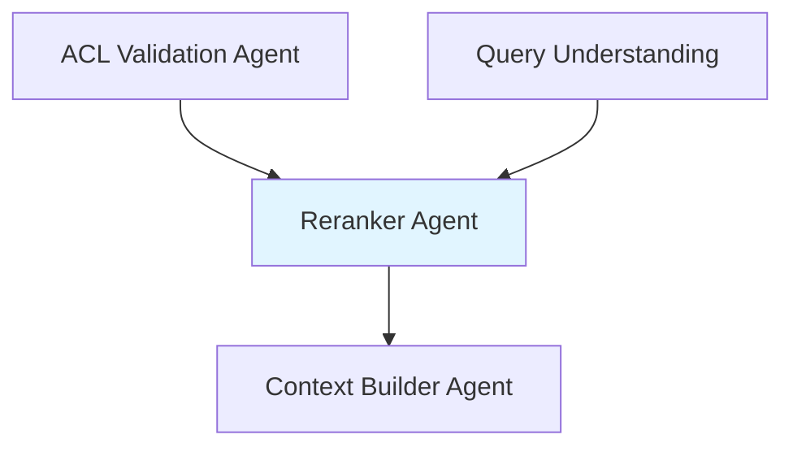
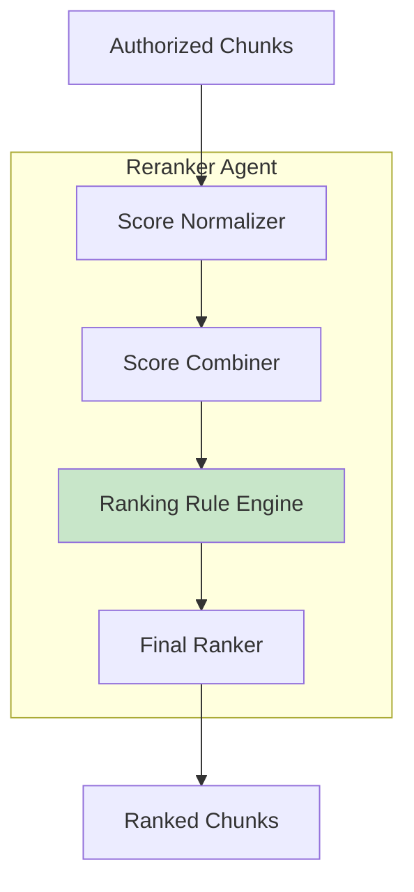

# Reranker Agent

**Domain:** Retrieval  
**Version:** 1.0  
**Last Updated:** 2026-05-17  
**Owner:** Retrieval Team  
**Status:** Specification

---

## Overview

The Reranker Agent ranks authorized chunks by relevance to the query, combining signals from multiple retrieval sources and applying domain-specific ranking rules to optimize answer quality.

### Purpose

- Rerank authorized chunks by query relevance
- Combine scores from vector, BM25, and knowledge graph retrieval
- Apply domain-specific ranking rules (recency, specificity, region match)
- Prioritize high-quality sources for LLM context
- Optimize for citation quality and answer accuracy

### Importance

Reranking is critical for:

- **Answer Quality:** Better ranking leads to better LLM answers
- **Context Efficiency:** Top chunks maximize limited context window
- **Citation Quality:** Prioritize authoritative, current sources
- **User Experience:** Faster, more relevant answers

---

## Responsibility

### Primary Responsibilities

1. **Score Combination**
   - Normalize scores from different retrieval sources
   - Combine vector, BM25, and graph scores
   - Apply weighted fusion strategies

2. **Relevance Ranking**
   - Rank chunks by semantic relevance
   - Consider keyword match quality
   - Consider entity relationship strength

3. **Domain-Specific Rules**
   - Prioritize current version over archived
   - Prioritize region-specific over global policy
   - Prioritize specific policy over general guideline
   - Prioritize recent documents for time-sensitive queries

4. **Quality Signals**
   - Consider document authority
   - Consider citation quality (page numbers, section titles)
   - Consider chunk completeness
   - Consider multi-source agreement

### Out of Scope

- Chunk retrieval (handled by [`hybrid-retrieval-agent`](./hybrid-retrieval-agent.md))
- Access control (handled by [`acl-validation-agent`](./acl-validation-agent.md))
- Context building (handled by [`context-builder-agent`](../generation/context-builder-agent.md))

---

## Architecture

### System Context



### Component Architecture



---

## API Contract

### Core Interface

```python
from typing import List, Dict, Any, Optional
from dataclasses import dataclass
from enum import Enum

@dataclass
class RankingSignals:
    """Signals used for ranking."""
    vector_score: Optional[float] = None
    bm25_score: Optional[float] = None
    graph_score: Optional[float] = None
    source_count: int = 0
    is_current_version: bool = True
    is_region_match: bool = False
    is_department_match: bool = False
    document_recency_days: Optional[int] = None
    has_page_numbers: bool = False
    has_section_title: bool = False
    chunk_completeness: float = 1.0

@dataclass
class RankedChunk:
    """Chunk with ranking information."""
    chunk_id: str
    document_id: str
    text: str
    final_score: float
    rank: int
    signals: RankingSignals
    metadata: Dict[str, Any]

@dataclass
class RerankingResult:
    """Result from reranking."""
    ranked_chunks: List[RankedChunk]
    top_k: int
    reranking_time_ms: float
    metadata: Dict[str, Any]

class RerankerAgent:
    """Reranker Agent interface."""

    def rerank(
        self,
        authorized_chunks: List[CandidateChunk],
        query_understanding: QueryUnderstanding,
        top_k: int = 10
    ) -> RerankingResult:
        """
        Rerank authorized chunks by relevance.

        Args:
            authorized_chunks: Chunks that passed ACL validation
            query_understanding: Query understanding from query-understanding-agent
            top_k: Number of top chunks to return

        Returns:
            RerankingResult with ranked chunks
        """
        pass

    def normalize_scores(
        self,
        chunks: List[CandidateChunk]
    ) -> List[CandidateChunk]:
        """
        Normalize scores from different retrieval sources.

        Args:
            chunks: Chunks with raw scores

        Returns:
            Chunks with normalized scores (0-1 range)
        """
        pass

    def combine_scores(
        self,
        chunk: CandidateChunk,
        weights: Dict[str, float]
    ) -> float:
        """
        Combine scores from multiple sources.

        Args:
            chunk: Chunk with multiple scores
            weights: Weights for each score type

        Returns:
            Combined score
        """
        pass

    def apply_ranking_rules(
        self,
        chunks: List[CandidateChunk],
        query_understanding: QueryUnderstanding
    ) -> List[RankedChunk]:
        """
        Apply domain-specific ranking rules.

        Args:
            chunks: Chunks with combined scores
            query_understanding: Query understanding

        Returns:
            Chunks with final scores after rule application
        """
        pass
```

---

## Implementation Details

### Score Normalization

```python
def normalize_scores(
    self,
    chunks: List[CandidateChunk]
) -> List[CandidateChunk]:
    """Normalize scores to 0-1 range using min-max normalization."""

    # Separate scores by source
    vector_scores = [c.scores.get(RetrievalSource.VECTOR, 0) for c in chunks]
    bm25_scores = [c.scores.get(RetrievalSource.BM25, 0) for c in chunks]
    graph_scores = [c.scores.get(RetrievalSource.KNOWLEDGE_GRAPH, 0) for c in chunks]

    # Normalize each source independently
    def min_max_normalize(scores: List[float]) -> List[float]:
        if not scores or max(scores) == min(scores):
            return [0.5] * len(scores)
        min_score = min(scores)
        max_score = max(scores)
        return [(s - min_score) / (max_score - min_score) for s in scores]

    normalized_vector = min_max_normalize(vector_scores)
    normalized_bm25 = min_max_normalize(bm25_scores)
    normalized_graph = min_max_normalize(graph_scores)

    # Update chunks with normalized scores
    for i, chunk in enumerate(chunks):
        if RetrievalSource.VECTOR in chunk.scores:
            chunk.scores[RetrievalSource.VECTOR] = normalized_vector[i]
        if RetrievalSource.BM25 in chunk.scores:
            chunk.scores[RetrievalSource.BM25] = normalized_bm25[i]
        if RetrievalSource.KNOWLEDGE_GRAPH in chunk.scores:
            chunk.scores[RetrievalSource.KNOWLEDGE_GRAPH] = normalized_graph[i]

    return chunks
```

### Score Combination

```python
def combine_scores(
    self,
    chunk: CandidateChunk,
    weights: Optional[Dict[str, float]] = None
) -> float:
    """Combine scores using weighted fusion."""

    # Default weights
    if weights is None:
        weights = {
            "vector": 0.5,
            "bm25": 0.3,
            "graph": 0.2
        }

    combined_score = 0.0
    total_weight = 0.0

    # Vector score
    if RetrievalSource.VECTOR in chunk.scores:
        combined_score += chunk.scores[RetrievalSource.VECTOR] * weights["vector"]
        total_weight += weights["vector"]

    # BM25 score
    if RetrievalSource.BM25 in chunk.scores:
        combined_score += chunk.scores[RetrievalSource.BM25] * weights["bm25"]
        total_weight += weights["bm25"]

    # Graph score
    if RetrievalSource.KNOWLEDGE_GRAPH in chunk.scores:
        combined_score += chunk.scores[RetrievalSource.KNOWLEDGE_GRAPH] * weights["graph"]
        total_weight += weights["graph"]

    # Normalize by total weight
    if total_weight > 0:
        combined_score /= total_weight

    # Boost for multi-source agreement
    source_count = len(chunk.retrieval_sources)
    if source_count >= 2:
        combined_score *= (1.0 + (source_count - 1) * 0.1)  # 10% boost per additional source

    return min(1.0, combined_score)  # Cap at 1.0
```

### Ranking Rules

```python
def apply_ranking_rules(
    self,
    chunks: List[CandidateChunk],
    query_understanding: QueryUnderstanding
) -> List[RankedChunk]:
    """Apply domain-specific ranking rules."""

    ranked_chunks = []

    for chunk in chunks:
        # Start with combined score
        base_score = self.combine_scores(chunk)
        final_score = base_score

        # Extract signals
        signals = RankingSignals(
            vector_score=chunk.scores.get(RetrievalSource.VECTOR),
            bm25_score=chunk.scores.get(RetrievalSource.BM25),
            graph_score=chunk.scores.get(RetrievalSource.KNOWLEDGE_GRAPH),
            source_count=len(chunk.retrieval_sources),
            is_current_version=chunk.metadata.get("version_status") == "current",
            has_page_numbers=chunk.metadata.get("page_start") is not None,
            has_section_title=chunk.metadata.get("section_title") is not None
        )

        # Rule 1: Current version boost
        if signals.is_current_version:
            final_score *= 1.2
        else:
            final_score *= 0.8  # Penalize archived versions

        # Rule 2: Region match boost
        if query_understanding.region_hint:
            chunk_region = chunk.metadata.get("region")
            if chunk_region == query_understanding.region_hint:
                final_score *= 1.15
                signals.is_region_match = True

        # Rule 3: Department match boost
        if query_understanding.department_hint:
            chunk_dept = chunk.metadata.get("department")
            if chunk_dept == query_understanding.department_hint:
                final_score *= 1.15
                signals.is_department_match = True

        # Rule 4: Citation quality boost
        if signals.has_page_numbers and signals.has_section_title:
            final_score *= 1.1

        # Rule 5: Exact term match boost (from BM25)
        if RetrievalSource.BM25 in chunk.retrieval_sources:
            if any(term.lower() in chunk.text.lower() for term in query_understanding.exact_terms):
                final_score *= 1.2

        # Rule 6: Document recency (for time-sensitive queries)
        if query_understanding.temporal_hint == "current":
            created_at = chunk.metadata.get("created_at")
            if created_at:
                days_old = (datetime.utcnow() - datetime.fromisoformat(created_at)).days
                signals.document_recency_days = days_old
                if days_old < 90:  # Less than 3 months
                    final_score *= 1.1
                elif days_old > 365:  # More than 1 year
                    final_score *= 0.9

        # Cap final score at 1.0
        final_score = min(1.0, final_score)

        ranked_chunk = RankedChunk(
            chunk_id=chunk.chunk_id,
            document_id=chunk.document_id,
            text=chunk.text,
            final_score=final_score,
            rank=0,  # Will be set after sorting
            signals=signals,
            metadata=chunk.metadata
        )
        ranked_chunks.append(ranked_chunk)

    # Sort by final score
    ranked_chunks.sort(key=lambda c: c.final_score, reverse=True)

    # Assign ranks
    for i, chunk in enumerate(ranked_chunks):
        chunk.rank = i + 1

    return ranked_chunks
```

### Reranking Pipeline

```python
def rerank(
    self,
    authorized_chunks: List[CandidateChunk],
    query_understanding: QueryUnderstanding,
    top_k: int = 10
) -> RerankingResult:
    """Execute complete reranking pipeline."""

    start_time = time.time()

    if not authorized_chunks:
        return RerankingResult(
            ranked_chunks=[],
            top_k=top_k,
            reranking_time_ms=0,
            metadata={}
        )

    # Step 1: Normalize scores
    normalized_chunks = self.normalize_scores(authorized_chunks)

    # Step 2: Apply ranking rules
    ranked_chunks = self.apply_ranking_rules(normalized_chunks, query_understanding)

    # Step 3: Select top-k
    top_chunks = ranked_chunks[:top_k]

    reranking_time_ms = (time.time() - start_time) * 1000

    logger.info(
        "reranking_complete",
        input_count=len(authorized_chunks),
        output_count=len(top_chunks),
        top_score=top_chunks[0].final_score if top_chunks else 0,
        reranking_time_ms=reranking_time_ms
    )

    return RerankingResult(
        ranked_chunks=top_chunks,
        top_k=top_k,
        reranking_time_ms=reranking_time_ms,
        metadata={
            "query": query_understanding.original_query,
            "intent": query_understanding.intent.value,
            "total_candidates": len(authorized_chunks)
        }
    )
```

---

## Testing Requirements

### Unit Tests

```python
def test_score_normalization():
    """Test score normalization."""
    agent = RerankerAgent()

    chunks = [
        CandidateChunk(
            chunk_id="chunk_001",
            scores={RetrievalSource.VECTOR: 0.85, RetrievalSource.BM25: 15.2},
            ...
        ),
        CandidateChunk(
            chunk_id="chunk_002",
            scores={RetrievalSource.VECTOR: 0.65, RetrievalSource.BM25: 8.5},
            ...
        ),
        CandidateChunk(
            chunk_id="chunk_003",
            scores={RetrievalSource.VECTOR: 0.75, RetrievalSource.BM25: 12.0},
            ...
        )
    ]

    normalized = agent.normalize_scores(chunks)

    # All scores should be in 0-1 range
    for chunk in normalized:
        for score in chunk.scores.values():
            assert 0 <= score <= 1

def test_score_combination():
    """Test score combination."""
    agent = RerankerAgent()

    chunk = CandidateChunk(
        chunk_id="chunk_001",
        retrieval_sources=[RetrievalSource.VECTOR, RetrievalSource.BM25],
        scores={
            RetrievalSource.VECTOR: 0.8,
            RetrievalSource.BM25: 0.6
        },
        ...
    )

    combined = agent.combine_scores(chunk)

    # Combined score should be weighted average with multi-source boost
    assert 0 < combined <= 1.0
    assert combined > 0.7  # Should be boosted for multi-source

def test_current_version_boost():
    """Test current version ranking boost."""
    agent = RerankerAgent()

    chunks = [
        CandidateChunk(
            chunk_id="chunk_001",
            metadata={"version_status": "archived"},
            scores={RetrievalSource.VECTOR: 0.8},
            ...
        ),
        CandidateChunk(
            chunk_id="chunk_002",
            metadata={"version_status": "current"},
            scores={RetrievalSource.VECTOR: 0.8},
            ...
        )
    ]

    query_understanding = QueryUnderstanding(...)
    ranked = agent.apply_ranking_rules(chunks, query_understanding)

    # Current version should rank higher
    assert ranked[0].chunk_id == "chunk_002"
    assert ranked[0].signals.is_current_version is True

def test_region_match_boost():
    """Test region match ranking boost."""
    agent = RerankerAgent()

    chunks = [
        CandidateChunk(
            chunk_id="chunk_001",
            metadata={"region": "US"},
            scores={RetrievalSource.VECTOR: 0.7},
            ...
        ),
        CandidateChunk(
            chunk_id="chunk_002",
            metadata={"region": "EMEA"},
            scores={RetrievalSource.VECTOR: 0.7},
            ...
        )
    ]

    query_understanding = QueryUnderstanding(
        region_hint="EMEA",
        ...
    )

    ranked = agent.apply_ranking_rules(chunks, query_understanding)

    # EMEA chunk should rank higher
    assert ranked[0].chunk_id == "chunk_002"
    assert ranked[0].signals.is_region_match is True
```

### Integration Tests

```python
def test_end_to_end_reranking():
    """Test complete reranking pipeline."""
    agent = RerankerAgent()

    authorized_chunks = [
        CandidateChunk(
            chunk_id="chunk_001",
            retrieval_sources=[RetrievalSource.VECTOR],
            scores={RetrievalSource.VECTOR: 0.85},
            metadata={"version_status": "current", "page_start": 5},
            ...
        ),
        CandidateChunk(
            chunk_id="chunk_002",
            retrieval_sources=[RetrievalSource.VECTOR, RetrievalSource.BM25],
            scores={RetrievalSource.VECTOR: 0.75, RetrievalSource.BM25: 12.0},
            metadata={"version_status": "current", "page_start": 8},
            ...
        ),
        CandidateChunk(
            chunk_id="chunk_003",
            retrieval_sources=[RetrievalSource.BM25],
            scores={RetrievalSource.BM25: 15.0},
            metadata={"version_status": "archived"},
            ...
        )
    ]

    query_understanding = QueryUnderstanding(...)

    result = agent.rerank(authorized_chunks, query_understanding, top_k=2)

    assert len(result.ranked_chunks) == 2
    assert result.ranked_chunks[0].rank == 1
    assert result.ranked_chunks[1].rank == 2
    assert result.reranking_time_ms < 100  # Performance target
```

---

## Configuration

### Environment Variables

```bash
# Reranking Configuration
RERANKING_TOP_K=10
RERANKING_TIMEOUT=1000  # ms

# Score Weights
VECTOR_WEIGHT=0.5
BM25_WEIGHT=0.3
GRAPH_WEIGHT=0.2

# Ranking Boosts
CURRENT_VERSION_BOOST=1.2
REGION_MATCH_BOOST=1.15
DEPARTMENT_MATCH_BOOST=1.15
CITATION_QUALITY_BOOST=1.1
EXACT_TERM_BOOST=1.2
MULTI_SOURCE_BOOST=0.1
```

### Configuration File

```yaml
# config/reranker.yaml

reranker:
  # Top-k selection
  default_top_k: 10
  max_top_k: 50

  # Score weights
  weights:
    vector: 0.5
    bm25: 0.3
    graph: 0.2

  # Ranking boosts
  boosts:
    current_version: 1.2
    archived_version: 0.8
    region_match: 1.15
    department_match: 1.15
    citation_quality: 1.1
    exact_term_match: 1.2
    multi_source: 0.1
    recent_document: 1.1
    old_document: 0.9

  # Recency thresholds
  recency:
    recent_days: 90
    old_days: 365
```

---

## Dependencies

### Upstream Dependencies

- **[`acl-validation-agent`](./acl-validation-agent.md):** Provides authorized chunks
- **[`query-understanding-agent`](./query-understanding-agent.md):** Provides query understanding

### Downstream Dependencies

- **[`context-builder-agent`](../generation/context-builder-agent.md):** Receives ranked chunks

### External Dependencies

```python
# requirements.txt
pydantic>=2.0.0
```

---

## Monitoring & Observability

### Metrics

```python
# Prometheus metrics
reranking_requests_total = Counter(
    "reranking_requests_total",
    "Total reranking requests",
    ["tenant_id"]
)

reranking_duration_seconds = Histogram(
    "reranking_duration_seconds",
    "Reranking duration"
)

reranking_input_count = Histogram(
    "reranking_input_count",
    "Number of input chunks"
)

reranking_output_count = Histogram(
    "reranking_output_count",
    "Number of output chunks"
)

reranking_top_score = Histogram(
    "reranking_top_score",
    "Top chunk score after reranking"
)
```

### Logging

```python
import structlog

logger = structlog.get_logger()

logger.info(
    "reranking_complete",
    input_count=len(authorized_chunks),
    output_count=len(top_chunks),
    top_score=top_chunks[0].final_score if top_chunks else 0,
    reranking_time_ms=reranking_time_ms
)
```

---

## Related Documentation

- [AGENTS.md](../../AGENTS.md) - Master agent index
- [ARCHITECTURE.md](../../ARCHITECTURE.md) - System architecture
- [hybrid-retrieval-agent.md](./hybrid-retrieval-agent.md) - Hybrid retrieval
- [acl-validation-agent.md](./acl-validation-agent.md) - Access control validation
- [context-builder-agent.md](../generation/context-builder-agent.md) - Context building

---

**Version History:**

- 1.0 (2026-05-17): Initial specification
